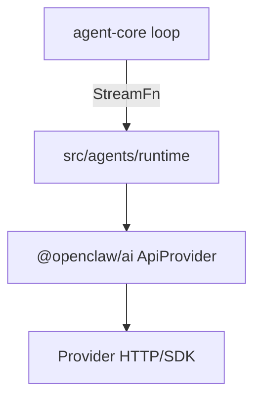
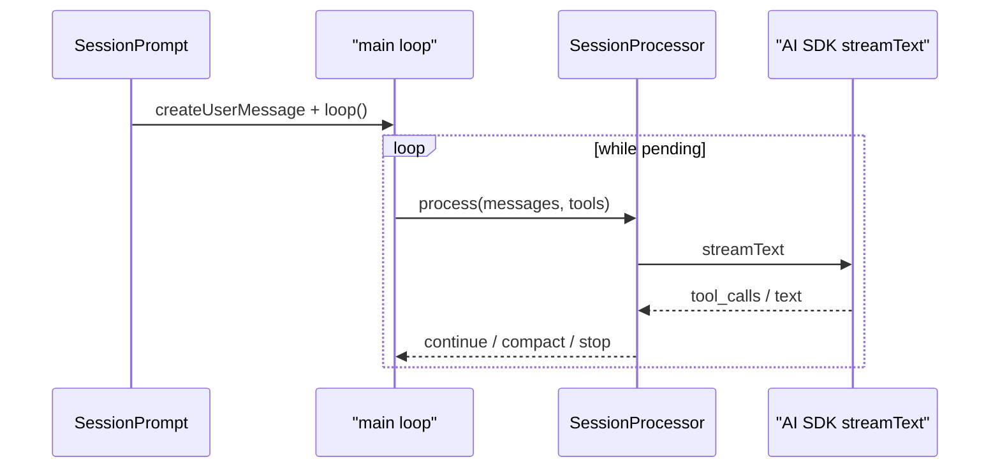
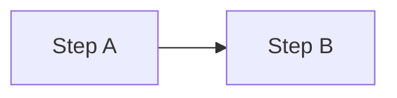

# 绘制 GitHub 兼容的 Mermaid 图

在 `Learning` 仓库的 Markdown 中编写 Mermaid 时，遵循本 skill，并在提交前运行验证。

## 工作流

1. **确定图类型**：flowchart / sequenceDiagram / stateDiagram-v2 / erDiagram / gantt
2. **按兼容性规则编写**（见下文）
3. **本地验证**：`npm run validate:mermaid`
4. **提交**：CI 工作流 `.github/workflows/validate-mermaid.yml` 会自动复检

## GitHub 兼容性规则（必须遵守）

### 通用

| 规则 | 说明 |
|------|------|
| 节点 ID | 用 camelCase，无空格：`userService`，不用 `user_service` |
| 保留字 | 不用 `end`、`subgraph`、`graph`、`loop` 作节点/参与者 ID |
| 特殊字符 | `@ / ( ) #` 等必须包在引号内：`A["@openclaw/ai"]` |
| 多词标签 | 一律加引号：`B["AI SDK streamText"]` |
| 不用 emoji | GitHub 渲染器可能拒绝 |
| 不用 `\n` | 用实际换行或缩短标签，勿写 `\n` 转义 |

### flowchart



- 边标签含特殊字符时加引号：`-->|"O(1) lookup"|`
- subgraph 标题加引号：`subgraph A["路径 A：渠道"]`
- 避免 `@pkg/name` 裸写在 `[]` 内

### sequenceDiagram



- **参与者 ID 不能与 `loop`/`alt`/`opt`/`par` 等关键字同名或冲突**
- 多词显示名必须引号：`participant LLM as "AI SDK streamText"`
- `loop` 块内缩进用 2 或 4 空格，块以 `end` 结束
- 避免 `Note over`（部分渲染器会剥离；非必要不用）

### stateDiagram-v2

- 转移标签含空格或符号时加引号：`Running --> Idle: drain inbox`
- 不用 `end` 作状态名

## 常见错误与修复

| 错误信息 | 原因 | 修复 |
|----------|------|------|
| `got 'loop'` | 参与者名/别名与 `loop` 关键字冲突 | 改 ID 为 `MainLoop`，别名可保留 `loop` |
| `got 'LINK_ID'` | 标签含 `@` 未加引号 | `AI["@openclaw/ai ApiProvider"]` |
| `Expecting 'ACTOR'` | 参与者别名含空格未引号 | `as "AI SDK streamText"` |
| `got 'end'` | 节点 ID 为 `end` | 改名为 `done` 或 `finish` |

## 验证命令

```bash
npm install          # 首次
npm run validate:mermaid              # 本地：lint 规则（无需浏览器）
npm run validate:mermaid -- --render  # 完整：lint + mmdc 渲染（CI 自动启用）
```

- 本地默认 **lint only**（避免 Windows 上 Puppeteer 启动失败）
- GitHub Actions 设置 `CI=true`，自动执行 **lint + render**

## 画图前自问

1. 这张图要表达什么 **一条主链路**？（避免一图塞太多）
2. 节点/参与者名称是否来自 **真实代码路径**？
3. 有没有 `@`、空格、括号、保留字？
4. 能否用 **更简单的图类型** 表达？（序列图 vs 流程图）

## 输出格式

在 Markdown 中：

````markdown

````

修复已有图时，只改图表块，不重写整篇文档。
