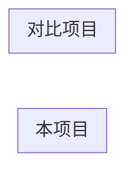

# 应用技术深挖模板

以 `frontier-apps/codex-note.md`、`opencode-note.md`、`openclaw-note.md` 为质量标准。

> **格式**：预估全文 < 150 行且图 ≤ 2 → 用本 Markdown 模板；否则用 [html-template.md](html-template.md)，或 `.md` 摘要 + `.html` 全文（见 [format-guide.md](format-guide.md)）。

```markdown
# [项目名] 学习笔记（[副标题：会话整合 / 架构深挖 / V1/V2 双轨版]）

> **来源**：[Cursor 会话 id]（YYYY-MM-DD ~ YYYY-MM-DD）/ 官方文档 / 自主阅读
> **仓库**：`path/to/repo`（默认分支 `main`）
> **读者定位**：算法工程师，关注 Agent 循环、上下文工程、模型通信
> **一句话**：[项目] = …

---

## 目录索引

| 章节 | 主题 | 关键文件 |
|------|------|----------|
| [§1](#1-整体心智模型与学习路径) | 心智模型 | `README.md` |
| [§2](#2-调用链) | Gateway → … → Runtime | `…` |
| … | … | … |

---

## 1. 整体心智模型与学习路径

### 1.1 一句话

### 1.2 架构图

```mermaid
flowchart LR
    …
```

### 1.3 顶层目录 / Crate / 包地图

| 路径 | 职责 | 优先级 |
|------|------|--------|

### 1.4 推荐学习路径（分阶段）

| 阶段 | 目标 | 必读 |
|------|------|------|

---

## 2. [主调用链名称]

> **先建立总调用链，再读循环细节。**

### 2.1 入口与分支

```mermaid
flowchart TB
    …
```

| 路径 | 入口文件 | 特点 |
|------|----------|------|

### 2.2 关键函数 / 类调用栈

`fileA` → `fileB` → `fileC`（用真实符号名）

### 2.3 与 [其他项目] 边界

| | 本项目 | 对比项目 A | 对比项目 B |
|--|--------|------------|------------|

---

## 3. 核心循环（ReAct 变体）

### 3.1 循环层级

| 层级 | 函数/模块 | 粒度 |
|------|-----------|------|

```mermaid
sequenceDiagram
    …
```

### 3.2 推理范式要点

- 每步模型输出什么？
- 工具调用数量约束？
- `needs_follow_up` / steer / interrupt 语义？

### 3.3 关键设计决策（编号）

1. …
2. …

---

## 4. Client / Server / LLM 通信

```mermaid
flowchart LR
    …
```

| 层 | 传输 | 协议 |
|----|------|------|

- 异步原语（channel / spawn / oneshot …）
- 审批 / 反向 RPC（若有）

---

## 5. Event 与持久化历史

| 概念 | 类比 | 要点 |
|------|------|------|

- Item vs Event 区分
- 流式 delta 落在哪里

---

## 6. Skills / MCP / Tool / Sandbox

| 维度 | 行为 |
|------|------|

- 加载时机（Session 创建 vs 首次 turn）
- 优先级与热更新
- 沙箱模式表

---

## 7. 上下文工程、压缩与记忆

### 7.1 总览图

```mermaid
flowchart TB
    …
```

### 7.2 什么进 history / 什么每轮重算

| 内容 | 进 history | 每轮重算 | API 字段 |
|------|------------|----------|----------|

### 7.3 首轮全量 vs 后续 diff

### 7.4 Compaction / Memory / Token Budget

### 7.5 Prompt Cache 影响

| 变更 | Cache 影响 |
|------|------------|

---

## 8. 与 [OpenCode / Codex / OpenClaw / …] 对比

> 突出 **差异**；相同点一行带过。

| 主题 | 本项目 | 项目 A | 项目 B |
|------|--------|--------|--------|



---

## 9. 高频问题速答

| 问题 | 答案 |
|------|------|

---

## 附录 A. 关键代码文件速查

| 主题 | 路径 |
|------|------|

## 附录 B. 文档 URL 索引

| 主题 | URL |
|------|------|

## 附录 C. 建议阅读顺序 / 实验命令

```bash
# 构建 / 测试 / 调试命令
```

## 附录 D. 一张表速查（模型可见上下文构造）

| 信息类型 | API 层 | role | 首轮 | 后续 |
|----------|--------|------|------|------|

---

*文档生成时间：YYYY-MM-DD*
```

## 章节取舍指南

按项目实际能力选章，不必机械凑满 9 章：

| 项目特征 | 必写章节 |
|----------|----------|
| 任何 Agent 产品 | §1 心智模型、§3 核心循环、§7 上下文 |
| 有 Gateway / IDE / SDK | §2 调用链、§4 通信 |
| 有 UI 流式 | §5 Event |
| 有 Skill/MCP | §6 |
| Learning 仓库已有类似笔记 | §8 横向对比 |
| 有集成测试断言 request | §7 末或附录写「测试即规格」 |

## 深挖执行顺序（推荐）

1. README + 官方 architecture 文档
2. 跟一条用户消息 / turn 的调用栈
3. 读主循环文件（while / loop / run_turn）
4. 读上下文组装与 compact
5. 读测试里对 request body 的断言
6. 回填对比表与 Mermaid
