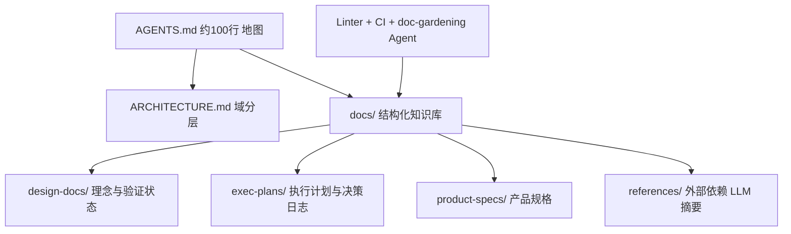
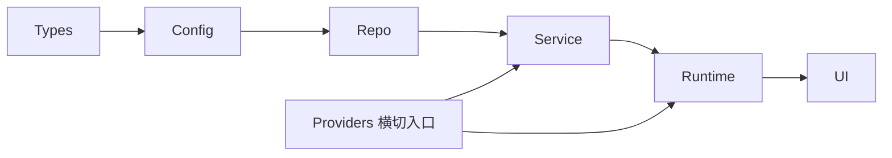

# 工程技术：在智能体优先的世界中利用 Codex

> **作者**：Ryan Lopopolo（OpenAI）
> **来源**：[工程技术：在智能体优先的世界中利用 Codex](https://openai.com/zh-Hans-CN/index/harness-engineering/)
> **发布**：2026-02-11
> **阅读日期**：2026-07-14
> **类型**：公司 Engineering Blog
> **读者定位**：Agent / 平台工程师、技术负责人
> **范围**：OpenAI 内部「零人工写码」实验的方法论与组织变革；不覆盖 Codex CLI/Rust 实现细节（见 `frontier-apps/codex-note.md`）

---

## 一句话

**软件工程的主战场从「写代码」转向「设计 harness（环境、意图、反馈回路）」，让人类注意力成为唯一瓶颈下的稀缺资源。**

## 为什么值得读

- **与主流认知的差异**：不是「Copilot 辅助人类写码」，而是 **100% 代码由 Codex 产出** 仍交付真实产品（内测 + Alpha），且 3 人团队 5 个月 ~100 万行、~1500 PR。
- **与当前学习主题的关联**：把 Agent 循环、上下文工程、Skills、CI/lint 从「模型侧技巧」升格为 **组织级工程系统**；与 `codex-note` 中的 AGENTS.md 原则、compact、tool loop 形成「产品实践 ↔ 开源实现」对照。

---

## 背景与实验设定

| 维度 | 数据（作者声称） |
|------|------------------|
| 时间 | 2025-08 末空仓库首提交 → 2026-02 博文发布，约 5 个月 |
| 规模 | ~100 万行代码；~1500 个 PR 合并 |
| 人力 | 初期 3 名工程师，后扩至 7 名；人均 ~3.5 PR/天，扩员后吞吐量仍上升 |
| 硬约束 | **人类从不直接贡献代码**；产品已有数百内测用户、日常重度用户 |
| 效率 | 估计为手工写码时间的 **~1/10** |

**核心隐喻**：人类掌舵（steer），智能体执行（execute）。

---

## 核心论点

### 论点 1：瓶颈从「模型能力」转向「环境规范」

- **作者说**：早期慢不是因为 Codex 不行，而是 **环境规范不够**——缺工具、抽象、内部结构，智能体无法推进高级目标。
- **论据**：工程师工作变为「深度优先拆解」：设计 → 代码 → 评审 → 测试，先让 Agent 建模块，再解锁更复杂任务。
- **我的理解**：这与 `codex-note` 中「context fragment 有界注入」同源——**不是 prompt 更长，而是可导航的结构更多**。失败时的默认动作不是「人下场写」，而是问：「还缺什么能力，如何让 Agent 可读且可强制执行？」

### 论点 2：AGENTS.md 是地图，不是百科全书

- **作者说**：巨型 `AGENTS.md` 失败——挤占 context、一切「重要」= 无重要、快速腐烂、无法机械验证。
- **论据**：改为 ~100 行入口 + 结构化 `docs/` 作为 **记录系统（system of record）**；渐进式披露（progressive disclosure）。
- **我的理解（事实）**：仓库布局包括 `design-docs/`、`exec-plans/`（active/completed）、`generated/`、`product-specs/`、`references/*-llms.txt` 等；专职 linter + CI 验证文档新鲜度；**doc-gardening Agent** 扫描过时文档并开 PR 修复。

### 论点 3：优化目标是「Agent 可读性」，不是「新人可读性」

- **作者说**：Agent 运行时看不到的 = 不存在；Slack 里达成的架构共识若未入库，Agent 像「迟三个月入职的新员工」。
- **论据**：
  - **可运行副本**：git worktree 启动应用实例，Agent 自驱验证。
  - **UI 可读**：Chrome DevTools Protocol + DOM 快照/截图/导航 Skills。
  - **可观测性可读**：每 worktree 临时本地 observability 栈；LogQL / PromQL 查询；可验证「启动 <800ms」「关键旅程 span <2s」。
  - 单次运行 **6+ 小时**（常为人类睡眠时段）并不罕见。
- **推断**：这是把 QA、SRE、设计评审从「人类眼睛」迁移到 **机器可查询信号**；与 `codex-note` 的 sandbox、MCP、skills 加载互补——本文强调 **被测系统本身要对 Agent 透明**。

### 论点 4：规范架构 + 机械不变量 = 高吞吐下的连贯性

- **作者说**：纯文档无法约束百万行 Agent 生成代码；需在边界解析数据形状，但不微观管理实现（模型偏好 Zod，未强制库）。
- **论据**：严格分层架构（Types → Config → Repo → Service → Runtime → UI），横切仅经 **Providers**；自定义 linter + 结构测试；lint 错误信息内嵌 **给 Agent 的修复指令**。
- **我的理解**：通常「数百工程师才上的架构治理」在这里是 **前置条件**——无约束则速度与架构漂移同时爆炸。人类品味通过审查评论、重构 PR、Bug → 文档或 **规则代码化** 回流。

### 论点 5：吞吐量改变合并哲学与质量模型

- **作者说**：最小化阻塞合并门；PR 生命周期短；测试 flake 常靠重跑而非无限阻塞；**纠错成本低、等待成本高**。
- **论据**：Agent 产出含 CI、发布工具、内部工具、文档、eval 框架、**审阅评论与回复**、仓库管理脚本、生产 dashboard 定义等。
- **我的理解**：这是 **统计质量控制** 思维——在 Agent 吞吐远超人类注意力时，用后续 PR 纠偏优于门前长时间卡死。低吞吐团队不宜照搬。

### 论点 6：Ralph Wiggum 循环与 Agent-on-Agent 审查

- **作者说**：人类几乎只通过 prompt 交互；Codex 本地自审 → 请求特定 Agent 审查 → 响应反馈 → 循环直至所有 Agent 审核满意；人类可审 PR 但非必须。
- **论据**：Codex 直接用 `gh`、本地脚本、仓库内嵌 skills 收集情境，无需人类复制粘贴。
- **与 codex-note 对照**：开源 Codex 有 turn loop、hooks、多 client；本文描述的是 **组织流程层** 把 review 也 Agent 化（推断：多 Codex 实例或不同 prompt 角色）。

### 论点 7：熵增与「垃圾回收」——黄金原则

- **作者说**：Agent 复现仓库既有模式（含劣化模式）→ 漂移；团队曾每周五 20% 时间手动清「AI 残渣」，不可扩展。
- **论据**：将主观 **黄金原则** 编码进仓库 + 后台 Codex 任务扫描偏差、更新质量分、开小型重构 PR（多数 1 分钟内可审并自动合并）。
- **我的理解**：类似 GC——小额持续还技术债，优于大爆炸式重构；人类品味一旦捕获即 **持续机械施加**。

### 论点 8：端到端自主的门槛（已跨过但不可轻易泛化）

- **作者说**：给定 prompt，Agent 可：验证仓库状态 → 复现 bug → 录故障视频 → 修复 → 跑应用验证 → 录修复视频 → 开 PR → 回应反馈 → 修 CI → **仅在需判断时找人类** → 合并。
- **我的理解（作者明示）**：高度依赖 **该仓库特有** 结构与工具投入；无类似 harness 不应假定可复现。

---

## 与已有知识的对照

| 主题 | 本文（Harness Engineering） | `codex-note` / 主流实践 | 一致性 |
|------|------------------------------|-------------------------|--------|
| AGENTS.md | ~100 行地图 + docs/ 渐进披露 | 有界 fragment、避免巨型前缀 | **一致且更激进**（组织级 docs 体系） |
| Context 稀缺 | 反对百科全书式单文件 | 单项 ≤10K、增量 history | 一致 |
| 架构约束 | 分层 + Providers + 自定义 lint | 代码库内 AGENTS.md 设计原则 | 本文强调 **业务域级** 结构测试 |
| Review | Agent-on-Agent Ralph 循环 | turn loop + hooks | 互补（流程 vs 运行时） |
| 合并策略 | 低阻塞、flake 重跑 | 未强调 | **本文特有**（高吞吐假设） |
| 可观测性 | LogQL/PromQL 给 Agent | sandbox、工具调用 | 本文强调 **被测系统可查询** |
| 零人工写码 | 100% 硬约束 | 开源 Codex 为人机协作设计 | **实验性极端点** |

---

## 工程落点

### 产品/系统上实际做了什么（可观察行为）

1. 内部 beta 产品，全栈 Codex 生成，真实用户在使用。
2. 仓库知识：**版本化的 exec-plans、product-specs、generated schema** 与代码同级。
3. **Doc-gardening Agent** 与 **entropy GC Agent** 作为持续维护力。
4. 开发环境：**worktree 隔离实例 + 临时 observability 栈**。
5. 审查与合并：**智能体自循环 + 可选人类**。

### 推断的实现手段（标明推断）

| 能力 | 合理推断 |
|------|----------|
| Agent 审查 | 多轮 Codex run / 不同 system prompt 角色 + `gh pr review` |
| 修复指令 lint | ESLint/custom rule `message` 含「如何改」文本，进入 Agent context |
| 6h 长任务 | 与 `codex-note` 长 turn、sleep 时段 unattended run 一致 |
| 自动合并 | 小 PR + 全绿 Agent 审查 + 低风险管理域 |

### 对自建 Agent / Harness 的启发

- **Harness = 环境 + 意图 + 反馈**，三者缺一则模型再强也推不动大仓库。
- **Repo-local truth**：任何未入库的知识都是 technical debt for agents。
- **Lint 即 prompt**：静态规则的错误文案是 cheapest 的 fine-tuning。
- **投资顺序**：架构不变量 → 可运行/可观测副本 → 文档地图 → 再追求吞吐。

---

## 可行动清单

1. **把 AGENTS.md 瘦身到「目录」**：检查是否 >200 行；能链接到 `docs/` 的不要堆进单文件。
2. **为 Agent 建「可验证运行时」**：worktree + 一键启动 + 最小 UI/日志查询接口（哪怕先是脚本）。
3. **选 3–5 条「黄金原则」写进 linter**（命名、边界解析、禁 YOLO 探测数据等），错误信息写给 Agent 读。
4. **引入 exec-plan 工件**：复杂任务先提交计划 Markdown（含决策日志），再让 Agent 按 plan 执行。
5. **安排后台「GC PR」机器人**：小步重构 + 自动合并，避免周五 manual 清残渣。

---

## 仍待验证

- [ ] ~100 万行、1500 PR 的 **缺陷率 / 回滚率** 未披露，高吞吐合并的实际质量成本不明。
- [ ] 「1/10 时间」的基线与测量方法未说明。
- [ ] Ralph Wiggum 循环的具体编排（单实例 vs 多实例）未公开。
- [ ] 架构分层与 Providers 模式是否开源或可复用到非 OpenAI 栈。
- [ ] 模型迭代（如 GPT-5 → 后续）后，docs/harness 维护成本如何变化。

---

## 关联阅读

- 应用笔记：[`frontier-apps/codex-note.md`](../frontier-apps/codex-note.md)（Codex Rust 实现、turn loop、context 工程）
- 同系列博文（OpenAI 站内）：*用 Codex 构建可自我改进的税务智能体*、*Windows Codex 沙箱*
- 外部概念：[AGENTS.md 社区实践](https://agents.md/)、Ralph Wiggum loop（Agent 自循环 meme/模式）

---

## 概念速查

| 术语 | 含义 |
|------|------|
| Harness engineering | 设计 Agent 运行环境、意图表达与反馈回路，而非手写业务代码 |
| System of record | 以版本化仓库文档为唯一真相源，非 Wiki/聊天 |
| Progressive disclosure | Agent 从小入口逐步拉取深层 doc，避免一次灌满 context |
| Ralph Wiggum loop | Agent 自审/互审直到通过的自循环（作者用语） |
| Golden principles | 带主观品味、可机械检查的仓库级规则 |
| Agent readability | UI/日志/指标对 Agent 可查询、可推理，不仅对人友好 |

---

*摘录完成：2026-07-14*
