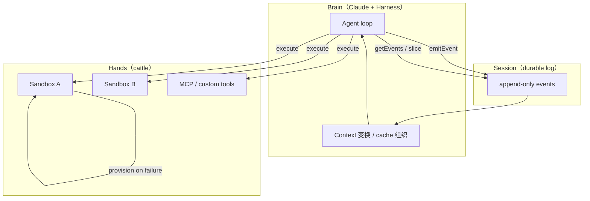
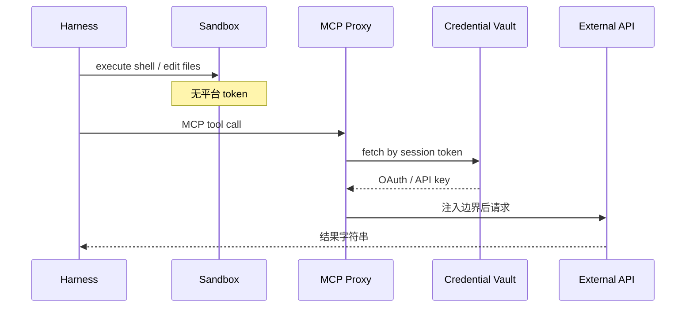

# Scaling Managed Agents：把大脑与双手解耦

> **作者**：Lance Martin、Gabe Cemaj、Michael Cohen（Anthropic）
> **来源**：[Scaling Managed Agents: Decoupling the brain from the hands](https://www.anthropic.com/engineering/managed-agents)
> **发布**：2026-04-08
> **阅读日期**：2026-07-14
> **类型**：公司 Engineering Blog
> **读者定位**：Agent 平台工程师、云基础设施 / SRE、技术负责人
> **范围**：Claude Platform **Managed Agents** 的 meta-harness 架构、三大抽象接口、安全与上下文工程；不覆盖 Managed Agents API 具体参数（见官方 docs）
> **完整版（浏览器）**：[2026-04-08-managed-agents.html](./2026-04-08-managed-agents.html)

---

## 一句话

**Managed Agents 用 Session / Harness / Sandbox 三类稳定接口把 Agent 虚拟化——让 harness 可随模型迭代而换，执行环境与凭证可 cattle 化替换，session 日志成为 context window 之外的 durable 真相源。**

## 为什么值得读

- **与主流认知的差异**：不是再写一层「更好的 prompt loop」，而是承认 **harness 里对模型能力的假设会过期**（如 Sonnet 4.5 的 context anxiety 在 Opus 4.5 上消失），因此需要 **meta-harness**——对 harness 本身做 OS 式抽象。
- **与当前学习主题的关联**：与 [Harness Engineering（OpenAI）](./2026-02-11-harness-engineering.md) 互补——OpenAI 强调 **仓库内环境如何让 Agent 可读可验证**；Anthropic 强调 **托管平台上 brain / hands / session 如何解耦、可恢复、可扩展**；与 [Claude Tag](./2026-06-23-claude-tag.md) 的 Agent Proxy + 沙箱注凭证 **同源安全思路**。

---

## Managed Agents 是什么

| 维度 | 说明 |
|------|------|
| **产品形态** | Claude Platform 上的 **托管长时程 Agent 服务** |
| **设计目标** | 接口比任何具体 harness 实现更长寿；可换 Claude Code 式通用 harness，也可换领域专用 harness |
| **核心隐喻** | 操作系统虚拟化硬件 → Managed Agents 虚拟化 **session、harness、sandbox** |
| **Brain / Hands** | **Brain** = Claude + harness（推理与编排）；**Hands** = sandbox 与外部工具（执行）；**Session** =  append-only 事件日志（状态） |

---

## 核心论点

### 论点 1：Harness 假设会过期，需要 meta-harness

- **作者说**：Harness 往往编码「模型自己做不到什么」的假设；模型变强后这些假设会变成 **死重（dead weight）**。
- **论据**：Claude Sonnet 4.5 在接近 context 上限时会过早收尾（**context anxiety**），团队加了 context reset；换到 Opus 4.5 后该行为消失，reset 逻辑无用。
- **我的理解**：这与 OpenAI Harness Engineering 里「环境规范要随 Agent 能力演进」一致，但 Anthropic 更进一步——**不赌某一种 harness 长久有效**，而是把 harness 也做成可替换组件。

### 论点 2：单容器耦合 = 养宠物（pet），不可扩展

- **作者说**：早期 session、harness、sandbox 同处一容器；文件编辑是直接 syscall，边界设计简单。
- **论据（问题）**：
  1. **Pet 问题**：容器挂则 session 丢；卡死需人工「护理」；WebSocket 事件流无法区分 harness bug、网络丢包、容器离线。
  2. **调试困境**：工程师需 shell 进容器，而容器常含用户数据 → 实质上 **无法安全调试**。
  3. **网络假设**：Harness 默认资源与自己在同一环境；客户 VPC 资源只能 **对等网络** 或 **把 harness 搬到客户环境**。
- **我的理解**：这是典型的 **把有状态长任务绑在不可替换实例上** 的反模式；与 cattle 化云原生方向相反。

### 论点 3：解耦 brain / hands / session——三类接口

- **作者说**：Brain（Claude + harness）、Hands（sandbox / tools）、Session（事件日志）各自成为 **少假设、可独立失败与替换** 的接口。

**Hands（Sandbox）**

| 接口 | 语义 |
|------|------|
| `execute(name, input) → string` | Harness 像调任意 tool 一样调容器 |
| `provision({resources})` | 容器死亡后按标准配方重建；失败以 tool error 回传 Claude |

**Harness（Brain）**

| 接口 | 语义 |
|------|------|
| `wake(sessionId)` | 新 harness 实例拉起 |
| `getSession(id)` | 读完整事件日志，从最后事件续跑 |
| `emitEvent(id, event)` | 循环中持久化每条事件 |

**Session**

| 接口 | 语义 |
|------|------|
| `getEvents()` | 按位置切片 interrogating 事件流；可 rewind、断点续读 |

### 论点 4：安全边界——凭证永远进不了 sandbox

- **作者说**：耦合设计里 Claude 生成代码与 **平台凭证同容器** → prompt injection 读环境变量即可 **spawn 无限制 session**；缩小 token scope 仍是假设「Claude 做不到 X」，会随模型变强而失效。
- **论据（两种模式）**：
  1. **Git**：初始化 sandbox 时用 repo token clone 并写入 local remote；sandbox 内 `push`/`pull` 可用，**Agent 不接触 token**。
  2. **MCP / 自定义工具**：OAuth 存 vault；**专用 proxy** 按 session 关联 token 取凭证代调外部服务；**harness 不知凭证**。
- **我的理解（事实 + 推断）**：与 Claude Tag 文档中的 **Agent Proxy + credential store** 同一安全范式；Managed Agents 是平台级 generalization。

### 论点 5：Session ≠ Context Window

- **作者说**：长时程任务必然超出 context；compaction、memory tool、context trimming 都涉及 **不可逆的保留/丢弃决策**，未来 turn 可能需要已删 token。
- **论据**：Session log 是 **context window 外的 context object**；`getEvents()` 支持灵活切片（从上次停处续读、rewind、重读某动作前上下文）。Harness 在注入 Claude 前可对 fetch 到的事件 **任意变换**（含 prompt cache 优化）。
- **我的理解**：
  - **Session** 保证 durable + interrogable；
  - **Harness** 负责 context engineering（compact、trim、cache 布局）——未来策略未知，故不固化在 session 层。
  - 与 `codex-note` 中 compact + rollout 持久化 **同族问题**，但 Managed Agents 把 **可恢复存储** 上升为平台一等公民。

### 论点 6：Many brains, many hands——性能与拓扑

**Many brains**

- **作者说**：Brain 进容器时，每个 session 先付 **整容器启动成本**（clone repo、拉事件），即使用户暂时不需要 sandbox；**TTFT**（time-to-first-token）差。
- **论据**：解耦后 inference 可在 orchestration 层 **读完 pending events 即开始**；sandbox 仅在被 `execute` 需要时 `provision`。**p50 TTFT ≈ -60%，p95 TTFT > -90%**（作者声称）。
- **推断**：多 brain = 多 **无状态 harness** 实例，按需连 hands。

**Many hands**

- **作者说**：早期模型只能单 shell；模型变强后需 **多执行环境路由**——比单 shell 认知更难。
- **论据**：每个 hand 统一为 `execute(name, input) → string`；harness 不知背后是容器、手机还是模拟器；**brain 之间可传递 hand**。
- **我的理解**：Hands 的 **名字空间 + 字符串 IO** 是刻意最小化接口，类似 Unix `read()` 对磁盘类型的无知。

---

## 架构演进对照

| 阶段 | Session | Harness | Sandbox | 主要痛点 |
|------|---------|---------|---------|----------|
| **耦合单容器** | 容器内 | 容器内 | 同容器 | Pet、丢 session、难调试、VPC 对等 |
| **Managed Agents** | 外部 durable log | 无状态 cattle | `execute` / `provision` | 需模型能处理多 hand 路由 |

---

## 与已有知识的对照

| 主题 | Managed Agents | 其他来源 | 一致性 |
|------|----------------|----------|--------|
| Harness 会过期 | context reset 对 Opus 4.5 成死重 | Harness Engineering：环境随能力演进 | **一致且更架构化** |
| Session / Event log | `getEvents()` 切片 + `emitEvent` | `codex-note`：ThreadId、rollout 持久化 | 同族；MA 平台化 |
| Compact / trim | harness 层变换，session 保留全量 | `codex-note` § compact、token budget | **职责分离更清晰** |
| 沙箱凭证 | vault + proxy，sandbox 无 token | Claude Tag Agent Proxy | **一致** |
| 多执行环境 | `execute(name, input)` 统一 | Codex sandbox、MCP tools | MA 强调 **brain 可连多 hand** |
| TTFT 优化 | 延迟 provision sandbox | 未在 codex-note 强调 | **MA 特有指标** |
| Meta-harness | 可换 Claude Code / 领域 harness | Claude Code 为具体 harness 实现 | **分层关系** |

---

## 工程落点

### 可观察的平台行为（作者描述）

1. 长时程 Agent 在 Claude Platform **托管运行**，客户通过稳定 API / docs 接入。
2. Session 为 **append-only**；harness crash 后 `wake` + `getSession` 续跑。
3. Sandbox 失败 → tool error → Claude 可选 retry → 新 `provision`。
4. Git / MCP 凭证 **不经 harness、不经 sandbox 明文**。
5. Context 从 session 切片注入，harness 可为此做 cache 友好布局。

### 推断的实现手段（标明推断）

| 能力 | 合理推断 |
|------|----------|
| Session 存储 |  append-only event store（类似 event sourcing）；按 sessionId 分区 |
| Orchestration | 独立服务读 pending events、调度无状态 harness worker |
| Sandbox 生命周期 | 容器 / VM / Firecracker 类；recipe 含 repo clone、资源配额 |
| MCP Proxy | 与 Claude Tag 共用或同构 egress gateway |
| `getEvents()` 切片 | cursor / offset + limit；harness 维护「已读水位」 |

### 对自建 Agent / 平台的启发

1. **把 harness 当 cattle**：状态进 session，不进 harness 进程内存。
2. **最小 hand 接口**：`name + input → string` 足够支撑 sandbox、MCP、异构设备。
3. **凭证与 compute 分离**：structural fix 优于「相信小 scope token 够用」。
4. **Session 与 context engineering 分层**：durable log 不做 irreversible 删改；compact 在 harness 读路径上做。
5. **TTFT 优化**：重活（provision sandbox）**懒加载**；先推理再开 shell。
6. **定期审计 harness 假设**：模型升级后删除 dead weight（如 context reset）。

---

## 可行动清单

1. **绘制你方 Agent 的 brain / hands / session 边界**：状态是否绑在单个 worker 容器上？若是，优先外置 event log。
2. **统一外部执行入口**：sandbox、远程 runner、MCP 是否都走同一 `execute` 语义，便于多 hand 与 retry。
3. **凭证注入点下沉到 proxy**：sandbox 内环境变量应 **零平台 secret**；Git 用 init-time clone 模式。
4. **分离「持久 log」与「送入模型的窗口」**：log 只追加；compact/trim 作为 harness 的 **读模型** 而非 **写模型**。
5. **模型升级回归**：列 harness 里「补偿模型弱点」的逻辑清单，升级后做 ablation（作者用 context reset 为例）。
6. **度量 TTFT**：区分「接受任务 → 首 token」与「首次 tool / sandbox 就绪」，验证懒 provision 收益。

---

## 仍待验证

- [ ] Managed Agents 公开 docs 中 **API 与配额** 细节（博文仅架构叙事）
- [ ] `getEvents()` 的 **一致性、顺序、最大 retention** 未说明
- [ ] 多 brain 同时 `wake` 同一 session 的 **并发语义**（锁 / 单 writer？）
- [ ] TTFT 数字的 **基准环境、负载、对照组** 未披露
- [ ] 「brain 之间传递 hand」的 **具体产品与权限模型** 未展开
- [ ] 与 Claude Code CLI 本地 session 是否 **共享 event schema**（推断：未必 1:1）

---

## 关联阅读

- 同目录：[Claude Tag（Slack 多人 Agent）](./2026-06-23-claude-tag.md) · [Harness Engineering（OpenAI）](./2026-02-11-harness-engineering.md)
- 应用笔记：[`frontier-apps/codex-note.md`](../frontier-apps/codex-note.md)（turn loop、compact、session 持久化）
- 官方入口：博文内链 [Managed Agents docs](https://www.anthropic.com/engineering/managed-agents)（Get started 指向 platform docs）

---

## 概念速查

| 术语 | 含义 |
|------|------|
| Meta-harness | 不绑定具体 prompt loop，而是提供 session / harness / sandbox 接口以容纳未来 harness |
| Brain / Hands | 推理编排层 vs 执行层（sandbox、tools） |
| Pet vs Cattle | 不可替代的长命实例 vs 可丢弃重建的互换实例 |
| Context anxiety | 模型感知 context 将满时过早结束任务的行为 |
| TTFT | Time to first token：接受任务到首个输出 token 的延迟 |
| Session（MA） | Append-only 事件日志，非 Claude 的 context window |
| `execute(name, input)` | Hand 的统一调用面，返回 string |

---

*摘录完成：2026-07-14*
