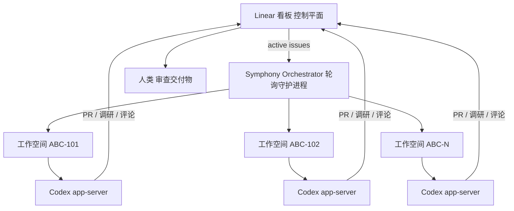
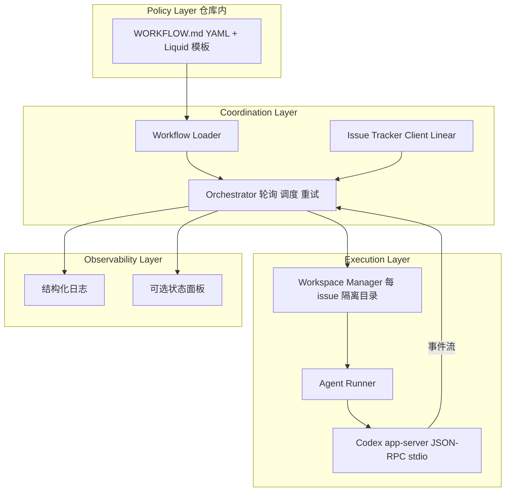
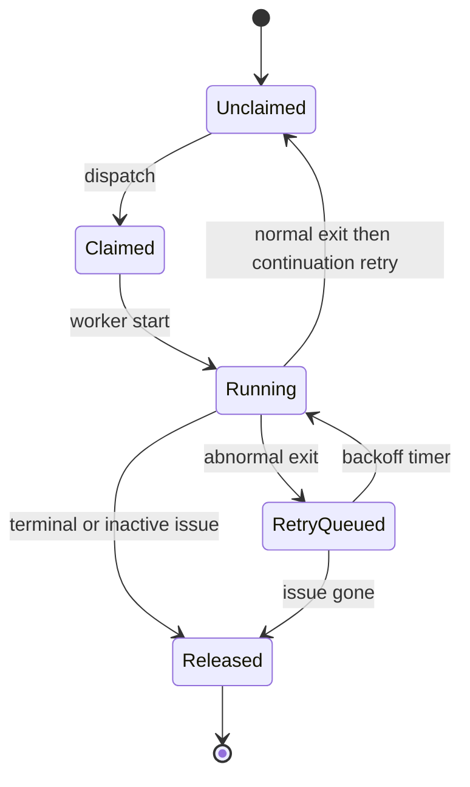

# Codex 编排的开源规范：Symphony

> **作者**：Alex Kotliarskyi、Victor Zhu、Zach Brock（OpenAI）
> **来源**：[Codex 编排的开源规范：Symphony](https://openai.com/zh-Hans-CN/index/open-source-codex-orchestration-symphony/)
> **发布**：2026-04-27
> **阅读日期**：2026-07-14
> **类型**：公司 Engineering Blog
> **读者定位**：Agent / 平台工程师、技术负责人
> **范围**：Symphony 编排理念、`SPEC.md` 契约与 `WORKFLOW.md` 工作流；不覆盖 Elixir 参考实现逐行源码（见 [openai/symphony](https://github.com/openai/symphony)）

---

## 一句话

**把 issue 跟踪器（如 Linear）当作智能体控制平面，让每个未关闭任务在独立工作空间中持续有 Agent 在跑，人类从「管会话」转向「审交付物」。**

## 为什么值得读

- **与主流认知的差异**：瓶颈不是「再开一个 Codex 标签页」，而是 **人类注意力无法同时监督 3–5 个以上交互式会话**；Symphony 把组织单位从 PR/会话换成 **工单**。
- **与当前学习主题的关联**：承接 [Harness Engineering](./2026-02-11-harness-engineering.md) 的「零人工写码仓库」实验，解决其 **上下文切换** 瓶颈；与 `frontier-apps/codex-note.md` 的 **app-server 协议、turn/thread** 形成「运行时 ↔ 编排层」对照。

---

## 背景：Harness 奏效后的下一道墙

六个月前，OpenAI 内部团队延续 Harness Engineering 路线：**仓库零人工写码**，Codex 视为完整团队成员。方法有效，但规模化后出现新负担：

| 现象 | 作者描述 |
|------|----------|
| 会话上限 | 多数工程师同时只能管好 **3–5 个** Codex 会话 |
| 切换成本 | 忘记各会话在做什么、终端间来回切、调试中途停滞的长任务 |
| 角色错位 | 构建了「超强初级工程师团队」，却由人类做 **细粒度督导** |
| 真正瓶颈 | 智能体跑得很快，**人类注意力** 才是系统瓶颈 |

**核心隐喻转变**：不再围绕「编程会话 / 已合并 PR」组织，而是围绕 **交付物（issue、里程碑）** 组织——PR 和会话只是手段。

---

## 核心论点

### 论点 1：Issue 跟踪器即控制平面（Control Plane）

- **作者说**：每个未关闭的 Linear issue 映射到 **专属智能体工作空间**；Symphony 持续监控看板，确保活跃任务在完成前 **始终有 Agent 在循环**。
- **论据**：
  - 智能体崩溃/卡住 → 自动重启
  - 新工单出现 → 立即接手编排
  - 工作流基于工单状态构建，Linear 充当 **状态机**
  - 编排器跑在 **始终在线的 devbox** 上；工程师曾在网络差的小木屋用手机 Linear 提交三项重要变更
- **我的理解**：这是把「调度器 + 执行器」从人类大脑外置到 daemon；与 CI 监听 PR 类似，但监听对象是 **业务工单** 而非 git 事件。

### 论点 2：工单粒度解耦「工作」与「代码变更」

- **作者说**：Symphony 将工作从会话和 PR 中 **解耦**——一 issue 可产生多仓库多 PR，也可能纯调研零代码。
- **论据**：
  - 可让 Agent 分析代码库/Slack/Notion 产出实现方案 → 确认后生成 **任务树（DAG）**
  - 智能体只处理 **未被阻塞** 的任务；示例中 React 升级依赖 Vite 迁移，顺序自动正确
  - 实现中可 **自行创建新 issue**（性能、重构、架构改进），供人类排期
- **我的理解**：工单成为比 PR 更大的工作单元；探索性任务 **做错也有信息价值、成本近零**，显著降低启动不确定性任务的认知成本。

### 论点 3：产出与角色边界的结构性变化

- **作者说**：部分团队前三周 **合并到主分支的 PR 数量增长 6 倍**；部分团队 **+500%**；Linear 创始人称 Symphony 发布后工作空间创建量明显增长。
- **论据**：
  - 工程师不再管理 Codex 会话 → 每次变更的 **感知成本** 下降
  - 探索/重构/验证假设变得轻量，只保留有价值结果
  - **PM/设计师** 可直接提交功能请求，无需检出仓库；获得含 **真实产品视频演示** 的评审包
  - 大型单体仓库：持续监控 CI、自动 rebase、解冲突、重试不稳定检查，推动变更过流水线
- **我的理解（推断）**：这是 Harness Engineering 高吞吐哲学的 **组织层放大器**——当单任务人力推动成本趋零，瓶颈自然上移到 **工作项定义与验收**。

### 论点 4：从刚性状态机到「目标（Objective）」驱动

- **作者说**：按工单分配工作后，失去执行过程中 **随时纠偏** 的能力；部分结果会完全偏离预期。
- **论据**：
  - 不手动修补失败结果，而是加 **防护与 Skills**（E2E、Chrome DevTools、QA 冒烟），并改进文档与「好结果」定义
  - 高度不确定、需强判断的任务仍适合 **交互式 Codex 会话**
  - 早期把 GitHub 集成写死在外层 harness（假设 Codex 只改代码）→ 证明局限；Codex 可创建多 PR、读评审反馈、关旧 PR、生成报告
  - 最终转向给智能体 **目标** 而非严格状态转换，类似优秀管理者派活
- **我的理解**：编排层应 **薄**、推理层应 **厚**；与 SPEC 中「工单写入由 Agent 工具完成，Symphony 只做 scheduler/reader」边界一致。

### 论点 5：Symphony 本质是 `SPEC.md`，参考实现可替换

- **作者说**：打开仓库首先看到的是 **`SPEC.md`**——问题定义 + 预期解法，而非复杂监督系统；参考实现用 **Elixir**（并发原语优势），但核心可用 Markdown 表达。
- **论据**：
  - v1：tmux 里 Codex 会话轮询 Linear 并 spawn 子智能体——能跑但不稳
  - v2：集成进已围绕 Agent 设计的主项目 harness
  - **用 Symphony 构建 Symphony**；让 Codex 用 TS/Go/Rust/Java/Python 等多语言实现以打磨 spec 歧义
  - 去除对特定仓库、Linear MCP 的依赖；核心收敛为一句：**每个未关闭任务，确保有 Agent 在独立工作空间运行**
  - 开发工作流显式写入 **`WORKFLOW.md`**（检出、标进行中、建 PR、附视频、自我反思等），Symphony 确保 Agent 遵循
- **我的理解**：这是「**规范即产品**」——当代码生成成本趋零，最有价值的是 **可版本化、可让 Agent 实现的契约**；与 Harness 文章里「docs 为 system of record」同构。

---

## SPEC 契约要点（工程落点）

### 边界：Symphony 做什么 / 不做什么

| 职责 | 归属 |
|------|------|
| 轮询 issue、并发调度、per-issue workspace、重试/对账 | Symphony Orchestrator |
| 工单状态迁移、评论、PR 链接 | **Coding Agent**（`WORKFLOW.md` 提示 + 工具，如 `gh`、可选 `linear_graphql`） |
| 成功终点 | 常为 workflow 定义的交接态（如 `Human Review`），**不一定是 `Done`** |
| 持久化 DB | **不要求**；重启恢复靠 tracker + 文件系统 |

### 关键文件与配置

| 文件 | 作用 |
|------|------|
| `SPEC.md` | 语言无关的服务规范（Draft v1） |
| `WORKFLOW.md` | 仓库内策略：YAML front matter（tracker/polling/workspace/hooks/agent/codex）+ Liquid 模板 prompt body |
| Workspace 目录 | `<workspace.root>/<sanitized_issue_id>`，跨 run 复用，终端态才清理 |

**默认参数摘录**（SPEC §5–6）：轮询 `30000ms`；全局并发默认 `10`；`Todo` 态若 blocker 未终端则 **不调度**；失败重试指数退避 capped `300000ms`；Codex 默认 `codex app-server`，turn 超时 `3600000ms`，stall 检测 `300000ms`。

### Agent Runner 与 Codex app-server

编排器通过 **行分隔 JSON-RPC** 与 Codex 通信（非 CLI/tmux）：

1. `initialize` → `initialized`
2. `thread/start`（`cwd` = workspace 绝对路径）
3. `turn/start`（首轮完整渲染 prompt；同 worker 内后续 turn 只发 **continuation guidance**，不重复灌入原任务 prompt）
4. 流式读取至 `turn/completed` / `turn/failed` / 超时

**安全不变量**：Agent 子进程 `cwd` 必须在 per-issue workspace 内，且 workspace 路径不得逃出 `workspace.root`。

**`linear_graphql` 动态工具**（可选扩展）：由 Symphony 侧实现并向 app-server 宣告，Agent 可发 GraphQL 而 **无需接触 Linear token**——避免 MCP 依赖与令牌泄露。

### 编排状态机（内部 claim 态，≠ Linear 状态）

---

## 与已有知识的对照

| 主题 | 本文（Symphony） | [Harness Engineering](./2026-02-11-harness-engineering.md) | `codex-note` / 交互式 Codex | 一致性 |
|------|------------------|-----------------------------------------------------------|----------------------------|--------|
| 瓶颈 | 人类管会话 | 人类写码 / 环境规范 | 单会话 turn loop | **互补层级** |
| 组织单位 | Issue / 工单 | 仓库 harness + docs | Thread / Turn | Symphony **上置** |
| 工作流定义 | `WORKFLOW.md` 版本化 | `AGENTS.md` + `docs/` | `AGENTS.md`、rules | **同族**（repo-local policy） |
| Agent 接口 | app-server headless | 未强调协议 | CLI / IDE / app-server | Symphony **绑定 app-server** |
| 并发模型 | 每 issue 一 workspace，bounded 全局并发 | worktree 多实例 | 人多开终端 | Symphony **daemon 化** |
| 失败处理 | 加 skills/文档，非人肉 patch | lint 含 Agent 修复指令 | hooks、retry | **一致哲学** |
| 产品定位 | 开源参考实现，非长期独立产品 | 内部实验博文 | 开源 Codex 产品 | 本文 **刻意薄编排层** |

---

## 工程落点

### 产品/系统上实际做了什么（可观察行为）

1. 发布 [openai/symphony](https://github.com/openai/symphony)（Apache 2.0），含 Elixir 参考实现 + `SPEC.md`。
2. 默认集成 **Linear** 为 issue 源；工单状态驱动调度与 handoff。
3. 使用 **Codex app-server** 作为唯一推荐的 headless 执行后端。
4. 内部 dogfood：Symphony 迭代由 Symphony 自身驱动；多语言原型用于验证 spec 可移植性。
5. 截至 2026-04-23 博文数据：GitHub **15k+ stars**（作者声称）。

### 推断的实现手段（标明推断）

| 能力 | 合理推断 |
|------|----------|
| 始终在线 | devbox / 常驻进程 + `polling.interval_ms` tick |
| DAG 依赖 | 利用 Linear `blocked_by`；`Todo` 态 blocker 未关闭则不 dispatch |
| CI 推动 | `WORKFLOW.md` prompt 要求 Agent 用 `gh` 读日志、rebase、重试 |
| 视频演示 | Harness 同源 UI Skills（Chrome DevTools）+ workflow 步骤写入 |
| 动态 reload | 监听 `WORKFLOW.md` 变更，无效配置保留 last known good |

### 对自建 Agent / Harness 的启发

- **控制平面选型**：已有 Jira/Linear/GitHub Issues 的团队，比自建任务 UI 更快落地「始终在线 Agent 劳动力」。
- **两层契约**：`SPEC.md` 定义编排器语义；`WORKFLOW.md` 定义 **团队特有** 派活与 handoff——分开才能跨语言实现。
- **薄编排 + 厚 Agent**：ticket write、PR、评论应留在 Agent 工具链，避免编排器膨胀成第二代 CI。
- **探索性工作的经济学**：当单次 Agent run 成本极低，应鼓励 **大量廉价工单 + 人类筛选**，而非人类前置完美 spec。

---

## 可行动清单

1. **盘点并发会话上限**：记录自己同时能保质管理的 Codex/Cursor 会话数，验证「3–5」是否也是你的瓶颈。
2. **起草 `WORKFLOW.md` v0**：哪怕先不接 Symphony，也把「issue → 分支 → PR → 评审态 → 附验收证据」写成 Liquid 模板 + YAML 配置。
3. **试用 app-server 模式**：用 `codex app-server` 跑一个最小 `thread/start` + `turn/start` 脚本，理解 Symphony Agent Runner 集成点。
4. **为 issue 设计 workspace 隔离规则**：目录命名、hook（`after_create` clone、`before_run` 依赖安装）、终端态清理策略。
5. **区分「编排态」与「推理态」任务**：把强判断/高不确定任务留在交互会话；把实现、迁移、CI 收尾交给 daemon 编排。

---

## 仍待验证

- [ ] 「6 倍 / 500% PR 增长」的 **基线团队、统计口径、时间窗口** 未完全披露。
- [ ] 15k stars 为博文时点快照；与后续维护热度、breaking change 频率待观察。
- [ ] 非 Linear tracker（Jira、GitHub Issues）需自建 adapter，SPEC 仅 normative 定义 Linear。
- [ ] 高信任 `approval_policy: never` 等配置的生产安全边界需结合 Codex sandbox 文档自行评估。
- [ ] 「失去执行中纠偏」的失败率与 rework 成本未量化。

---

## 关联阅读

- 同系列前置：[Harness Engineering](./2026-02-11-harness-engineering.md)（零人工写码仓库与 harness 设计）
- 规范与实现：[openai/symphony `SPEC.md`](https://github.com/openai/symphony/blob/main/SPEC.md)、[Symphony 文档站](https://openai-symphony.mintlify.app/)
- 应用笔记：[`frontier-apps/codex-note.md`](../frontier-apps/codex-note.md)（Codex turn loop、app-server、context 工程）
- 外部：[Codex app-server 文档](https://developers.openai.com/codex/app-server/)

---

## 概念速查

| 术语 | 含义 |
|------|------|
| Control plane | 本文明指 issue 跟踪器（Linear），承载任务状态与人类验收入口 |
| Symphony | 长运行编排服务：读 tracker → 建 workspace → 跑 coding agent |
| `WORKFLOW.md` | 仓库内版本化的编排策略 + Agent prompt 模板（YAML + Liquid） |
| app-server | Codex headless 模式，stdio JSON-RPC，适合程序化 turn/thread 管理 |
| Continuation turn | 同 thread 后续轮次只发简短继续指引，避免重复灌入完整任务 prompt |
| Handoff state | 工作流定义的「交给人类」状态，如 `Human Review` |
| `linear_graphql` | Symphony 可选客户端工具，代 Agent 调 Linear API 而不暴露 token |

---

*摘录完成：2026-07-14*
