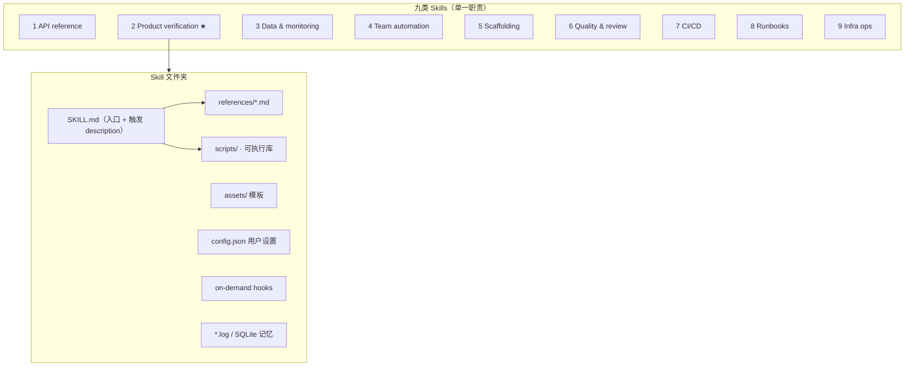

# Claude Code 内部 Skills 实践：九类分类与编写心法

> **作者**：Thariq Shihipar（Anthropic，Member of Technical Staff，Claude Code 团队）
> **来源**：[Lessons from building Claude Code: How we use skills](https://claude.com/blog/lessons-from-building-claude-code-how-we-use-skills)
> **发布**：2026-06-03
> **阅读日期**：2026-07-14
> **类型**：公司 Claude Code 实践 Blog
> **读者定位**：Agent / 平台工程师、Claude Code / Cursor Skills 作者、技术负责人
> **范围**：Anthropic 内部数百个 Skills 的分类框架、编写最佳实践、分发与度量；不覆盖 Skills 运行时源码
> **完整版（浏览器精读）**：[2026-06-03-lessons-from-building-claude-code-skills.html](./2026-06-03-lessons-from-building-claude-code-skills.html)

---

## 一句话

**Skills 不是「又一个 markdown 文件」，而是可渐进披露的文件夹 + 可选脚本/钩子；Anthropic 内部按九类用途组织，最高 ROI 在验证类与 Gotchas，description 写给模型做触发器而非给人看摘要。**

## 为什么值得读

- **与主流认知的差异**：社区常把 Skill 当成「长 prompt 片段」；Claude Code 团队强调 **文件夹结构、脚本库、按需 Hook、持久化记忆** 才是高杠杆部分——与 `2026-06-18-steering` 中「Skills 按需加载全文」形成 **从机制到内容** 的闭环。
- **与当前学习主题的关联**：直接指导 Learning 仓库 `.cursor/skills/` 与 `interpret-tech-notes` 的写法；与 OpenAI Harness「AGENTS.md 是地图」、验证即规格（`verification-before-completion`）同构；**Product verification** 类 Skill 被明确为内部 **可度量质量提升最大** 的投资点。

---

## Skills 是什么（纠偏）

| 常见误解 | 团队实际用法 |
|----------|--------------|
| 「就是 SKILL.md」 | **文件夹**：`SKILL.md` + `references/`、`scripts/`、`assets/`、`config.json` 等 |
| 纯知识注入 | 可注册 **动态 Hook**（仅 skill 激活期间生效）、可执行脚本、可存持久化数据 |
| 越大越好 | **单一职责**：横跨多类目的 skill 会 **混淆 agent**；最好干净落入九类之一 |

前置：博文假设已了解 Skills 基础；新手可从 [Introduction to agent skills（Skilljar）](https://anthropic.skilljar.com/) 入门。

---

## 九类 Skills 分类框架

Anthropic 对内部 Skills 编目后的聚类（非权威清单，但是 **识别缺口** 的实用框架）：

| # | 类别 | 核心作用 | 内部示例（原文） | ROI 提示 |
|---|------|----------|------------------|----------|
| 1 | **Library & API reference** | 正确使用内部/难搞库、CLI、SDK | `billing-lib`、`internal-platform-cli`、`sandbox-proxy` | 附 reference 代码片段 + gotchas |
| 2 | **Product verification** | 测试/验证代码是否真能用 | `signup-flow-driver`、`checkout-verifier`、`tmux-cli-driver` | **内部可度量影响最大**；值得专人花一周打磨 |
| 3 | **Data fetching & analysis** | 接数据栈、监控、看板 | `funnel-query`、`cohort-compare`、`grafana`、`datadog` | 含凭证获取、dashboard ID、字段对照 |
| 4 | **Business process & automation** | 重复工作流一键化 | `standup-post`、`create-<ticket>-ticket`、`weekly-recap` | 常依赖其他 skill/MCP；日志保一致性 |
| 5 | **Code scaffolding & templates** | 生成框架样板 | `new-<framework>-workflow`、`new-migration`、`create-app` | NL 要求无法纯代码覆盖时用 skill |
| 6 | **Code quality & review** | 组织内质量与审查 | `adversarial-review`、`code-style`、`testing-practices` | 可挂 Hook 或 GitHub Action |
| 7 | **CI/CD & deployment** | 拉取、推送、部署 | `babysit-pr`、`deploy-<service>`、`cherry-pick-prod` | 可引用其他 skill 收集数据 |
| 8 | **Runbooks** | 症状 → 多工具调查 → 结构化报告 | `<service>-debugging`、`oncall-runner`、`log-correlator` | 映射 symptom → tool → query |
| 9 | **Infrastructure operations** | 例行运维（含破坏性操作护栏） | `<resource>-orphans`、`dependency-management`、`cost-investigation` | 确认步骤 + soak period 等 guardrail |

**反模式**：一个 skill 同时做「部署 + 数据分析 + code review」→ 应拆成多个，或上层 skill **按名引用** 组合（见下文）。

---

## 核心论点

### 论点 1：最高信号内容是 Gotchas，不是重复 Claude 已知的常识

- **作者说**：Claude 会读代码库、会写代码；skill 若复述默认行为 = **加 context 不加价值**。知识型 skill 应推模型 **走出惯性**（如 `frontend-design`：避免 Inter 字体、紫色渐变）。
- **论据**：Gotchas 来自 Claude **真实踩坑** 后迭代写入——例如 append-only 表取 max version 而非 `created_at`；跨服务 `@request_id` vs `trace_id` 同值；staging 200 但 webhook 未处理需查 `payment_events`。
- **我的理解**：与 Harness Engineering「地图 + 渐进披露」一致——**SKILL.md 是索引，gotchas 是组织记忆**。

### 论点 2：文件夹 = 上下文工程的渐进披露

- **作者说**：`SKILL.md` 指向 `references/`、`assets/` 等；告诉 Claude 有哪些文件，模型 **在合适时机自读**。
- **论据**：pending job → 读 `stuck-jobs.md`；输出格式 → 复制 `assets/template.md`；API 细节 → `references/api.md`。
- **我的理解（推断）**：启动时只见 name+description（见 steering 博文）；全文与附属文件 **invoke 后** 进入 context——文件夹深度越深，越要避免在 SKILL.md 里一次性灌完。

### 论点 3：给信息不给铁轨——避免 over-specify

- **作者说**：Skills 高复用，指令过细会让 Claude **僵化**；应提供决策所需信息，保留适应空间的灵活性。
- **我的理解**：与 Cursor Rules「约束边界」、Subagent「只回摘要」形成梯度——Skill 在主线程，仍需 **procedure 而非剧本**。

### 论点 4：Description 是触发器，不是给人看的摘要

- **作者说**：Session 启动会列出 **所有 skill 的 name + description**；Claude 据此判断「有没有 skill 适用」→ description 应写 **何时触发**，可含关键词如 `babysit`。
- **我的理解（事实）**：这是 **检索层 prompt**；写成人话简介会导致 under-trigger。与 Cursor skill frontmatter `description` 设计同构。

### 论点 5：脚本让 Claude 花在「组合」而非「重写样板」

- **作者说**：skill 内放可执行库（如 `data-science` 的 `fetch_events` / `compute_funnel`），Claude 现场生成脚本 **组合** 调用，应对「周二发生了什么？」类 ad-hoc 分析。
- **论据**：turn 预算应用在决策与编排，不在每次重建 boilerplate。

### 论点 6：按需 Hook = 场景化硬护栏

- **作者说**：Skill 可注册 **仅在该 skill 调用期间** 生效的 hook；适合不想全局开启的强意见行为。
- **论据**：
  - `/careful`：`PreToolUse` 拦截 `rm -rf`、`DROP TABLE`、force-push、`kubectl delete`
  - `/freeze`：非指定目录禁止 `Edit`/`Write`，调试时防「顺手修 unrelated」
- **我的理解**：与 steering 博文「Hooks 绕过 compaction」互补——**全局 hook 在 settings；场景 hook 在 skill**。

### 论点 7：分发与治理靠有机增长，不靠中央审批

- **作者说**：
  - 小团队：`.claude/skills` 入库即可，但 **每个 check-in skill 都略增 model context**
  - 规模化：**Plugin marketplace**，用户自选安装 + setup flow
  - 治理：无中央选品；先放 GitHub sandbox folder → Slack 传播 → 有 traction 后 PR 进 marketplace
- **组合**：skill 间 **按名引用** 即可链式调用；marketplace **尚无原生依赖管理**（待验证演进）。
- **度量**：`PreToolUse` hook 记录 skill 使用（[示例代码](https://github.com/anthropics/claude-code/blob/main/examples/hooks/skill-usage-logging.sh)）→ 发现热门或 **under-trigger** skill。

---

## 编写实践速查

| 实践 | 做法 | 反例 |
|------|------|------|
| **Setup** | `config.json` 存用户配置；缺失时 prompt 用户（可用 `AskUserQuestion`） | 硬编码 Slack channel |
| **记忆** | append-only `standups.log`、JSON、SQLite；插件数据用 `${CLAUDE_PLUGIN_DATA}` | 每次从零推断历史 |
| **渐进披露** | SKILL.md 列目录 + 条件指针 | 单文件 500 行 |
| **验证类** | Playwright/tmux + **逐步断言**；可录屏回看测了什么 | 只写「请手动测一下」 |
| **描述** | 触发词 + 场景 | 「这是一个帮助部署的工具」 |

---

## 与已有知识的对照

| 主题 | 本文（Skills 实践） | 其他来源 | 一致性 |
|------|---------------------|----------|--------|
| Skill 加载 | 启动只见元数据；全文按需 | `2026-06-18-steering` Skills 行 | **一致** |
| 地图 vs 百科全书 | 文件夹渐进披露；SKILL.md 指引用 | Harness `AGENTS.md` + `docs/` | **一致** |
| 硬护栏 | Skill 内 on-demand hooks | Steering：全局 Hooks + Managed settings | **补充**（分层） |
| 验证 ROI | verification skill 一周投入 | `verification-before-completion` skill | **一致** |
| 组合编排 | 按名引用其他 skill | Plugin marketplace 无原生依赖 | **待演进** |
| Cursor 对照 | description=触发器 | `.cursor/skills/*/SKILL.md` | **一致** |
| Subagent 分工 | 未展开 | Steering：侧任务用 Subagent 隔离 | **互补**（本文偏 procedure skill） |

---

## 工程落点

### 产品侧可观察行为

1. **发现**：启动扫描 skills 目录 → 构建 name+description 列表供模型自选 invoke。
2. **激活**：slash command 或语义匹配 → 加载 SKILL.md + 按需读子文件/跑脚本。
3. **Hook 作用域**：skill 级 hook 仅 session 内、skill 相关期间注册（如 `/careful`）。
4. **持久化**：`${CLAUDE_PLUGIN_DATA}` 提供跨 session 稳定目录（[plugins 文档](https://code.claude.com/docs/en/plugins-reference#persistent-data-directory)）。
5. **分发**：repo check-in vs plugin install；marketplace 有机晋升路径。

### 对自建 Agent / Cursor Skills 的启发

1. **先分类再写**：用九类框架审计现有 skills，识别缺口（多数团队缺 **#2 验证** 与 **#8 runbook**）。
2. **投资验证 skill**：程序化断言 + 可选录屏；比再加 50 行 CLAUDE.md 更有效。
3. **Gotchas 运维化**：每次 agent 踩坑 → PR 更新 skill，而非口头传承。
4. **Description 工程**：当作 **embedding 前的关键词检索字段** 维护。
5. **脚本优先**：把稳定 IO（查表、调 API、跑浏览器）固化在 `scripts/`，让 LLM 写薄编排层。
6. **规模化**：<10 个 skill 可跟 repo；数十个以上考虑 plugin/marketplace 减 context 膨胀。

---

## 可行动清单

1. **盘点现有 skills**：是否每个都能归入九类之一？横跨多类则拆分。
2. **为最高流量流程写 verification skill**：signup/checkout/CLI 交互各一个，含逐步断言。
3. **每 skill 增加 Gotchas 节**：从最近 3 次 agent 失败反推写入。
4. **重写 description**：加入触发词（`deploy`、`babysit`、`oncall`、`review`）与「当用户…时使用」。
5. **拆 `references/`**：API 签名、长示例、模板移出 SKILL.md 正文。
6. **破坏性操作用 `/careful` 模式**：skill 内注册 PreToolUse，而非全局恐吓 prompt。
7. **加使用日志 hook**：找 under-trigger 与热门 skill，指导迭代。
8. **与 `2026-06-18-steering` 对照**：流程进 skill、侧任务进 subagent、必做进 hook。

---

## 仍待验证

- [ ] Skill 内 on-demand hook 与 `settings.json` 全局 hook 的优先级与合并规则
- [ ] `${CLAUDE_PLUGIN_DATA}` 在纯 repo skills（非 plugin）下的行为
- [ ] Marketplace skill 依赖「按名引用」时，未安装依赖的失败模式与提示
- [ ] Skills 共享 compaction budget 与多 skill 同时 invoke 时的 LRU 细节（见 steering 博文）
- [ ] `skill-usage-logging.sh` 示例与内部度量看板的具体字段（需对照 GitHub 示例）

---

## 关联阅读

- 博客：`2026-06-18-steering-claude-code-skills-hooks-rules-subagents.md`（七种 steering 机制与 Skills 加载语义）
- 博客：`2026-05-20-claude-code-html-effectiveness.md`（HTML 交付物与 skill 封装 recurring 模式）
- 博客：`2026-02-11-harness-engineering.md`（AGENTS.md 地图论）
- 博客：`2026-04-08-managed-agents.md`（可分发 harness / plugin）
- 技能：`verification-before-completion`（验证再宣称完成）
- 技能：`interpret-tech-notes`（本仓库 skill 结构范例）
- 原文延伸：[Building skills for Claude](https://claude.com/blog/building-skills-for-claude) · [Skills 文档](https://docs.anthropic.com/en/docs/claude-code/skills) · [Plugins 持久化数据](https://code.claude.com/docs/en/plugins-reference#persistent-data-directory)

---

*摘录完成：2026-07-14*
