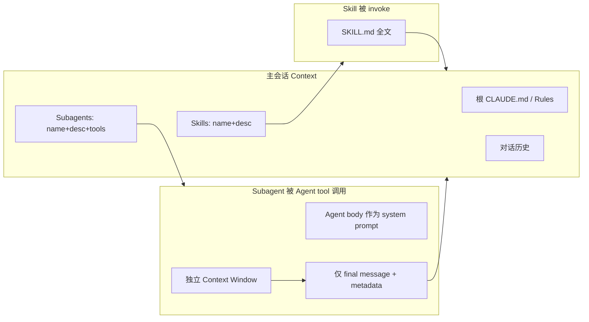

# Steering Claude Code：七种指令投递方式的分工框架

> **作者**：Michael Segner（Anthropic）
> **来源**：[Steering Claude Code: when to use CLAUDE.md, skills, hooks, and subagents](https://claude.com/blog/steering-claude-code-skills-hooks-rules-subagents-and-more)
> **发布**：2026-06-18
> **阅读日期**：2026-07-14
> **类型**：公司 Engineering Blog（Claude Code）
> **读者定位**：Agent / 平台工程师、Claude Code 重度用户、技术负责人
> **范围**：Claude Code 七种自定义指令机制的加载时机、compaction 行为、上下文成本与选型决策；不覆盖 CLI 源码实现

---

## 一句话

**Claude Code 的「steering」不是堆 prompt，而是按加载时机、持久性与权威度，把指令拆进 CLAUDE.md、Rules、Skills、Subagents、Hooks、Output styles 与 system prompt append 七条通道。**

## 为什么值得读

- **与主流认知的差异**：多数团队把「所有规范」塞进一个巨型 CLAUDE.md；Anthropic 明确区分 **prompt 式软约束** 与 **Hook / Managed settings 式硬护栏**，并给出 compaction 下各机制如何「丢上下文 / 重注入 / 完全绕过」。
- **与当前学习主题的关联**：与 `2026-02-11-harness-engineering` 的「AGENTS.md 是地图不是百科全书」同构；与 Cursor 的 Rules / Skills / Subagents / Hooks 形成 **跨产品对照**；Subagents 的「独立 context + 仅摘要回主会话」是规模化 Agent 编排的核心模式。

---

## 核心框架：三个控制维度

博文把七种方法统一映射到三个维度：

| 维度 | 含义 |
|------|------|
| **何时加载** | Session 启动即入 context？触达某路径？被 invoke？生命周期事件？ |
| **Compaction 行为** | 长会话压缩后：memoized 重读、按需丢失、共享 budget 重注入、还是完全绕过 |
| **权威度 / 上下文成本** | 占多少 token；对行为的影响力（Output style 在 system prompt 中权重最高） |

另有两条 **与 steering 正交** 的拨盘：**模型选择** 与 **effort level**——它们决定「有多聪明、有多努力」，不决定「遵循哪套项目规范」。

---

## 七种方法速查

| 方法 | 何时加载 | Compaction 行为 | 上下文成本 | 适用场景 |
|------|----------|-----------------|------------|----------|
| **CLAUDE.md（根目录）** | Session 启动，全程驻留 | Memoized；压缩后清 cache 并重读 | **高**——每行都计费，无关也加载 | 构建命令、目录布局、monorepo 结构、编码惯例、团队规范 |
| **CLAUDE.md（子目录）** | 读取该子目录下文件时按需 | 子目录未再触达则丢失 | **低**——仅相关工作时加载 | 子目录/团队专属惯例 |
| **Rules** | 无 scope：启动即加载；有 `paths:`：匹配文件时加载 | 压缩后重注入 | **中**（无 scope 时等同 always-on） | 硬约束/惯例，如「API handler 必须用 Zod 校验」 |
| **Skills** | 启动仅 name+description；invoke 时加载全文 | 已 invoke 的 skill 按共享 budget 重注入，最旧先丢 | **低**——全文按需；多 skill 共享 token 上限 | 流程型工作流：部署清单、发布检查、code review playbook |
| **Subagents** | 启动仅 name+description+tool list；经 Agent tool 调用 | 仅 **最终消息（摘要+元数据）** 回主会话 | **低**——主会话零成本直到调用；独立 context | 并行/隔离侧任务：深度搜索、日志分析、依赖审计 |
| **Hooks** | 生命周期事件触发 | **完全绕过 compaction** | **低**——配置在 context 外；阻塞错误等少量输出可能回写 | 确定性自动化：lint、Slack 通知、命令拦截、PreCompact 备份 |
| **Output styles** | Session 启动，注入 system prompt | **永不 compact** | **高**——覆盖默认 system prompt | 角色级变更（编码助手 → 通用助手） |
| **append-system-prompt** | CLI 启动参数，单次 invocation | 永不 compact；仅当次有效 | **中**——首请求后 prompt cache 降本 | 语气、长度、格式偏好；additive 不改默认角色 |

---

## 核心论点

### 论点 1：CLAUDE.md 是「代码库索引」，不是「万能垃圾桶」

- **作者说**：根 CLAUDE.md 在 session 启动加载并 memoized；子目录 CLAUDE.md 按需加载，compaction 后与 path-scoped rules 一样会丢，直到再次触达该目录。
- **论据**：共享仓库里 CLAUDE.md 会像无人维护的配置一样无限 append——**每一行对每个工程师的每个 session 都计费**，且稀释真正重要指令的 adherence。
- **我的理解（事实 + 推断）**：
  - 建议 **<200 行、指定 owner、当代码 review**；内容写「为什么」+ 示例，可当指向其他文档的 index。
  - Monorepo：各团队子目录放独立 CLAUDE.md；个人可用 `claudeMdExcludes` 跳过无关团队文件。
  - 组织级安全/合规：经 MDM 下发 centrally managed CLAUDE.md，**个人设置无法 exclude**。

### 论点 2：Rules 用 `paths:` 做「按需约束」，无 scope 等同根 CLAUDE.md

- **作者说**：Rules 位于 `.claude/rules/`；无 scope 则启动加载 + compaction 重注入；有 `paths:` 则仅在 Claude 读取匹配路径时加载。
- **论据**：跨切面约束（如「migration 只 append」）适合 path-scoped rule，优于嵌套 CLAUDE.md——当约束关联 **出现在多目录、非全仓库** 的文件类型时尤其如此。

```yaml
---
paths:
  - "src/api/**"
  - "**/*.handler.ts"
---
All API handlers must validate input with Zod before processing.
```

### 论点 3：Skills = 主线程内可 steer 的流程；Subagents = 隔离 context 的委派

- **作者说**：
  - Skills（`.claude/skills/*/SKILL.md`）：启动只见 name/description；全文在 slash command 或 auto-match 时加载；compaction 后按 **共享 budget** 重注入，最旧 skill 先 drop。
  - Subagents（`.claude/agents/`）：body **永不进入父会话**；经 Agent tool 调用后在 **全新 context** 运行；仅 final message 回主会话；可嵌套 **最多 5 层**；大规模编排时 plan 与中间结果放 script variables 而非 Claude context。
- **论据**：内置 `/code-review` 是 skill 范例——结构化 playbook，不编辑文件只报告。
- **我的理解（推断）**：
  - **Skill**：你要看见并干预每一步 → 主线程 procedure。
  - **Subagent**：中间产物不会再看 → 深度搜索、日志扫一遍、依赖审计；与 OpenAI Symphony / 多 Agent 编排的「摘要上浮」同构。



### 论点 4：Hooks 是 harness 层确定性逻辑，不是「更硬的 prompt」

- **作者说**：Hooks 注册于 `settings.json`、managed policy、或 skill/agent frontmatter；类型含 command、HTTP、mcp_tool、prompt、agent；前三种 **确定性执行**，后两种用模型判断。
- **论据**：
  - 配置在 main context **之外**；harness 执行 handler 或在独立 window 调模型。
  - 阻塞 hook 的 stderr 可能写入 context 让 Claude 知道被拒原因；PreCompact 备份到文件则 **Claude 不会自动知道备份路径**。
  - `PreToolUse` hook 可检查任意 tool call，**exit code 2 拒绝**。
- **我的理解（事实）**：Skills + Hooks 还是 **Agent loop**（重复工作流直到 stop condition）的构建块——与「Loop engineering」系列博文衔接。

### 论点 5：Output style 权重最高但危险；append-system-prompt 是 additive 替代

- **作者说**：
  - Output styles（`.claude/output-styles/`）注入 system prompt，**永不 compact**，instruction-following 权重 **高于前述所有方法**。
  - 默认会 **替换** 整个默认 coding assistant system prompt（除非 `keep-coding-instructions: true`）——会丢掉 scope 控制、注释习惯、安全处理、完成前跑测试等内置行为。
  - 内置 Proactive / Explanatory / Learning 已覆盖常见需求。
  - `append-system-prompt` CLI flag：**只追加**、不改角色；仅当次 invocation；instruction 越多 adherence **递减**，尤其有矛盾时。
- **我的理解（推断）**：Output style 适合「我要彻底换人格」；append 适合「微调默认工程师行为」。

---

## 反模式 → 正解（决策树精华）

| 你在 CLAUDE.md 里写了… | 问题 | 应改用 |
|------------------------|------|--------|
| 「每次 X 都自动做 Y」 | 模型 **选择** 跑 formatter ≠ formatter **必然** 运行 | **Hook**（`settings.json`） |
| 「绝对不要做 Z」 | 长会话、歧义、prompt injection 下 prompt 会失效 | **PreToolUse Hook**（exit 2）+ **Managed settings**（组织级不可覆盖） |
| 30 行部署/审查流程 | 流程应按需加载，不应 always-on | **Skill**（`.claude/skills/`） |
| 仅适用于 `src/api/**` 的 API 规则 | 无 scope 浪费 token | **Rule + `paths:`** |
| 个人 commit message 偏好 | 污染团队共享 CLAUDE.md | **User-level** 对应机制（每 session 跨 repo 加载） |

**Managed settings**：管理员部署、用户 local config **无法覆盖**——组织级 deterministic guardrail 的唯一途径。

---

## 与已有知识的对照

| 主题 | 本文（Claude Code） | 其他来源 | 一致性 |
|------|---------------------|----------|--------|
| 项目地图 vs 百科全书 | 根 CLAUDE.md <200 行，流程进 Skills | OpenAI Harness：`AGENTS.md` ~100 行 + `docs/` 渐进披露 | **一致** |
| 按需加载规范 | path-scoped Rules、子目录 CLAUDE.md | Cursor `.cursor/rules` glob scope | **一致** |
| 流程 playbook | Skills（invoke 加载全文） | Cursor Skills、`interpret-tech-notes` skill | **一致** |
| 隔离委派 | Subagents → 独立 context，摘要回主线程 | Cursor Task/Subagent、Codex Symphony 编排 | **补充**（Claude 明确 5 层嵌套 + script 变量存中间态） |
| 硬护栏 | Hooks + Managed settings | Cursor hooks、permissions | **一致** |
| Compaction 与 cache | 根 CLAUDE.md memoized；Skills 共享 budget LRU | `codex-note` compact / prompt cache | **需对照实现**（机制名不同，思路相近） |
| Agent loop | Skills + Hooks 为 loop 构建块 | 「Loop engineering」博文（2026-06-30） | **衔接** |

---

## 工程落点

### 产品侧可观察行为

1. **Session 启动**：根 CLAUDE.md + unscoped rules + skills/agents 元数据 + output style → 进入 context；子目录 CLAUDE.md / scoped rules **不在**。
2. **Compaction**：对话压缩后根 CLAUDE.md 重读；已 invoke skills 按 budget 重注入；hooks **不受影响**。
3. **Subagent 调用**：父会话只见 tool 返回的 summary；子 agent 中间 tool 轨迹不污染主 timeline。
4. **Plugin**：skills、subagents、hooks、output styles 可打包为 plugin 跨团队/项目共享。

### 对自建 Agent harness 的启发

1. **分层指令模型**：Always-on / Path-scoped / On-invoke / Event-driven / System-level 五档，避免单一 system prompt 膨胀。
2. **软约束 vs 硬护栏**：Prompt 管「应该」；Hook + policy 管「必须 / 禁止」——长会话与 injection 场景下不可混用。
3. **Context 经济学**：把 procedure 从 always-on 挪到 skill；把侧任务从主线程挪到 subagent；用 hook 做零 context 成本的 side effect。
4. **组织 scale**：centrally managed CLAUDE.md + managed settings 对应企业 MDM / 策略下发；monorepo 用子目录 CLAUDE.md + excludes 控制 blast radius。

---

## 可行动清单

1. **审计根 CLAUDE.md**：是否 >200 行？是否有 30 行以上流程可迁到 Skills？是否有「每次必做」应改 Hooks？
2. **为跨目录约束加 Rules**：API、migration、handler 等用 `paths:` frontmatter，勿写进 unscoped rule。
3. **区分 Skill vs Subagent**：需要逐步 steer → Skill；只需最终结论 → Subagent。
4. **安全敏感「禁止」**：从 CLAUDE.md 迁到 `PreToolUse` hook；组织级用 Managed settings。
5. **Output style 前先试内置三种**；若只需微调，优先 `append-system-prompt` 而非替换默认 coding instructions。
6. **成熟后打 Plugin**：把 `.claude/` 下配置打包，与 `2026-04-08-managed-agents` 的「可分发 harness」思路对齐。

---

## 仍待验证

- [ ] Skills 共享 compaction budget 的具体 token 上限与 LRU 策略（博文未给数字）
- [ ] Subagent 嵌套 5 层的默认 model/tool 继承规则
- [ ] `claudeMdExcludes` 与 centrally managed CLAUDE.md 的加载优先级
- [ ] prompt/agent 类型 hook 与 command hook 在 audit log 中的可观测性差异

---

## 关联阅读

- 博客：`2026-02-11-harness-engineering.md`（AGENTS.md 地图论）
- 博客：`2026-04-08-managed-agents.md`（Managed Agents 与 harness 解耦）
- 博客：`2026-06-23-claude-tag.md`（Slack 多人 Agent 与 identity）
- 应用笔记：`frontier-apps/codex-note.md`（compact、tool loop 实现对照）
- 原文延伸：[CLAUDE.md files 专题](https://claude.com/blog/claude-md-files) · [Hooks 配置](https://claude.com/blog/how-to-configure-hooks) · [Skills 构建指南](https://claude.com/blog/building-skills-for-claude) · [Best practices](https://docs.anthropic.com/en/docs/claude-code/best-practices)

---

*摘录完成：2026-07-14*
