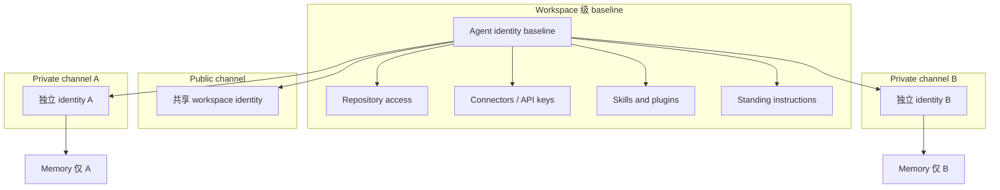
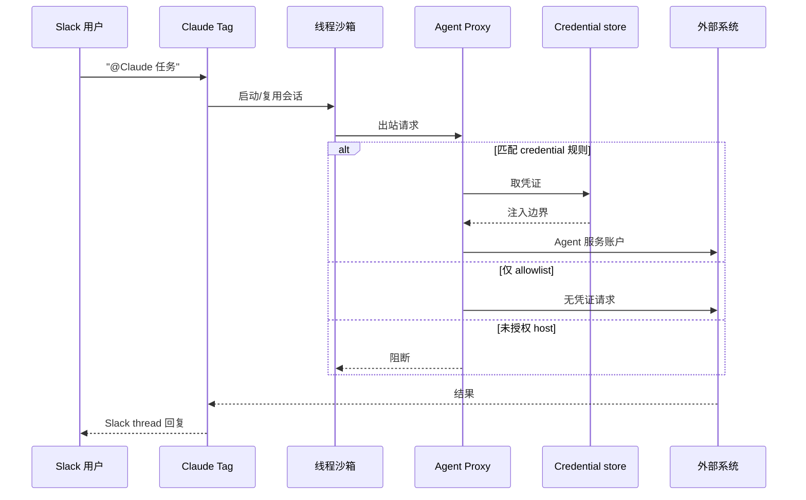

# Claude Tag：Slack 里的多人 AI 队友

> **作者**：Anthropic（产品发布 + Noah Zweben 技术博文）
> **来源**：[Introducing Claude Tag](https://www.anthropic.com/news/introducing-claude-tag) · [Agent identity 访问模型](https://claude.com/blog/agent-identity-access-model) · [Security and data handling 文档](https://claude.com/docs/claude-tag/concepts/security-and-data)
> **发布**：2026-06-23（产品）/ 2026-06-24（Agent identity 博文）
> **阅读日期**：2026-07-14
> **类型**：公司 Product / Engineering Blog
> **读者定位**：Agent 平台工程师、企业 IT/安全管理员、技术负责人
> **范围**：Claude Tag 产品定位、Agent identity 权限模型、安全架构与组织落地；不覆盖 Claude Code CLI 实现（无公开源码）

---

## 一句话

**Claude Tag 把 Claude 从「个人私聊助手」变成 Slack 频道里的共享队友——在 @ 提及即可委派任务，靠 Agent identity 按频道隔离权限与记忆，并支持异步与主动（ambient）协作。**

## 为什么值得读

- **与主流认知的差异**：不是「每人一个 Copilot DM」，而是 **频道级单一 Claude 实例 + 组织身份 + 跨工具上下文叠加**；权限问的是「这个 Agent 在这个隔间能做什么」，而非「触发者本人能做什么」。
- **与当前学习主题的关联**：把 Claude Code 的 tool loop、Skills、沙箱执行 **产品化到团队协作面**；Agent identity 是 multiplayer Agent 的访问控制范式，可与 `2026-02-11-harness-engineering` 中的「组织级 harness」对照——前者管 **谁/在哪能用什么工具**，后者管 **环境如何让 Agent 可读可验证**。

---

## Claude Tag 是什么

| 维度 | 说明 |
|------|------|
| **形态** | Slack 集成：管理员把 Claude 加入选定频道，成员 `@Claude` 委派任务 |
| **模型** | Opus 4.8（官方声称） |
| **可用性** | 2026-06-23 beta 起，Claude **Enterprise / Team** 客户可用 |
| **计费** | 组织级 consumption-based；管理员可设组织与 **单频道** token 上限 |
| **迁移** | 取代旧版 **Claude in Slack**；管理员 30 天内 opt-in 迁移；**2026-08-03** 旧集成退役 |
| **内部采用（Anthropic 声称）** | 产品团队 **65%** 代码由内部 Claude Tag 生成；用途已扩至指标追踪、工单、排障 |

**心智模型**：Claude Code / Cowork 的「分阶段用工具完成任务」不变，但 **交互面从单人会话 → 频道公共线程**，且 Claude 可持续积累频道上下文、可自排程、可在 ambient 模式下主动介入。

---

## 核心论点

### 论点 1：Multiplayer —— 一个频道一个 Claude

- **作者说**：频道内 **只有一个 Claude** 与所有人交互；任何人可见其在做什么，可接续他人对话。
- **论据**：与单人 chat / 单次任务不同，行为更像 **协作队友** 而非私有助手。
- **我的理解（事实）**：DM 仍可用，但走 **用户个人 claude.ai 账户** 与个人 connectors，与频道 Agent 身份分离（见论点 3）。

### 论点 2：持续上下文 + 异步 + 主动（Ambient）

- **作者说**：
  - Claude **随频道积累上下文**，减少重复解释；经授权可学习其他 Slack 频道与数据源（**不报告 private channel 内容**）。
  - 任务可 **异步** 执行；Claude 可 **自排程**，跨小时/天推进项目。
  - 开启 **ambient** 后，Claude **主动** 推送可能相关的信息、跟进未解决线程。
- **论据**：Anthropic 内部「并行委派多个 Claude」成为常态；Agent 可可靠完成的 **自主任务长度约每 4 个月翻倍**（Agent identity 博文）。
- **我的理解（推断）**：ambient 本质是 **事件驱动 + 频道级 memory 检索** 的产品封装；具体触发策略与 prompt 未公开，需从 audit log 与试点行为反推。

### 论点 3：Agent identity —— 从「代用户行动」到「Agent 自有账户」

- **作者说**：Multiplayer 下无法选定「谁的 GitHub/Drive 权限」；Claude 在 Slack 以 **Claude app** 发帖，在 GitHub 以 **Claude GitHub App** 开 PR，在数仓等系统用 **管理员配置的服务账户**。
- **论据**：
  - **无个人凭证** → 共享频道不会变成窥视某人私文的侧门。
  - **Workspace 级 baseline identity**，频道可 **override**（工程频道给 GitHub+数仓，CRM 仅某 private 频道）。
  - **Private channel = 独立 identity**；**Public channel 共享 workspace identity**。
  - **Memory 与 access 同边界**：legal 频道所学不会泄漏到 engineering 频道。
- **我的理解（事实 + 推断）**：
  - 频道成员 **即使本人无 repo 权限**，只要频道 profile 授予 Claude 读 repo，即可让 Claude 代读——这是 **per-channel ACL 替代 per-user ACL** 的刻意设计。
  - 撤销 identity 即 **一处撤销、处处失效**，比审计数十个用户代操作账户更易治理。
  - 未来计划 **JIT 临时授权** + **identity-aware overlay**（频道 profile **与** 请求者本人权限 **同时** 满足才行动）。

### 论点 4：安全架构 —— 沙箱 + Agent Proxy + 默认拒绝出站

- **作者说 / 文档**：每个 Slack thread 在 **独立沙箱** 运行（与 Claude Code on the web 同源托管计算）；出站经 **Agent Proxy**，凭证在 **边界注入**，沙箱与模型 **不持有密钥**。
- **论据（文档级）**：

| 检查点 | 保证 |
|--------|------|
| Sandbox | Anthropic 托管；无凭证 |
| Agent Proxy | 从 credential store 注入；**未列 host 默认 block** |
| 下游系统 | 见到的是 **Agent 服务账户**，可在外部工具 audit log 追溯 |

- **持久 vs  ephemeral**：
  - **持久**：线程、可见产出、推到 branch/PR、Slack 帖子；**频道 memory + session transcript**
  - **不持久**：仅存在于沙箱内的文件（需 push branch 或贴 thread）
  - Thread 静默后沙箱释放，回复时 **新建沙箱**
- **限制**：因 retention，**启用 Zero Data Retention (ZDR) 的组织不可用 Claude Tag**。
- **Artifact**：会话可发布 claude.ai 托管页面并贴链接；**有源频道访问权者可打开**（public 频道 ≈ 全 workspace）。

### 论点 5：DM 与 Channel 双轨 —— 个人 vs 组织

| 场景 | 身份 | Connectors | 归因 |
|------|------|------------|------|
| **Channel @Claude** | Agent identity / 服务账户 | Access bundle 内组织级连接 | Agent 在各系统日志 |
| **DM @Claude** | 用户 claude.ai | 个人 connectors | 用户本人 |

- **作者建议**：低风险的 ** broad 集成** 放 shared channel；邮件草稿、仅个人有 license 的工具 **留 DM**。
- **成员访问**：默认 workspace 内 **任何人** 可在频道 invoke（可无 Claude 账户）；Team/Enterprise 可开限制 toggle；Enterprise 可用 RBAC 限制 **谁可 invoke Claude Tag**。

---

## 与已有知识的对照

| 主题 | Claude Tag | 其他来源 | 一致性 |
|------|------------|----------|--------|
| Tool loop / 分阶段执行 | 类似 Claude Code/Cowork，@ 后拆解阶段、用工具、thread 回复 | Claude Code 产品文档 | 一致（同一产品族） |
| 权限模型 | **Agent identity / per-channel compartment** | 传统 OAuth「代用户」、MCP 用户 token | **范式转移** |
| 沙箱执行 | 线程级沙箱 + default-deny egress | `codex-note` sandbox、Claude Code web | 同类思路，Claude Tag 强调 **Agent Proxy 注凭证** |
| 组织 harness | 管理员配 tools/memory/ spend cap / audit | OpenAI Harness Engineering（AGENTS.md、doc 系统） | **互补**：Tag 管协作面与 IAM，Harness 管代码库可导航性 |
| 主动 Agent | Ambient + 自排程 | OpenClaw heartbeat、cron | 产品化「ambient」vs 开源 cron，机制待对照 |
| 记忆 | 频道级持久 memory，private 隔离 | 个人 chat history、RAG | Tag 显式 **隔间化 memory** |

---

## 工程落点

### 可观察的产品行为

1. **频道内单一 Claude**，thread 内可见工具调用与产出。
2. **Access bundle**：repos、connectors、Skills/plugins、standing instructions、Domains allowlist。
3. **Spend limit**：组织 + 频道双层。
4. **Audit**：routine、memory write、network call 均可追溯；外部系统见 Agent 账户。
5. **Artifact 链接**随 thread 发布，权限绑定源频道。

### 推断的实现手段（标明推断）

- **Memory**：likely 频道-scoped vector + transcript retention，与 identity ID 绑定；private channel 硬隔离。
- **Ambient**：likely 对频道新消息 / 连接器 webhook / 定时 routine 做 **轻量分类器 + 任务队列**，非全量 LLM 扫描（待验证）。
- **Agent Proxy**：类似 **egress gateway + secret injection**，与 Claude Code web 共用基础设施（文档明示）。

### 对自建 Agent / 平台的启发

1. **Multiplayer 必须先有 Agent 主体**：服务账户、独立 audit trail、可撤销的 identity bundle。
2. **Compartment = channel（或 project）**，不是 user session；memory 与 credential 同生命周期绑定。
3. **Broad read + narrow write** 可分层：同一 SaaS 不同 API key 只读/读写，按频道 override。
4. **沙箱 ephemeral + 显式持久化动作**（push PR / post Slack）避免「沙箱里改完就丢」。
5. **JIT 授权** 是 enterprise 下一关：长期 scope 与单次敏感操作分离。

---

## 上线四步（官方）

1. 将 Claude Tag 与 Slack workspace 配对
2. 为 Claude 配置工具连接（Access bundle）
3. 设置组织月度 spend 上限
4. 在 **private channel** 试点验证

---

## 可行动清单

1. **试点频道选型**：选 cross-functional、工具链清晰的小团队频道；baseline identity 从 **只读** 连接器开始，读 audit 再扩写权限。
2. **为每个连接建专用服务账户**（如 `claude@company.example.com`、GitHub App），避免个人 OAuth 代操作。
3. **划分 Channel vs DM 政策**：组织知识协作走 channel；个人邮件/未授权 SaaS 走 DM。
4. **设定 spend cap 与 ambient 策略**：先关 ambient，验证被动 @ 任务质量后再开 proactive，避免噪音。
5. **对照 2026-08-03 迁移窗口**：若已用 Claude in Slack，在 30 天 opt-in 期内完成 identity 与 connector 重配。

---

## 仍待验证

- [ ] Ambient 模式的 **具体触发条件** 与频率上限（文档未细述）
- [ ] 频道 memory 的 **容量、过期、人工删除** API/管理面
- [ ] Skills/plugins 与 Claude Code 仓库内 Skills 的 **格式是否 1:1 兼容**
- [ ] JIT credential grants 上线时间与交互（博文仅 roadmap）
- [ ] 与 Microsoft Teams / 其他 IM 扩展时间表（发布文称「从 Slack 开始」）

---

## 关联阅读

- 同目录：[Harness Engineering（OpenAI Codex 组织实践）](./2026-02-11-harness-engineering.md)
- 官方文档索引：https://claude.com/docs/llms.txt
- Agent identity 全文：https://claude.com/blog/agent-identity-access-model
- 产品页：https://claude.com/product/claude-tag（发布文链接）

---

*摘录完成：2026-07-14*
