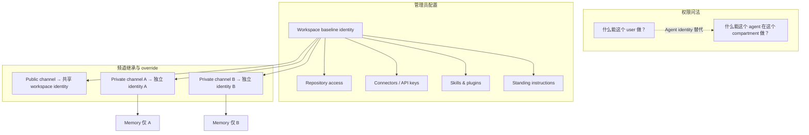
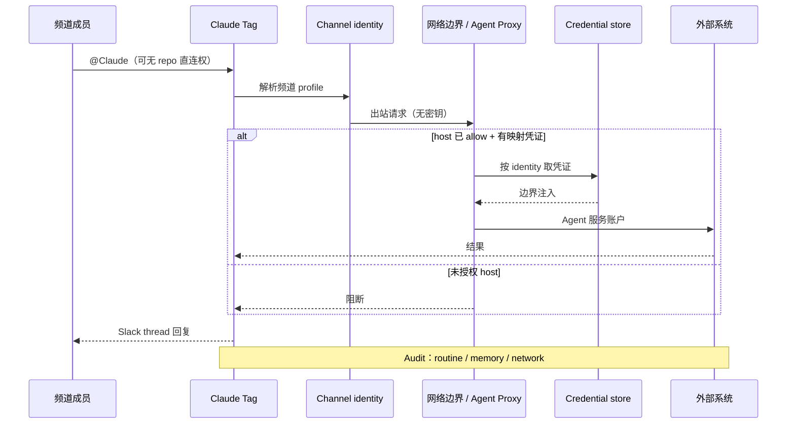

# Agent Identity：多人 Agent 的新访问模型

> **作者**：Noah Zweben（Anthropic，Claude Code 团队）
> **来源**：[Agent identity in Claude Tag: a new access model for autonomous, team-wide AI](https://claude.com/blog/agent-identity-access-model)
> **发布**：2026-06-24
> **阅读日期**：2026-07-14
> **类型**：公司 Engineering Blog
> **读者定位**：企业 IT/安全管理员、Agent 平台工程师、技术负责人
> **范围**：Claude Tag 的 **Agent identity** 权限范式、隔间边界、审计与落地建议；不覆盖 Claude Tag 产品全貌（见 [Claude Tag 笔记](./2026-06-23-claude-tag.md)）
> **完整版（浏览器）**：[2026-06-24-agent-identity-access-model.html](./2026-06-24-agent-identity-access-model.html)

---

## 一句话

**Agent identity 把权限问题从「代哪个用户行动」改成「这个 Agent 在这个隔间能做什么」——Claude 以自有服务账户接入各系统，按 workspace / 频道隔离凭证与记忆，支撑长期自治的多人协作。**

## 为什么值得读

- **与主流认知的差异**：OAuth「代用户」在 **multiplayer + 长时自治** 场景下会系统性失效；Anthropic 提出 **Agent 作为独立主体** 的 IAM 范式，而非在频道里选「谁的 token」。
- **与当前学习主题的关联**：是 [Claude Tag](./2026-06-23-claude-tag.md) 安全模型的 **权限层核心**；与 [Managed Agents](./2026-04-08-managed-agents.md) 的 sandbox 注凭证、[Harness Engineering](./2026-02-11-harness-engineering.md) 的组织 harness **互补**——前者管 **协作面 IAM**，后两者管 **执行环境与代码库可导航性**。

---

## Agent identity 是什么

| 维度 | 说明 |
|------|------|
| **定义** | 管理员为 workspace 配置的 **Claude 组织身份**：一组连接、技能与 standing instructions，绑定到 workspace 或频道，而非任何个人 |
| **触发场景** | Claude Tag 等 **multiplayer** 体验：Claude 坐在共享频道，与多人同时协作 |
| **核心转变** | 从 per-user ACL → **per-compartment（频道/隔间）ACL** |
| **归因** | Slack 以 Claude app 发帖；GitHub 以 Claude GitHub App 开 PR；数仓等以 **管理员配置的服务账户** 查询 |

**Single player vs Multiplayer**

| 模式 | 凭证来源 | 权限语义 | 典型产品 |
|------|----------|----------|----------|
| **Single player** | 用户个人 connectors | 「代我行动」 | claude.ai 私聊、个人 Claude Code |
| **Multiplayer** | Workspace / 频道 Agent identity | 「Claude 在此隔间能做什么」 | Claude Tag 频道 @Claude |

---

## 核心论点

### 论点 1：「代用户行动」在 multiplayer 下必然失败

- **作者说**：个人助手模式下，用户连接 Google Drive、GitHub、日历，模型用 **你的** 权限读写——这在 Claude Tag 行不通。
- **论据（两条结构性原因）**：
  1. **Agent 自治变长**：可靠完成的自主任务长度约 **每 4 个月翻倍**；Agent 可自排程、响应事件，发起者早已离线。
  2. **多人共 steer**：工程频道里三人一 PM 同时调试——**谁的权限** 都不可能是全局正确答案；需要管理员在 Slack 侧 **独立于参与者** 定义 Agent 能做什么，并 **独立追踪** Slack 内行为。
- **我的理解**：这不是实现细节问题，而是 **主体（subject）从 User 变成 Agent** 的 IAM 范式转移；长时自治要求权限 **不随用户 session 消失**，multiplayer 要求权限 **不绑定任一触发者**。

### 论点 2：Claude 以「自己」行动，且凭证与隔间绑定

- **作者说**：频道内 Claude **不代表单一用户**；各系统有 **Claude 自己的账户**。
- **论据**：
  - **无个人凭证** → 共享频道不会成为窥视某人私文的 **侧门（side door）**。
  - **撤销 identity** → 一处撤销、处处失效，比审计数十个「用户代操作」账户省力。
- **Identity 配置项（workspace baseline，频道可 override）**：

| 组件 | 作用 |
|------|------|
| **Repository access** | Claude 可读写的 repo 范围 |
| **Connectors** | 工具与 API key；同一 SaaS 可在不同频道用 **不同权限级** 的 key（如数仓只读 vs 读写） |
| **Skills & plugins** | 动态加载的指令、脚本与资源 |
| **Standing instructions** | 频道级自定义指令与上下文 |

### 论点 3：隔间边界——身份属于频道，记忆与访问同边界

- **作者说**：
  - **Private channel = 独立 identity**；**Public channel = 共享 workspace-level identity**。
  - Legal 频道的 Claude **碰不到** 未授予的代码；Engineering 频道的 Claude **读不到** 未授予的法律文档。
  - **Memory 尊重边界**：private 频道所学 **不会** 出现在更宽的 workspace 上下文里。
- **论据（非常规但刻意的设计）**：
  - 频道成员 **即使本人无 repo 直连权限**，只要 **频道 profile 授予 Claude 读 repo**，即可让 Claude 代读——权限挂在 **Agent + 隔间** 上，而非 **User**。
  - 默认 **频道内任何人可 @Claude**；Enterprise 可用 **RBAC** 限制 **谁可 invoke**，使频道同时治理 **Agent 能 reach 什么** 与 **谁能 ask**。
- **我的理解**：这是 **能力委托（delegation）** 模型：人类借 Agent 的隔间权限完成工作，类似「服务账户 + 项目 scope」，而非 impersonation。

### 论点 4：先给 broad 低风险访问，再 deliberate 收紧

- **作者说**：Anthropic 内部实践表明，Claude 价值随 **跨系统上下文叠加** 复利——Slack 线程 + Drive 文档 + 工单 + 数仓查询合成单一答案，单工具无法替代。
- **论据 / 建议**：
  - **Broad、低风险的集成** 放 shared channel（Agent identity）。
  - **个人或团队专属工具** 留 **DM**（见论点 5）。
  - 落地路径：**少数频道 baseline profile → 读 audit trail → 按需一次 grant 扩展**。
  - 需更细粒度时：可 **禁用特定频道的 Claude Tag**；Enterprise RBAC 限制 invoke 人群。
- **我的理解**：与零信任里「默认拒绝」表面相反，作者主张 **默认足够宽以产生 cross-tool 价值**，再用 **隔间 + audit + 撤销 identity** 控 blast radius——enterprise 场景下的 **实用主义 least privilege**。

### 论点 5：DM 双轨——频道走 Agent，私信走用户

| 场景 | 身份 | Connectors | 适用任务 |
|------|------|------------|----------|
| **Shared channel** | Agent identity / 服务账户 | 组织级 Access bundle | 跨团队、可审计的协作 |
| **DM** | 用户个人 claude.ai | 个人 connectors | 邮件草稿、仅个人有 license 的软件 |

- **作者说**：DM 结果以 **用户本人** 名义与凭证呈现；这是 **永远不应进频道** 的工作的正确容器。

### 论点 6：安全与审计——凭证在边界注入，出站默认拒绝

- **作者说**：
  - 管理员为频道 profile 添加连接时，凭证 **独立存储**，映射到该频道 identity，在 **网络边界 request time 注入**。
  - 出站 traffic 到 **未 allow 的 host 直接 block**。
  - **Audit**：routine、memory write、network call 全记录；因 Claude 用 **自有服务账户**，动作也出现在 **各连接系统自身日志**。
- **我的理解（与 Claude Tag 安全文档一致）**：沙箱/模型 **不持密钥**；Agent Proxy 做 egress gateway + secret injection——identity 是 **credential store 的索引键**。

---

## 路线图（作者披露）

| 能力 | 意图 |
|------|------|
| **JIT credential grants** | 单次敏感操作 **现场批准**，不永久扩大 Agent scope |
| **Identity-aware overlay** | 在 Agent 隔间 scope 之上叠加 **用户级 clearance**——仅当 **频道 profile 与请求者本人权限同时允许** 才行动 |

**我的理解**：当前模型是 **纯 Agent-centric compartment**；overlay 将引入 **dual authorization**（Agent scope ∧ User scope），适合多级密级组织，但会增加「谁能借 Agent 做什么」的策略复杂度。

---

## 与已有知识的对照

| 主题 | Agent identity（本文） | 其他来源 | 一致性 |
|------|------------------------|----------|--------|
| 权限主体 | **Agent 服务账户 + 频道隔间** | OAuth 代用户、个人 MCP token | **范式转移** |
| 记忆边界 | 与 identity 同 lifecycle，private 硬隔离 | 个人 chat history | Tag 显式隔间化 |
| 凭证生命周期 | 边界注入；撤销 identity 全局失效 | 用户 refresh token | 更易治理（作者声称） |
| 沙箱执行 | 出站经 proxy，未 allow 则 block | Claude Tag 安全文档、Managed Agents sandbox | **一致** |
| 组织 harness | Admin 配 tools / instructions / audit | OpenAI Harness Engineering（AGENTS.md） | **互补** |
| 未来 JIT | 临时 grant | 人类-in-the-loop tool approval（各产品） | 方向一致，实现待发布 |

---

## 工程落点

### 可观察的产品行为（Claude Tag）

1. Workspace **baseline identity**，频道 **inherit + override**。
2. Private / public 频道 **identity 分裂规则** 不同。
3. 频道内 invoke 默认开放；Enterprise **RBAC** 可收紧。
4. DM 与 channel **凭证与归因双轨**。
5. Audit 覆盖 routine、memory write、network；外部系统见 Agent 账户。

### 对自建 Agent / 平台的启发

1. **Multiplayer 必须先定义 Agent 主体**：独立服务账户、可撤销 bundle、与 user session 解耦。
2. **Compartment 是一等公民**：memory、credential、standing instructions 与 compartment ID 绑定，而非 user ID。
3. **同一 SaaS 多 API key 分层**：只读 key 给 broad channel，读写 key 仅 data team private channel。
4. **刻意允许「用户无权但 Agent 有权」**：前提是 compartment 小、audit 全、identity 可撤销。
5. **规划 dual authorization 扩展位**：长期 scope 与 JIT 单次授权分离。

---

## 可行动清单

1. **为 Claude 建专用服务账户**（GitHub App、Drive 服务账号、数仓 SA），禁止个人 OAuth 进 shared channel。
2. **从 baseline + 单 private 频道试点**：连接器先 **只读**，读 audit 后再 **一次 grant** 写权限。
3. **写清 Channel vs DM 政策**：组织知识协作 vs 个人敏感工具。
4. **按职能拆 private channel identity**：legal / eng / data 各自 bundle，避免 workspace 级 over-provision。
5. **对照 [Claude Tag 产品笔记](./2026-06-23-claude-tag.md)** 补齐沙箱、spend cap、ambient 策略。

---

## 仍待验证

- [ ] Identity-aware overlay 的 **策略表达式** 与上线时间（博文仅 roadmap）
- [ ] JIT grant 的 **UI/审批链** 与 audit 事件格式
- [ ] Public channel 共享 identity 时，**standing instructions 冲突** 如何 merge
- [ ] 频道 memory 容量、过期与 **合规删除** API
- [ ] Connectors 权限级是否在管理面 **可视化 diff**（不同频道同一 SaaS 多 key）

---

## 关联阅读

- 同目录：[Claude Tag：Slack 里的多人 AI 队友](./2026-06-23-claude-tag.md)
- 同目录：[Scaling Managed Agents](./2026-04-08-managed-agents.md)
- 官方安全文档：https://claude.com/docs/claude-tag/concepts/security-and-data

---

*摘录完成：2026-07-14*
