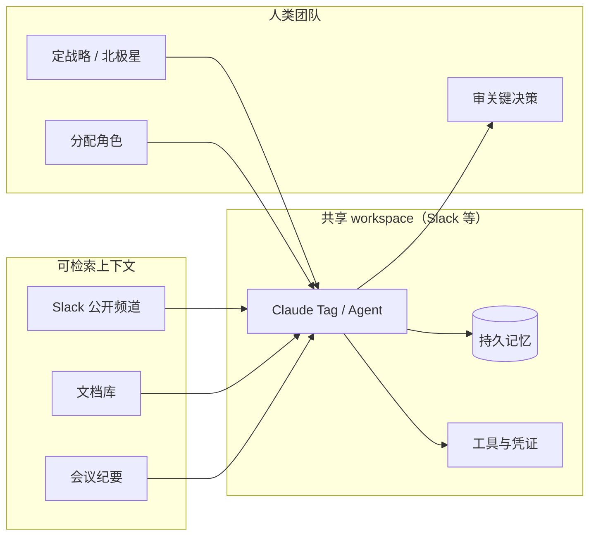

# Building effective human-agent teams：多人 Agent 协作心法

> **作者**：Kristen Swanson（Anthropic Education）
> **来源**：[Building effective human-agent teams](https://claude.com/blog/building-effective-human-agent-teams)
> **发布**：2026-06-24
> **阅读日期**：2026-07-14
> **类型**：公司 Enterprise AI Blog（Claude Tag 配套实践）
> **读者定位**：技术负责人、工程经理、企业 Agent 落地负责人
> **范围**：Anthropic 内部 multiplayer Agent 协作范式与四条落地教训；不覆盖 Claude Tag API/管理面细节（见 [Claude Tag 笔记](./2026-06-23-claude-tag.md)）
> **完整版（浏览器）**：[2026-06-24-building-effective-human-agent-teams.html](./2026-06-24-building-effective-human-agent-teams.html)

---

## 一句话

**AI 协作正从「单人单窗」变为「多人同 workspace」——人类定战略与北极星，Agent 在共享上下文与明确角色下执行；成功靠的不是新魔法，而是把公开文档、分工、质量门槛与渐进信任这些老团队习惯做到极致。**

## 为什么值得读

- **与主流认知的差异**：重点不在「更强的模型」，而在 **组织信息架构与协作规范**——Agent 只能消费「写下来且可检索」的上下文；私密走廊对话对 Agent 等于不存在。
- **与当前学习主题的关联**：是 [Claude Tag](./2026-06-23-claude-tag.md) 的 **实践层说明书**（产品管身份/工具/频道，本文管团队怎么用好）；与 [Harness Engineering](./2026-02-11-harness-engineering.md) 互补——后者让代码库对 Agent 可读可验证，本文让 **Slack/文档/会议记录** 对 Agent 可读可行动。

---

## Multiplayer agents 是什么

| 维度 | 单人 Agent（旧常态） | Multiplayer Agent（本文） |
|------|----------------------|---------------------------|
| **交互面** | 一人 ↔ 一个 chat 窗 | 多人 ↔ 同一 workspace（如 Slack 频道） |
| **记忆** | 个人会话上下文 | **持久记忆**，跨线程、跨人延续目标 |
| **身份** | 常绑定触发者个人凭证 | **独立凭证**，在安全护栏内可预测地行动 |
| **信息** | 用户当场粘贴 | **持续、广泛** 访问组织可检索文本（Slack、代码、文档、会议纪要） |
| **协作隐喻** | 单人游戏 | **多人游戏**：人类定策略，Claude 执行 |

**技术底座（必要非充分）**：

1. **Persistent memory** — 记住团队目标并据此调整执行
2. **Credentials not tied to humans** — Agent 自有账户，避免「代用户」权限混乱
3. **Ongoing broad access to information** — 学习组织如何运作，并在团队目标下行动

---

## 核心论点

### 论点 1：公开工作（Work in public）——上下文是硬通货

- **作者说**：Agent 的理解 **完全来自团队使其可检索的文本**；私信、走廊对话、受限文档对 Agent **不存在**。
- **论据**：
  - 不用「逐文档决定 Agent 能否看」，而用 **少量清晰的 workspace 级安全边界**（整个 Slack workspace、会议转录库、文档库各一层）。
  - 边界内 **上下文流向每个队友（人 or AI）**，减少「这频道该公开吗？这 Agent 能看那线程吗？」的决策疲劳。
  - 能读会议决策的 Agent 不会建议已被砍的项目；能读跨团队 spec 的 Agent 可推荐已验证模式；Agent 还能 **高速扫大量文本**，挖出人类会漏的相关工作。
- **我的理解（事实 + 推断）**：
  - **事实**：这与 Claude Tag 的频道级 memory、Agent identity 产品方向一致。
  - **推断**：「默认组织内公开」是 **RAG 召回率** 与 **合规边界** 的折中——边界粗、内部透明，比 per-item ACL 更适合 Agent 消费。
- **敏感场景**：一对一私密协作可走 **Claude Tag DM**、claude.ai 或 Cowork + **个人 MCP connectors**（对话与分享保持私有）。

**Anthropic 内部做法摘要**：

- 按安全级别划少数 workspace，文档共享策略与之对齐
- 新频道默认组织内公开；决策 **必须** 落在频道、文档、会议纪要
- **为 Agent 可发现性而写** 文档（Agent 已是文档主要消费者之一）
- 确保 AI 具备完成岗位所需的工具与信息

### 论点 2：一张花名册、明确角色与工具

- **作者说**：人机团队共享 **同一花名册、同一套 artifact、同一工作区**；不同 Agent 承担不同角色（数据分析、设计标准、研究综合等），各有凭证、Skills 与工具。
- **论据**：
  - 项目启动时，人类与 Agent **对话协商** 分工；Agent 可 **再拉起其他 Agent**，把任务交给记忆与权限更匹配的实例。
  - 工具必须 **岗位对齐**：分析 Agent 要 BigQuery，QA Agent 要 Playwright MCP。
  - 无清晰角色时，成员会在侧边栏跑 **个人 AI 舰队**，重复劳动、撕裂团队上下文（指标追踪是典型反例）。
  - 工程团队用 **roster** 固化人机分工；用 **Skill 文件** 定义 Agent 角色，便于全公司复用同类 Agent；项目变复杂时 **加 Agent**（如 release manager）。
- **我的理解**：这是 **multi-agent orchestration 的组织层抽象**——不是 prompt 里随口「你是 QA」，而是 **可版本化的角色契约 + 工具 bundle**，与 [Steering Claude Code](./2026-06-18-steering-claude-code-skills-hooks-rules-subagents.md) 中的 Skills 机制同源。

**工程团队 Agent 分工示例（博文）**：共享日常维护——分流反馈、规划、写码、审改、报状态；各 Agent **自有明确任务与 schedule**，人类定目标并审输出。

### 论点 3：北极星（North star）——让 Agent 从被动变主动

- **作者说**：在 **丰富上下文 + 清晰角色** 之上，人类写下 **宏大、可引用的长期目标**；并 **点名** 哪些 Agent 有权 **主动建议** 新工作流。
- **论据**：内部工具团队北极星为「让产品 onboarding 更有帮助」时，某 Agent **主动** 建议修改 onboarding 错误文案，次周 **可量化提升** onboarding 成功率。
- **我的理解**：
  - **事实**：并非每个 Agent 都该 proactive——需技能与信任门槛。
  - **推断**：北极星写入 persistent memory 后，ambient / 例行扫描才有 **排序函数**，否则 proactive 只会变成噪音（与 Claude Tag ambient 需配合 spend/策略管控一致）。
- **配套习惯**：保护高价值人类会议时间，会议聚焦最重要议题。

### 论点 4：渐进建立信任——Doer-Verifier 与注意力经济学

- **作者说**：按 ** demonstrated reliability** 比例授予自主性；新 Agent 像新同事，需多轮反馈才能把隐性流程外显化；模型升级后需 **重测** prompt 与护栏（旧 guardrail 可能束缚更强模型）。
- **论据**：
  - 工程师曾让团队 Agent **独立处理 500 个 bug fix**，但并非起步即如此。
  - **Doer-Verifier harness**：一 Agent 执行，另一 Agent 按 rubric / 测试 / 风格指南验收（代码有测试，文档有 rubric）。
  - **案例（工程负责人）**：
    - 两组 Agent 处理 backlog：一组标归属与复杂度，另一组对中低复杂度项出 patch；初期人类审每个决策，再教 Agent **自行上浮** 需人类权衡的项。
    - 每周要求 Agent 提交含 **「lessons & missteps」** 的报告，避免重复犯错。
    - 自主性提高后，教练 Agent **批量提问**、重复关键上下文、限制每人同时可见事项——把 **人类注意力当稀缺资源**。
  - 有人设专职 Agent 负责 **批处理与升级沟通**；有人设 **每日工作量上限**，保证人类能实质审阅且自身技能不退化。
- **我的理解**：与 [Managed Agents](./2026-04-08-managed-agents.md) 的 session 可审计、可恢复 **精神一致**——信任来自 **可验证产出 + 可追溯事件**，不是一次性放权。

---

## 与已有知识的对照

| 主题 | 本文说法 | 其他来源 | 一致性 |
|------|----------|----------|--------|
| 协作面 | 多人同 workspace，共享线程 | Claude Tag 产品文 | **一致**（产品 + 实践） |
| 权限 | Agent 独立凭证，workspace 级边界 | Claude Tag Agent identity | **一致** |
| 上下文 | 写下来才可被 Agent 消费 | Harness Engineering（AGENTS.md、结构化 doc） | **互补**（IM/会议 vs 代码库） |
| 角色定义 | Roster + Skill 文件 | Steering Claude Code（Skills） | **一致** |
| 质量 | Doer-Verifier、rubric、测试 | Harness Engineering（可验证环境） | **一致** |
| 主动 Agent | 北极星 + 指定 proactive Agent | Claude Tag ambient | **补充**（本文给组织前提） |
| 信任曲线 | 按任务类型逐步扩权 | Cognition「通宵托付」案例（公司 blog 索引） | **同类叙事**，本文更强调 **过程** |

---

## 工程落点

### 可观察行为（Claude Tag / agent teams）

1. 频道内 **@Claude** 与多人共享同一 thread 与 artifact。
2. Agent **独立凭证** 访问 BigQuery、GitHub、Playwright 等（岗位相关）。
3. Agent 可 **委派子 Agent**（博文描述；具体产品路径见 Claude Code agent teams）。
4. **DM** 保留私人协作入口。

### 推断的实现手段（标明推断）

- **Broad context**：likely 频道 + workspace 连接器索引 Slack/文档/转录，受 security boundary 过滤。
- **Roster / Skills**：likely 频道级 standing instructions + Skills 文件映射到 Agent 角色模板。
- **North star**：likely 写入频道 memory 或 pinned doc，供 proactive routine 检索。
- **Doer-Verifier**：likely 同频道两次 @ 或 agent teams 内多实例编排（机制未公开）。

### 对自建 Agent 平台的启发

1. **先设计信息架构，再上 Agent**：无公开可检索上下文，multiplayer 必败。
2. **角色 = 工具 bundle + memory 范围 + Skill**，可登记在花名册上。
3. **Proactive 是特权**：需北极星 + 信任分级 + 人类注意力预算。
4. **验证链是一等公民**：每种 artifact 类型都应有自动验收路径。
5. **扩权粒度到「任务类型」**，不是全局 on/off。

---

## 官方自检五问

1. Agent 与人类所需信息是否 **公开且可广泛检索**？
2. 能否写下 **花名册** 并说明每个成员（人/Agent）负责什么？
3. 每个成员是否有 **正确工具**？
4. 关键产出是否有 **rubric 或测试** 供人机验收？
5. 团队是否有 **清晰北极星** 可供引用？

---

## 可行动清单

1. **划 2–3 个 security boundary**（如「全公司工程 Slack」「客户数据隔离区」），边界内默认公开；敏感一对一走 DM。
2. **建人机花名册**：频道置顶 doc 或 roster 表——人负责 judgment/审批，Agent 负责可验证的执行类任务。
3. **为每类 Agent 写 Skill 文件**（角色、范围、工具、验收标准），与 [Claude Code Skills 实践](./2026-06-03-lessons-from-building-claude-code-skills.md) 对齐。
4. **写一句北极星** 并指定 **最多 1–2 个** 可 proactive 建议的 Agent；其余保持任务驱动。
5. **上线 Doer-Verifier**：执行与验收拆实例；为文档等非代码产出写 rubric。
6. **设人类注意力护栏**：批处理提问、每周 lessons 报告、每日待审上限。

---

## 仍待验证

- [ ] 「Agent 再拉起 Agent」在 Claude Tag 与 Claude Code agent teams 中的 **具体入口与权限继承**
- [ ] Workspace 级 security boundary 在 Claude Tag 管理台的 **配置项名称与默认值**
- [ ] Proactive 建议是否 **可关闭/按 Agent 粒度** 配置（博文描述原则，产品 UI 待对照）
- [ ] 「每周 lessons & missteps」是否有 **模板或自动化 routine** 示例

---

## 关联阅读

- 同目录：[Claude Tag：Slack 里的多人 AI 队友](./2026-06-23-claude-tag.md)
- 同目录：[Scaling Managed Agents](./2026-04-08-managed-agents.md)
- 同目录：[Steering Claude Code](./2026-06-18-steering-claude-code-skills-hooks-rules-subagents.md)
- 同目录：[Harness Engineering（OpenAI）](./2026-02-11-harness-engineering.md)
- 原文致谢贡献者：Matt Bell、Erik Olesund、Hasnain Lakhani 等

---

*摘录完成：2026-07-14*
