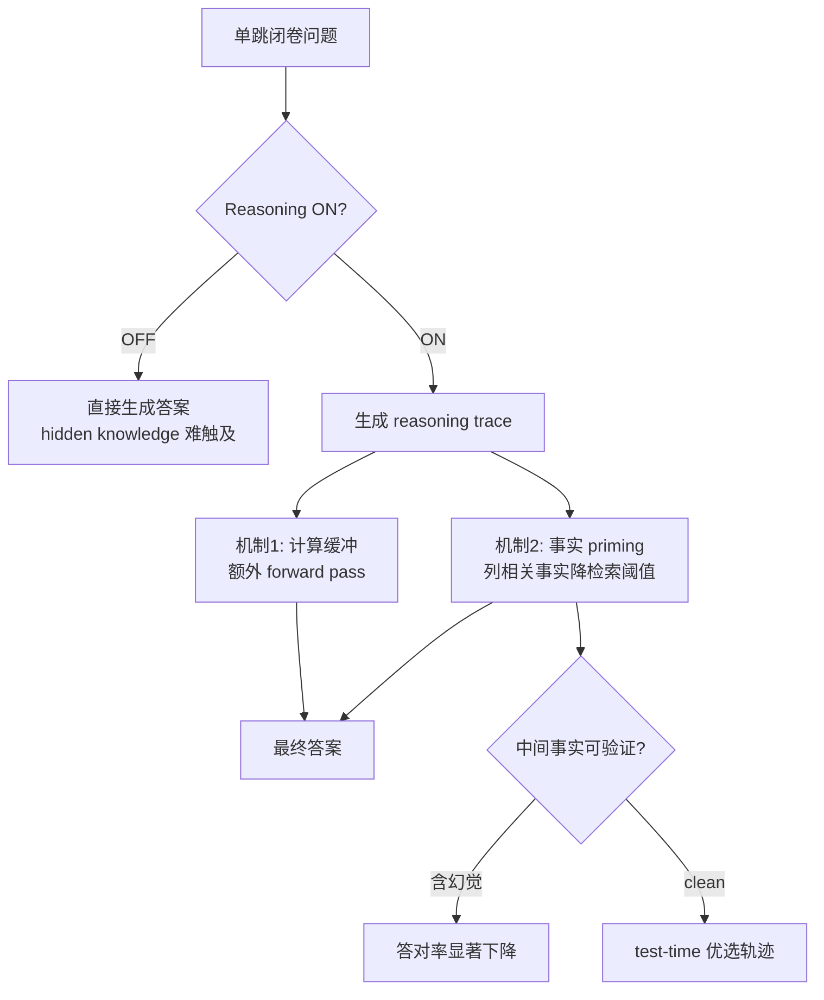

# Thinking to Recall：Reasoning 如何解锁 LLM 的参数记忆

> **作者**：Zorik Gekhman、Jonathan Herzig（Google Research）；论文合著 Roee Aharoni、Eran Ofek、Mor Geva、Roi Reichart
> **来源**：[Google Research Blog](https://research.google/blog/thinking-to-recall-how-reasoning-unlocks-parametric-knowledge-in-llms/) · [arXiv:2603.09906](https://arxiv.org/abs/2603.09906) · COLM 2026
> **发布**：2026-06-24
> **阅读日期**：2026-07-14
> **类型**：公司 Research Blog（配套论文解读）
> **读者定位**：算法工程师、R-LLM 产品/评测工程师、Agent 系统工程师
> **范围**：博文核心论点、实验叙事与工程启发；方法细节与完整数字见 [`papers/2026-06-24-thinking-to-recall.md`](../papers/2026-06-24-thinking-to-recall.md)

---

## 一句话

**在简单单跳闭卷问答上，开启 reasoning 能显著扩展模型的参数知识召回边界——主要靠「多算几步」的计算缓冲与「先列相关事实」的事实 priming，而非任务分解；但中间事实一旦幻觉，最终答案会明显变差。**

## 为什么值得读

- **与主流认知的差异**：CoT / thinking 常被当成「复杂题专用」（数学、代码、多跳推理）；本文用 controlled ablation 证明，**连「模型权重里已有、直接生成却采不出」的简单事实**，reasoning 也能解锁——且增益在高 pass@\(k\) 上更明显，说明是 **扩展能力边界** 而非仅 sharpen top-1。
- **与当前学习主题的关联**：直接解释 Gemini / Qwen 等 hybrid R-LLM 为何要为「简单 factual QA」保留 thinking budget；为 Agent 的 **best-of-N 轨迹筛选、process reward、自检索 vs 外部 search** 提供可验证的设计原则。

---

## 核心论点

### 论点 1：Reasoning 扩展参数知识边界，而非只做任务分解

- **作者说**：在 SimpleQA Verified、EntityQuestions 等 **以单跳题为主** 的闭卷 QA 上，Gemini-2.5（Flash/Pro）与 Qwen3-32B 在 reasoning ON 时的 pass@\(k\) 曲线 **一致高于** OFF；OFF 时几乎采不到的正确答案，ON 时可在多次采样中出现。
- **论据**：用 hybrid R-LLM（同一权重、reasoning 可开关）控制变量；pass@\(k\) 衡量「正确答案是否在输出分布里」，比 pass@1 更能反映 **潜在召回能力**（博文 Figure 1）。
- **我的理解（事实）**：这与作者前作 *Inside-out hidden knowledge*（COLM 2025）一脉相承——问题不是「模型没学过」，而是 **direct generation 触达不到**；reasoning 是暴露内部记忆的协议。复杂题分解 **不是** 主因：Simple vs Complex 子集增益无显著差异（论文 §3.2，博文未展开数字）。

### 论点 2：机制一 —— 计算缓冲（Computational Buffer）

- **作者说**：把 reasoning trace 替换成重复的无意义句 `"Let me think"`（长度匹配原 trace），最终答案召回仍 **显著优于** reasoning 完全关闭——说明 **额外 token / forward pass** 本身就在做 latent 计算，与 trace 语义无关。
- **论据**：ON Dummy 实验（博文 Figure 2）；但 dummy 再长会饱和，且 **永远达不到** 自然 reasoning trace 的上限（博文 Figure 3，指标 \(\Omega\) 汇总各 \(k\) 的相对增益）。
- **我的理解（推断）**：对 Gemini 类产品，「thinking token 预算」有独立价值——即使 trace 质量一般，也给模型 **整理内部状态的时间**；但不能指望用 filler 完全替代有内容的思考。

### 论点 3：机制二 —— 事实 Priming（Generative Self-Retrieval）

- **作者说**：自然 reasoning trace 常见模式不是写证明，而是 **先 surface 相关事实**（类比人类 spreading activation）；从 trace 提取纯事实列表后，用 **ON Facts** 或 **OFF Facts** 条件生成，可 **恢复大部分** reasoning 增益。
- **论据**：尼泊尔第 10 任国王案例——先列前 9 任再答对第 10 任；仅 fact list 也能在 reasoning OFF 时答对（博文 Figure 4–5）。
- **我的理解（事实 + 推断）**：这是 **自举式轻量 RAG**——模型用生成的事实搭语义桥，降低目标答案检索阈值。工程上可显式 prompt「先列出与问题相关的已知事实，再作答」，而不必等模型自发写出长 trace。

### 论点 4：幻觉中间事实是脆弱点，也是改进杠杆

- **作者说**：对数十万 reasoning trace 做 search 逐条验 fact；**只要 trace 中含一条幻觉中间事实**，最终答对概率就大幅下降（博文 Figure 6）。
- **论据**：Test-time 生成多条轨迹，只保留 **可验证、无幻觉事实** 的路径（Only Correct Facts），期望准确率相对 Regular 提升约 **5–12%**（博文 Figure 7；论文 Table 1 有分数据集数字）。
- **我的理解（事实）**：与「reasoning 天然更可靠」的叙事 **相反**——自检索有效，但 **错误事实会污染 priming**。训练侧可用 **process reward 奖励可验证中间步**；推理侧用 fact verifier 做轨迹筛选，比纯长度或自信度更靠谱。

---

## 与已有知识的对照

| 主题 | 本文说法 | 其他来源 | 一致性 |
|------|----------|----------|--------|
| Reasoning 适用场景 | 简单 factual QA 也受益 | 主流产品文案偏「复杂任务开 thinking」 | **补充** — 应按 **召回难度** 路由，而非任务表面复杂度 |
| pass@\(k\) vs pass@1 | 高 \(k\) 增益更大 → 边界扩展 | 数学推理上常见 probability sharpening（高 \(k\) 无增益） | **矛盾于任务类型** — factual recall 与 math 机制不同 |
| 中间步质量 | 幻觉 fact 拖累最终答案 | OpenClaw-RL PRM 对 next-state 打分 | **补充** — PRM 粒度应下沉到 **fact-level**，见 `papers/2026-03-10-openclaw-rl.md` |
| 自检索 vs 工具检索 | 生成事实可 priming 参数记忆 | Agent harness 常默认 search/RAG | **补充** — 先自检索，失败或验不过再 fallback search |
| Hidden knowledge | 权重有、生成无 | Gekhman COLM 2025 同作者线 | **一致** |
| Concurrent work | pass@\(k\) + 机制分离 | Ma & Hewitt 2026；Calderon et al. 2026 | **补充** — 本文 ablation 更细（Dummy / Facts 因果链） |

---

## 工程落点（Google Research 视角）

### 产品 / 模型上可观察的行为

- **Hybrid R-LLM 设计**：Gemini-2.5 Flash/Pro 作为实验载体，说明 Google 已在产品层区分 **reasoning ON/OFF** 同一套权重——用户切换 thinking 不只是「多写几步」，而是改 **参数召回协议**。
- **弱模型收益更大**：Qwen3-32B 的 \(\Omega\) 高于 Gemini Pro（论文 Figure 2）→ 对 **参数召回效率较低** 的模型，开 reasoning 的 ROI 更高；可作 **模型路由** 信号。

### 合理推断的实现手段

- **Thinking 阶段**：额外 autoregressive forward pass 作为 latent workspace；与「pause token / thinking block」产品形态一致（推断）。
- **Test-time selection**：博文描述的 Only Correct Facts 策略，落地为 **N 条 thinking 轨迹 + search/verifier 过滤中间 fact + 选最优**——与 Gemini 多候选内部机制可能同源（推断，无公开源码）。
- **训练 recipe**：process reward 鼓励 **可事实支撑的中间陈述**，而非仅最终答案正确——与 RLVR / PRM 方向对齐。

### 对自建 Agent / 评测的启发

| 场景 | 建议 |
|------|------|
| Factual 子任务 | 勿默认关 reasoning；对「模型应该懂」却答错的题，试 **ON + best-of-N** |
| Best-of-N 筛选 | 优先 **无幻觉中间事实** 的轨迹，其次才是长度/置信度 |
| Prompt 设计 | 显式两阶段：「先列相关已知事实（勿猜最终答案）→ 再作答」 |
| Eval | 报告 **pass@\(k\) ON vs OFF**，不只 pass@1；区分 hidden-knowledge 题 |
| 幻觉防护 | 自生成 fact 验不过时 **切断 priming 链**，改走 search tool |

---

## 可行动清单

1. **评测**：在闭卷 factual benchmark 上增加 reasoning ON/OFF × pass@\(k\) 对照，识别「hidden knowledge」题型占比。
2. **推理管线**：对 factual QA 实现 **generate N thinking paths → fact verifier → 选 clean 轨迹**，复现 Only Correct Facts 思路。
3. **Prompt**：为 Agent 增加「相关事实预热」阶段，并禁止在预热中泄露/猜测最终答案（对齐论文 fact 提取过滤规则）。
4. **路由**：弱模型或高 miss 率 factual 任务 **默认开 reasoning**；强模型可权衡 latency，但勿仅凭「单跳」关 thinking。
5. **训练/RL**：若用 process reward，奖励粒度下沉到 **可验证的 intermediate facts**，而非整段 CoT 格式正确。

---

## 仍待验证

- [ ] 论文是否发布官方代码 / 审计 pipeline（博文未给 repo）
- [ ] Dummy trace 最优长度是否随题目「召回难度」变化，能否 adaptive thinking budget
- [ ] 机制在 **RAG + reasoning** 混合场景是否仍成立（本文 strictly closed-book）
- [ ] Gemini 产品层 test-time selection 是否已内置 fact-level 过滤（无公开细节）

---

## 关联阅读

- **论文精读**：[`papers/2026-06-24-thinking-to-recall.md`](../papers/2026-06-24-thinking-to-recall.md)（ablation 设计、完整数字、局限）
- **PRM / 过程奖励**：[`papers/2026-03-10-openclaw-rl.md`](../papers/2026-03-10-openclaw-rl.md)
- **Agent harness**：[`company-blogs/2026-02-11-harness-engineering.md`](./2026-02-11-harness-engineering.md) — reasoning 作为 **内存暴露层** 的系统视角
- **原文**：[Thinking to recall — Google Research Blog](https://research.google/blog/thinking-to-recall-how-reasoning-unlocks-parametric-knowledge-in-llms/)

---

*摘录完成：2026-07-14*
