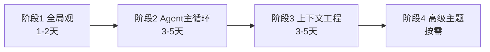
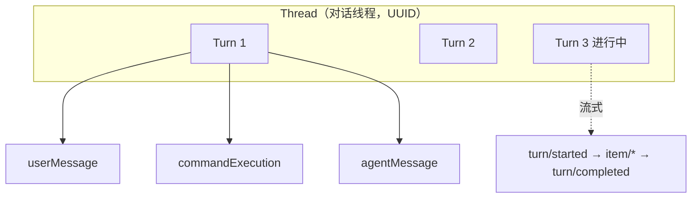
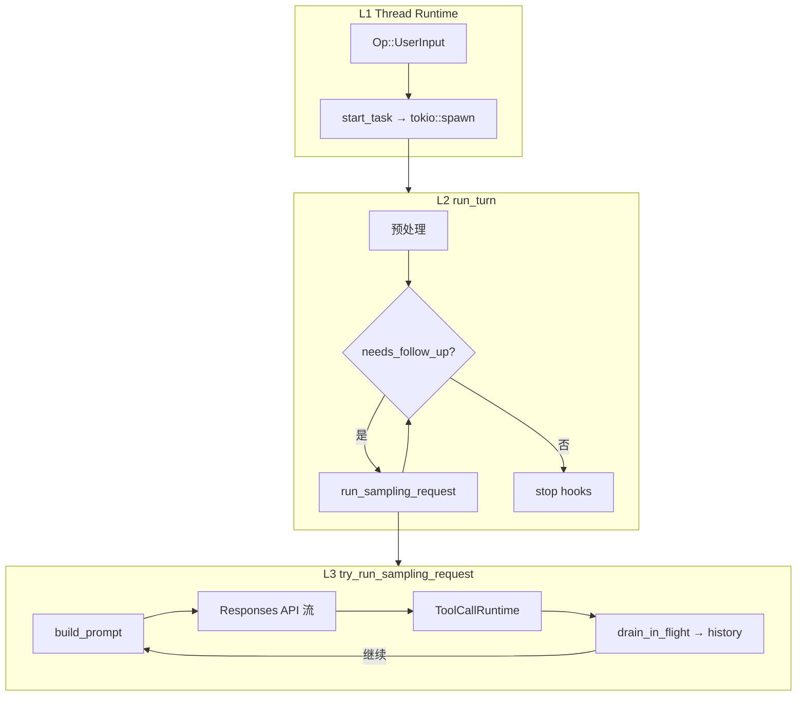
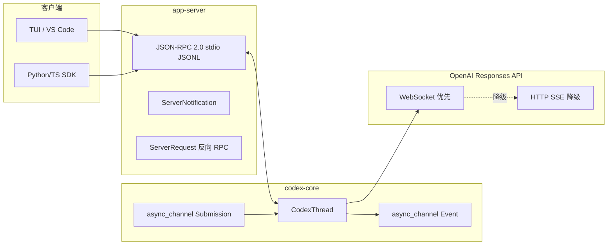
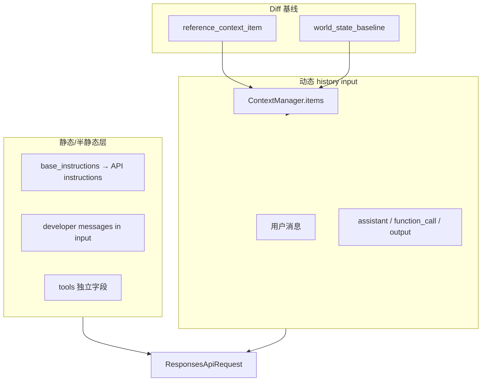
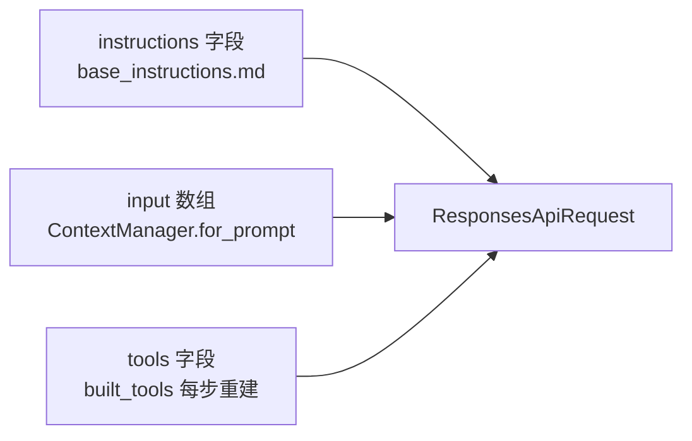
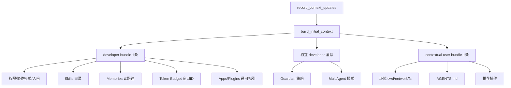
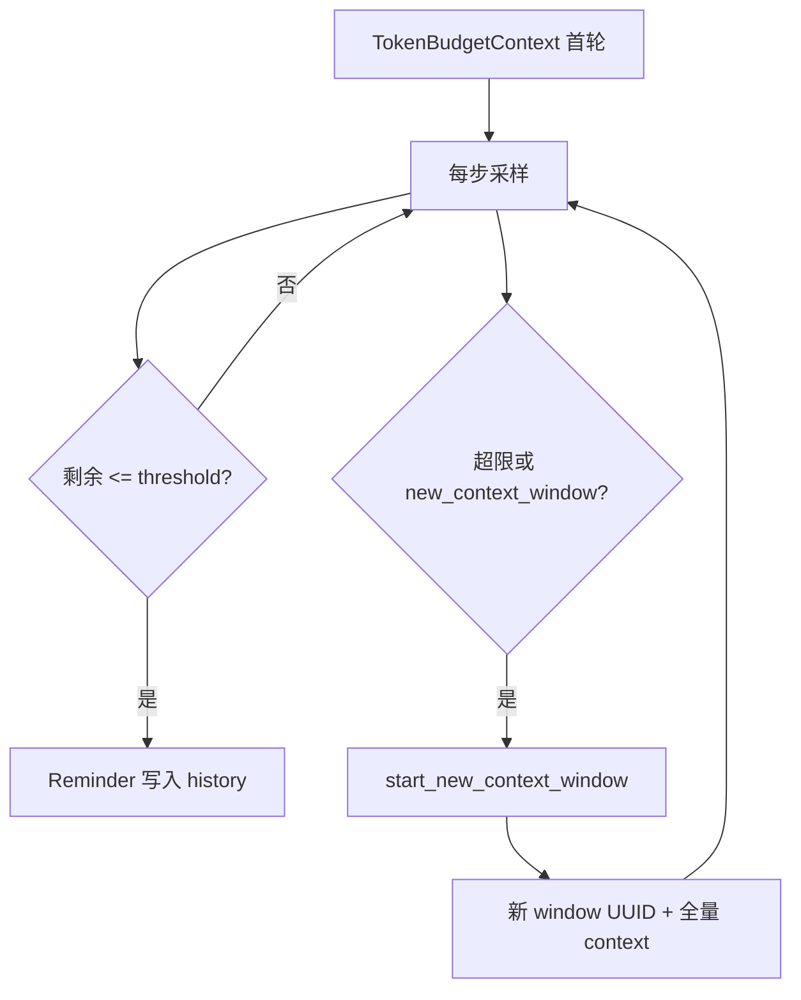

# Codex 算法工程师学习笔记（会话整合）

> **来源**：Cursor 会话 `d93accac-a75c-4f94-8e37-99d2d212b2a5`（2026-07-10 ~ 2026-07-11）  
> **仓库**：`e:\codex`（Rust 核心在 `codex-rs/`）  
> **读者定位**：算法工程师，关注 Agent 循环、上下文工程、模型通信

---

## 目录索引

| 章节 | 主题 | 关键文件 |
|------|------|----------|
| [§1](#1-仓库结构与学习路径) | 仓库结构与学习路径 | `codex-rs/core/README.md` |
| [§2](#2-thread--turn--event) | Thread / Turn / Event | `app-server/README.md`, `protocol/src/protocol.rs` |
| [§3](#3-核心循环推理范式与-runtime) | 核心循环、推理范式、Runtime | `core/src/session/turn.rs` |
| [§4](#4-clientserver-与-llm-api-通信) | Client/Server 与 LLM API 通信 | `app-server-transport/`, `core/src/client.rs` |
| [§5](#5-上下文工程压缩与记忆) | 上下文工程、压缩、记忆 | `context_manager/`, `compact.rs` |
| [§6](#6-模型上下文构造与-api-拼接) | 模型上下文构造与 API 拼接 | `session/mod.rs`, `context_manager/`, `client.rs` |
| [§7](#7-token-budget--rollout-budget--集成测试) | Token/Rollout Budget、集成测试 | `token_budget_context.rs`, `tests/suite/` |
| [附录 A](#附录-a-关键代码文件速查) | 关键代码文件速查 | — |
| [附录 B](#附录-b-推荐实验命令) | 推荐实验命令 | — |

---

## 1. 仓库结构与学习路径

### 1.1 顶层结构

```
e:\codex\
├── codex-rs/     ← 核心：~100+ Rust crate，Agent 大脑
├── sdk/          ← Python/TS SDK（基于 app-server）
├── docs/         ← 贡献/安装文档
├── .codex/skills/← 内置 skill 示例
└── bazel/        ← Bazel 构建（日常用 just）
```

**算法工程师最该关注**：`codex-rs/core/`（session、turn、context、tools、compact、client）。

### 1.2 核心 Crate 地图（精简）

| 层次 | Crate / 模块 | 职责 |
|------|---------------|------|
| 入口 | `cli`, `exec`, `tui` | 命令行 / 非交互 / 终端 UI |
| 线程 | `core/thread_manager`, `codex_thread` | Thread 生命周期 |
| 会话枢纽 | `core/session/` | 状态机、上下文更新、事件发送 |
| Turn 循环 | `core/session/turn.rs` | Agent 主循环 |
| 上下文 | `core/context/`, `context_manager/` | Fragment 注入与 history |
| 工具 | `core/tools/`, `tools/` | ToolRouter、执行、MCP |
| 模型 | `core/client.rs`, `codex-api/` | Responses API / WebSocket |
| 协议 | `protocol/`, `app-server-protocol/` | Event、ResponseItem、v2 API |
| 扩展 | `core-skills`, `memories/`, `hooks/` | Skill、记忆、Hook |

### 1.3 四阶段学习路径



| 阶段 | 目标 | 必读 |
|------|------|------|
| 1 | 知道输入→模型→工具的链路 | `core/README.md`, `app-server/README.md` |
| 2 | 理解 ReAct 循环 | `tasks/regular.rs` → `session/turn.rs` |
| 3 | 理解模型看到什么 | `context-fragments/`, `context_manager/history.rs` |
| 4 | 多 Agent / Skills / Code Mode | 按兴趣选读 |

**Top 5 深入模块**：`turn.rs` · `context/` · `compact.rs` · `tools/` · `core/tests/suite/`

**AGENTS.md 上下文设计原则**（必须遵守）：
1. 不 rewrite history，增量构建  
2. 避免频繁变更导致 cache miss  
3. 所有注入有界、有硬上限  
4. 单项 ≤ 10K tokens  
5. 新 fragment 实现 `ContextualUserFragment` trait  

---

## 2. Thread / Turn / Event

> 官方定义：`app-server/README.md` → Core Primitives

### 2.1 三层关系



| 概念 | 类比 | 要点 |
|------|------|------|
| **Thread** | 聊天窗口 | 含配置、完整历史；对外 Thread = 内部 Session（同 UUID） |
| **Turn** | 一次用户发起到 Agent 完结 | 内部可有多次 model↔tool 循环 |
| **Item** | 气泡/记录单元 | 持久化，供后续上下文 |
| **Event** | 实时进度推送 | 驱动 UI，部分写入 rollout |

### 2.2 代码映射

**ThreadId ≈ SessionId**（`protocol/src/session_id.rs`）

**Rollout 持久化**（`protocol/src/protocol.rs`）：

```rust
pub enum RolloutItem {
    SessionMeta(...),
    ResponseItem(...),      // 发给模型的原始消息
    Compacted(...),         // 压缩摘要
    TurnContext(...),       // Turn 配置快照
    WorldState(...),        // 环境状态快照
    EventMsg(...),          // UI/客户端事件
}
```

**Turn 状态**（`app-server-protocol/src/protocol/v2/turn.rs`）：`inProgress` / `completed` / `interrupted` / `failed`

### 2.3 Event 两层含义

| 层 | 类型 | 用途 |
|----|------|------|
| Core 内部 | `EventMsg`（`protocol/src/protocol.rs`） | 引擎事件：`TurnStarted`, `ExecCommandBegin`, `TokenCount`… |
| App-server 对外 | JSON-RPC 通知 | `turn/started`, `item/agentMessage/delta`, `turn/completed` |

**关键区分**：Item = 结构化历史记录；Event = 流式通知（可很细，如 text delta）。

### 2.4 算法工程师必记

- **一个 Turn ≠ 一次模型调用**；一次 Turn 内可多次 Sampling。  
- 用户再次 `turn/start` 才开新 Turn。  
- Core 里 `sub_id` ≈ app-server 的 `turnId`。

---

## 3. 核心循环、推理范式与 Runtime

### 3.1 三层嵌套循环



| 层级 | 函数 | 粒度 |
|------|------|------|
| L1 | `Session::start_task` | Thread 级任务调度 |
| L2 | `run_turn` | 一次用户 Turn |
| L3 | `try_run_sampling_request` | 一次模型请求（ReAct 单步） |

### 3.2 推理范式：受约束的 ReAct

`session/turn.rs` 注释要点：

- 模型每步返回：function call **或** assistant message  
- **实践中每步 0~1 个工具调用**（降低状态复杂度）  
- 有 function call → 执行 → 再采样；仅 assistant message → Turn 可结束  

**`needs_follow_up`** = `model_needs_follow_up || has_pending_input`（模型要继续 **或** 用户 steer）

### 3.3 Prompt 结构（单次 Sampling 输入）

```rust
// client_common.rs
pub struct Prompt {
    pub input: Vec<ResponseItem>,           // history + context fragments
    pub tools: Vec<ToolSpec>,               // 工具 schema（不进 history）
    pub base_instructions: BaseInstructions,  // → API instructions 字段
    pub parallel_tool_calls: bool,
    pub output_schema: Option<Value>,
}
```

### 3.4 Runtime 组件

| Runtime | 文件 | 职责 |
|---------|------|------|
| **Task Runtime** | `tasks/mod.rs` | `SessionTask` + `tokio::spawn` + `CancellationToken` |
| **StepContext** | `session/step_context.rs` | 采样步不可变快照（cwd、MCP、AGENTS.md） |
| **ToolCallRuntime** | `tools/parallel.rs` | 工具路由、审批、沙箱、并行锁 |
| **ModelClientSession** | `client.rs` | Turn 级 WebSocket 复用、sticky routing |
| **HookRuntime** | `hook_runtime.rs` | sessionStart / userPromptSubmit / preCompact / stop… |
| **Unified Exec** | `unified_exec/` | 长期 PTY 进程 |
| **Code Mode** | `code-mode/` | 模型写 JS 编排工具 |

### 3.5 五个关键设计决策

1. **一步一工具**（实践中）  
2. **StepContext 快照**防环境漂移  
3. **History 只追加**，compact 有专门 reinject  
4. **Mid-turn compact**（token 超限不中断 Turn）  
5. **Steer**（`pending_input` 中途注入）  

---

## 4. Client、Server 与 LLM API 通信

### 4.1 三条通信链路



### 4.2 Client ↔ app-server

- **传输**：stdio JSONL（`app-server-transport/src/transport/stdio.rs`）  
- **协议**：JSON-RPC 2.0  
  - Client → Server：`thread/start`, `turn/start`…  
  - Server → Client：通知 `turn/started`, `item/*/delta`, `turn/completed`  
  - **反向 RPC**：`ServerRequest`（审批等，客户端必须响应）  

Python SDK 用 `_message_router.py` 分发 request/response/notification。

### 4.3 app-server ↔ core

- `CodexThread.submit(Op)` → `async_channel` 提交队列  
- `CodexThread.next_event()` → 事件接收队列  
- app-server 在 `thread_lifecycle.rs` 挂 listener，把 `EventMsg` 翻译成 v2 通知  

### 4.4 core ↔ LLM

- `ModelClientSession`（Turn 级复用）  
- **WebSocket 优先**（`codex-api/endpoint/responses_websocket.rs`）  
- 失败降级 **HTTP SSE**（`codex-api/sse/responses.rs`）  
- 流事件：`OutputTextDelta`, `OutputItemDone`, `Completed`…  

### 4.5 异步原语

| 原语 | 用途 |
|------|------|
| `async_channel` | Submission 队列、Event 广播 |
| `tokio::spawn` | Turn 任务、流消费 |
| `oneshot` | 审批等待（exec/patch approval） |
| `CancellationToken` | Turn interrupt |
| `FuturesOrdered` | 工具并行完成顺序 |

### 4.6 审批双向流示例

```
core: 需要执行危险命令
  → EventMsg::ExecApprovalRequest
  → app-server: ServerRequest → 客户端 UI
  → 用户点击批准
  → 客户端 JSON-RPC response
  → core oneshot 唤醒 → 继续执行工具
```

---

## 5. 上下文工程、压缩与记忆

### 5.1 上下文体系总览



### 5.2 ContextManager

**文件**：`core/src/context_manager/history.rs`

```rust
pub(crate) struct ContextManager {
    items: Vec<ResponseItem>,              // 对话 transcript
    reference_context_item: Option<TurnContextItem>,  // settings diff 基线
    world_state_baseline: Option<WorldStateSnapshot>, // 环境 diff 基线
}
```

- `for_prompt()`：规范化后作为 `Prompt.input`  
- `reference_context_item == None` → 下轮**全量**注入 initial context  
- 有 baseline → 只注入 **diff**  

### 5.3 ContextualUserFragment

**Trait**：`context-fragments/src/fragment.rs`

- 每个注入片段定义 `role()`、`markers()`、`body()`  
- `render()` → 带标记的文本  
- `into()` → `ResponseItem::Message`  

### 5.4 压缩（Compact）

| 类型 | 入口 | 策略 |
|------|------|------|
| **本地 compact** | `compact.rs` | `SUMMARIZATION_PROMPT` 本地摘要 |
| **Remote V2** | `compact_remote_v2.rs` | 模型/API 侧压缩 |
| **Token Budget** | `compact_token_budget.rs` | **不摘要**，直接 `start_new_context_window` |

压缩后 `build_compacted_history` 保留用户消息 + 摘要，并 reinject initial context。

### 5.5 记忆（Memories）

- **写入**：Phase1/Phase2 pipeline（`memories/write/`）  
- **读取**：developer 指令（extension `contribute_thread_context`）+ `memory_*` 工具  
- 存储：`~/.codex/memories/`  
- **不**每轮全量注入记忆正文；引导模型用工具读取  

---

## 6. 模型上下文构造与 API 拼接

> 本节合并原「ContextManager 构造」与「developer vs system」——从 history 组装到 API wire 形态，一条链路读完。

### 6.1 最终 API 三层（标准模式）



**核心结论**：Skills、环境、AGENTS.md 等进 `input`；工具 schema **不进 history**。

### 6.2 首轮 Turn（`reference_context_item == None`）

**入口**：`run_turn` → `record_context_updates_and_set_reference_context_item` → `build_initial_context_with_world_state`



**History 写入顺序**（`session/turn.rs`）：

1. 全量 context items（developer + user bundles）  
2. **用户真实输入**（`run_hooks_and_record_inputs`）  
3. **Skill/Plugin 注入**（`build_skills_and_plugins`，仅 @mention 时）  

### 6.3 各片段 role 分配表

| 内容 | role | 位置 |
|------|------|------|
| 模型 base prompt | — | API `instructions` |
| 权限、协作模式、人格 | `developer` | developer bundle |
| Skills **目录** | `developer` | developer bundle |
| Memories 读路径 | `developer` | developer bundle |
| Token Budget 窗口 ID | `developer` | developer bundle（仅首轮） |
| 环境信息 | `user` | contextual user bundle |
| AGENTS.md | `user` | contextual user bundle |
| 推荐未安装插件 | `user` | contextual user bundle |
| MultiAgent 模式 | `developer` | 独立 developer message |
| Skill **全文**（mention） | `user` | `<skill>` 独立 message |
| Plugin 指引（mention） | `developer` | 独立 message |
| 工具 schema | — | API `tools` 字段 |

**World state 构建**：`session/world_state.rs` → `AgentsMdState`（user）、`EnvironmentsState`（user）、`AppsInstructionsState`（developer）…

### 6.4 后续 Turn（有 baseline）

`record_context_updates` 走 diff 路径（`session/mod.rs`）：

1. **`build_settings_update_items`**：模型切换、权限、协作模式、MultiAgent、Realtime、人格 → 合并 1 条 developer（有变才发）  
2. **`update_world_state`**：环境/AGENTS.md diff → user/developer fragment  
3. **`build_turn_context_contribution_items`**：extension per-turn 贡献（`turn_context_changed` 时）  

**不再每轮重复**：Skills 目录、Token Budget 窗口 ID、Memories 读路径、推荐插件。

### 6.5 同 Turn 内多步采样

- 每步：`clone_history().for_prompt()` + `built_tools()` 重建 tools  
- `instructions`（base_instructions）不变  
- history 累积 assistant / function_call / function_call_output  

### 6.6 developer vs system 与 API 拼接

#### 6.6.1 developer ≈ system？—— 两层分工

| 层级 | API 位置 | 内容 | 类比 Chat API |
|------|----------|------|---------------|
| **第一层** | `instructions` 字段 | `base_instructions`（模型 `.md`） | `role: system` 主 prompt |
| **第二层** | `input` 里 `role: developer` | 权限、Skills 目录、动态策略 | 额外 system/developer 块 |

**语义上** `developer` ≈ 系统指令；**API 上**不与 `instructions` 字符串拼接。

#### 6.6.2 客户端是否合并？—— 不会

`build_responses_request`（`core/src/client.rs`）：

```rust
// 标准模式
(instructions, tools) = (
    prompt.base_instructions.text.clone(),
    Some(tools),
);
// input 里 developer 消息原样保留

// responses_lite 模式
instructions = "";
// base_instructions → input 最前 developer message
// tools → AdditionalTools developer item
```

#### 6.6.3 标准模式请求体示意

```json
{
  "instructions": "<base_instructions 全文>",
  "tools": [ ... ],
  "input": [
    { "role": "developer", "content": [
        { "type": "input_text", "text": "<permissions>" },
        { "type": "input_text", "text": "<skills catalog>" }
    ]},
    { "role": "user", "content": ["<环境+AGENTS.md>"] },
    { "role": "user", "content": ["用户输入"] }
  ]
}
```

#### 6.6.4 OpenAI 接口能力

- 顶层 `instructions`：**1 个字符串**  
- `input` 内 `role: developer`：**可多条**  
- 顶层 `tools`：**1 个数组**（标准模式）  
- **允许** `instructions` + 多条 developer **并存**，客户端不 merge  

#### 6.6.5 developer bundle 内部合并方式

`context_manager/updates.rs` → `build_text_message`：多个 section 合成**一条** message 的 `content[]` 数组（多个 `input_text`），非字符串 concat。Guardian 等敏感块刻意拆成**独立** developer message。

#### 6.6.6 缓存含义

WebSocket 复用时 `instructions` 与 `input` **分开比较**（`responses_request_properties_match`），各自影响 prefix cache。

---

## 7. Token Budget / Rollout Budget / 集成测试

### 7.1 Token Budget（上下文窗口级）

**Feature**：`Feature::TokenBudget`  
**文件**：`context/token_budget_context.rs`, `session/token_budget.rs`, `compact_token_budget.rs`

#### 四个 Fragment

| 类型 | role | 时机 |
|------|------|------|
| `TokenBudgetContext` | developer | 首轮全量（window UUID） |
| `ContextWindowGuidance` | developer | 首轮（用户配置引导语） |
| `TokenBudgetReminder` | developer | 采样后，距压缩阈值很近 |
| `TokenBudgetRemainingContext` | developer | `get_context_remaining` 工具输出 |

#### 剩余 token 计算

`session/context_window.rs` → `tokens_until_compaction` = min(自动压缩 scope 剩余, 全窗口剩余)

#### Reminder 触发

```
采样结束 → context_window_token_status
  → tokens_until_compaction <= reminder_threshold_tokens
  → claim_token_budget_reminder()（每 window 一次）
  → TokenBudgetReminder 写入 history
```

#### 压缩 = 开新窗口（非摘要）

`new_context_window` 工具 或 token 超限 → `start_new_context_window` → 清空 history 前缀 + 重注入 initial context



### 7.2 Rollout Budget（会话树级共享）

**文件**：`core/src/rollout_budget.rs`, `session/rollout_budget.rs`, `context/rollout_budget.rs`

#### 加权计数

```
weighted_used += output_tokens × sampling_token_weight
               + non_cached_input × prefill_token_weight
```

每次 `record_token_usage_info` 记账；超限 → `CodexErr::SessionBudgetExceeded`。

#### 提醒

- **时机**：每步采样**前**（`rollout_budget::maybe_record_reminder`）  
- **内容**：`<rollout_budget>` developer fragment  
- **阈值**：`reminder_at_remaining_tokens: [75, 50, 25]`，跨阈值追加（可累积多条）  
- root + subagent **共享**同一预算池  

| | Token Budget | Rollout Budget |
|--|-------------|----------------|
| 范围 | 单 context window | 整棵 session 树 |
| 超限 | 开新 window | 终止 Turn |
| 提醒时机 | 采样后 | 采样前 |

### 7.3 `core/tests/suite/` — 集成测试即规格

**入口**：`core/tests/suite/mod.rs`（~70 模块）

#### 标准四步范式

```rust
// 1. Mock SSE
let responses = mount_sse_sequence(&server, vec![...]).await;

// 2. 可控 config
let test = test_codex().with_config(|c| { ... }).build(&server).await?;

// 3. 驱动 Agent
test.submit_turn("prompt").await?;

// 4. 断言 outbound 请求体（非内部状态）
let req = responses.single_request();
assert_eq!(req.message_input_texts("developer"), expected);
```

#### 关键工具

| 工具 | 作用 |
|------|------|
| `test_codex()` | 完整 Agent 实例 |
| `mount_sse_sequence` | 多轮模型响应 mock |
| `ResponseMock::requests()` | 捕获每次 POST body |
| `ResponsesRequest::message_input_texts` | 提取 developer 文本 |
| `wait_for_event` | 等 `TurnComplete` 等 |
| `context_snapshot` | insta 快照 model-visible layout |

#### 规格示例（测试函数名 = 行为规格）

- `token_budget_context_is_only_emitted_with_full_context` — window ID 仅首轮  
- `token_budget_reminder_emits_after_crossing_compaction_threshold` — 阈值提醒  
- `token_budget_context_uses_new_window_after_compaction` — 压缩后 window 变更  
- `adds_weighted_initial_and_threshold_reminders` — rollout 加权提醒  
- `subagent_usage_draws_from_the_shared_budget` — 子 agent 共享预算  

**原则**：改 Agent 逻辑 → 先看/改对应 suite 测试；断言 **request body** 而非私有函数。

---

## 附录 A. 关键代码文件速查

| 主题 | 路径 |
|------|------|
| Turn 主循环 | `codex-rs/core/src/session/turn.rs` |
| 上下文更新 | `codex-rs/core/src/session/mod.rs`（`build_initial_context`, `record_context_updates`） |
| History 管理 | `codex-rs/core/src/context_manager/history.rs` |
| Settings diff | `codex-rs/core/src/context_manager/updates.rs` |
| API 请求组装 | `codex-rs/core/src/client.rs`（`build_responses_request`） |
| Prompt 结构 | `codex-rs/core/src/client_common.rs` |
| Fragment trait | `codex-rs/context-fragments/src/fragment.rs` |
| World state | `codex-rs/core/src/session/world_state.rs` |
| 本地压缩 | `codex-rs/core/src/compact.rs` |
| Token budget 压缩 | `codex-rs/core/src/compact_token_budget.rs` |
| Token budget fragment | `codex-rs/core/src/context/token_budget_context.rs` |
| Rollout budget | `codex-rs/core/src/rollout_budget.rs` |
| 工具路由 | `codex-rs/core/src/tools/router.rs` |
| 工具执行 | `codex-rs/core/src/tools/parallel.rs` |
| 事件定义 | `codex-rs/protocol/src/protocol.rs` |
| App-server v2 | `codex-rs/app-server-protocol/src/protocol/v2/` |
| 集成测试 | `codex-rs/core/tests/suite/` |
| 测试基础设施 | `codex-rs/core/tests/common/test_codex.rs` |

---

## 附录 B. 推荐实验命令

```bash
cd e:\codex\codex-rs

# 集成测试（活文档）
just test -p codex-core agent_execution
just test -p codex-core token_budget
just test -p codex-core rollout_budget
just test -p codex-core compact_resume_fork
just test -p codex-core skills

# 回放 session
codex rollout-trace <session-file>

# 读系统 prompt
# codex-rs/core/gpt_5_1_prompt.md
# codex-rs/prompts/src/compact.rs → SUMMARIZATION_PROMPT
```

---

## 附录 C. 速查：模型上下文构造（一张表）

| 信息类型 | API 层 | Message role | 首轮 | 后续 Turn |
|----------|--------|--------------|------|-----------|
| 模型系统 prompt | `instructions` | — | 每步 | 每步 |
| 工具 schema | `tools` | — | 每步重建 | 每步重建 |
| 权限/Sandbox | `input` | `developer` | 全量 bundle | diff bundle |
| Skills 目录 | `input` | `developer` | 全量 | 不重复 |
| Skill 全文 | `input` | `user` | mention 时 | 新 mention 时 |
| AGENTS.md | `input` | `user` | 全量 bundle | diff |
| 环境/cwd | `input` | `user` | 全量 bundle | diff |
| 用户输入 | `input` | `user` | 每轮 | 每轮 |
| 模型回复 | `input` | `assistant` | Turn 内累积 | 累积 |
| 工具调用/结果 | `input` | `function_call` / `function_call_output` | Turn 内累积 | 累积 |

---

*文档生成时间：2026-07-11 · 基于 Cursor 会话完整内容整合*
