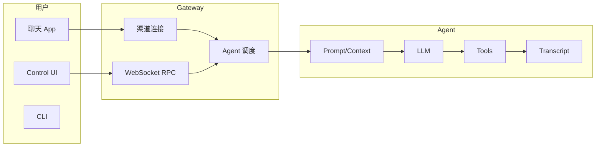
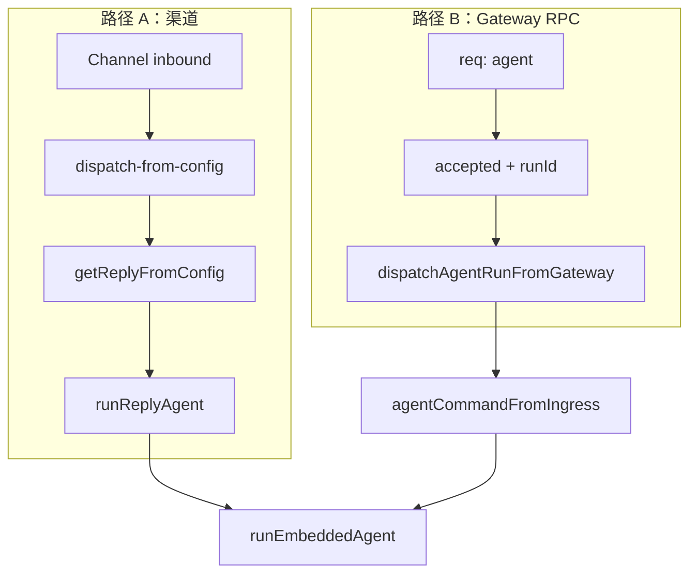
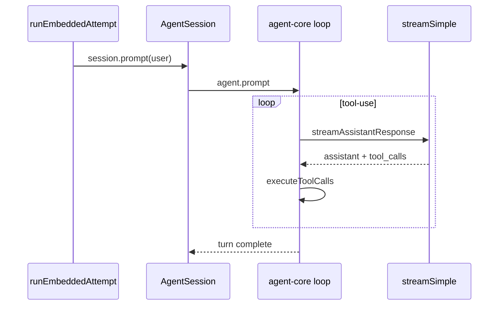
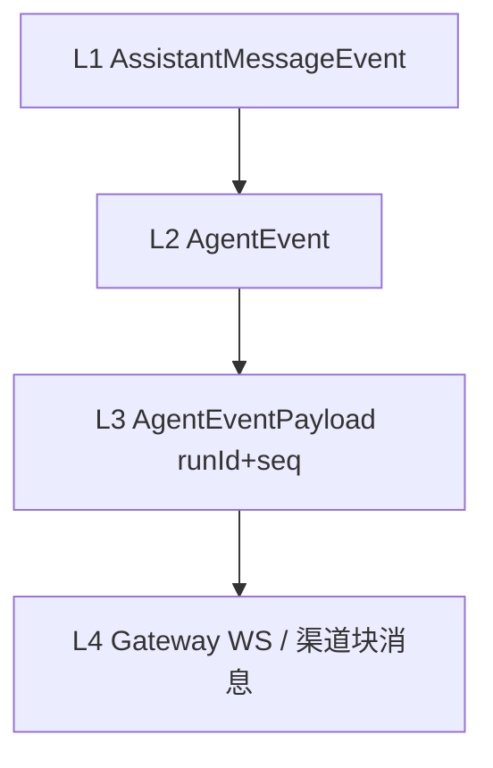
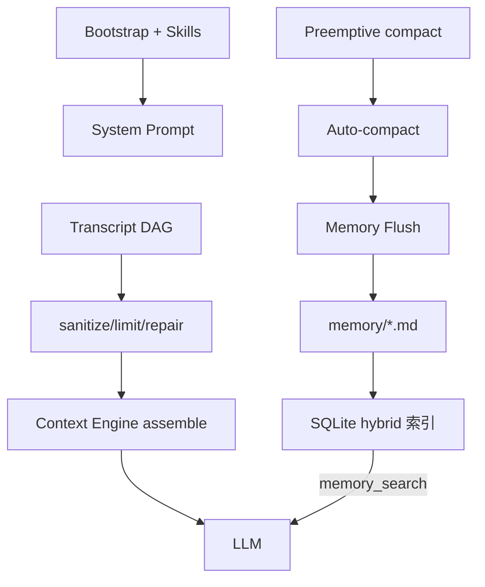

# OpenClaw 实现学习笔记（会话整合）

> **来源**：Cursor 会话 `87d78f12-2455-4947-bcfa-a03c8cd8fe2f`（2026-07-10 ~ 2026-07-11）  
> **仓库**：`e:\openclaw`（OpenClaw 官方）+ 附录 Codex（`e:\codex`）  
> **用途**：实现向复习；配合官方文档 https://docs.openclaw.ai

---

## 目录

### 第一部分：OpenClaw 主线

1. [整体心智模型与学习路径](#1-整体心智模型与学习路径)
2. [Gateway → Agent → Harness → Runtime 调用链](#2-gateway--agent--harness--runtime-调用链)
3. [核心循环（ReAct）](#3-核心循环react)
4. [Agent 与 LLM API 通信](#4-agent-与-llm-api-通信)
5. [Event 事件流与异步消息](#5-event-事件流与异步消息)
6. [Skills、MCP、内置工具与沙箱](#6-skillsmcp内置工具与沙箱)
7. [上下文工程、Transcript、压缩与记忆](#7-上下文工程transcript压缩与记忆)

### 第二部分：附录

8. [Codex 对照：Token Budget / Remote Compact / Rollout Budget](#8-codex-对照token-budget--remote-compact--rollout-budget)

### 索引

- [代码文件索引](#代码文件索引)
- [文档 URL 索引](#文档-url-索引)
- [建议阅读顺序](#建议阅读顺序)

---

# 第一部分：OpenClaw 主线

## 1. 整体心智模型与学习路径

### 1.1 一句话

OpenClaw = **自托管个人 AI 助手平台**：Gateway（控制面）+ Agent（大脑）+ 插件（手眼）+ 渠道（嘴耳）。

### 1.2 架构图



### 1.3 顶层目录（优先级）

| 目录 | 作用 | 优先级 |
|------|------|--------|
| `src/` | 核心 TS：Gateway、Agent、CLI | ⭐⭐⭐⭐⭐ |
| `extensions/` | 143+ 插件（渠道/Provider/工具） | ⭐⭐⭐⭐ |
| `packages/` | agent-core、llm-core、gateway-protocol | ⭐⭐⭐ |
| `docs/` | 文档源（→ docs.openclaw.ai） | ⭐⭐⭐⭐⭐ |

### 1.4 `src/` 核心子模块

| 路径 | 功能 |
|------|------|
| `src/agents/embedded-agent-runner/` | **核心循环入口** |
| `src/agents/harness/` | Runtime 实现（谁拥有 loop） |
| `src/gateway/` | WebSocket、RPC、事件 |
| `src/context-engine/` | 可插拔上下文引擎 |
| `src/agents/runtime/` | LLM **传输层**（非 loop 所有者） |

### 1.5 推荐学习路径

| 阶段 | 内容 |
|------|------|
| 0 | 用户视角跑通 Gateway / Control UI |
| 1 | 读 `docs/concepts/architecture.md`、`agent-loop.md`、`context.md` |
| 2 | 跟一条消息：Gateway → `agentCommand` → harness → attempt → agent-core loop |
| 3 | 上下文与记忆：`transcript-tree.ts` → `attempt.ts` assemble 段 |

---

## 2. Gateway → Agent → Harness → Runtime 调用链

> **先建立总调用链，再读 §3 循环细节。** 三个「Runtime」别混：**Agent Runtime id**（谁拥有 loop）≠ **Harness**（代码实现）≠ **`src/agents/runtime/`**（LLM 传输）。

### 2.1 两条 Ingress



| 路径 | 入口 | 特点 |
|------|------|------|
| **渠道** | `src/auto-reply/reply/agent-runner.ts` | typing、block streaming、delivery |
| **Gateway RPC** | `src/gateway/server-methods/agent.ts` | 立即 ack，异步执行 |

### 2.2 Turn 编排：`agentCommand`

`src/agents/agent-command.ts` → **三分支**（`src/agents/command/attempt-execution.ts`）：

| 分支 | 条件 | 路径 |
|------|------|------|
| CLI | `claude-cli` 等 | `runCliAgent` |
| ACP | `runtime: "acp"` | 外部 harness |
| **Embedded（默认）** | 其余 | `runEmbeddedAgent` |

### 2.3 队列 + Harness 选择

**双层 Lane**（`src/agents/embedded-agent-runner/run.ts`）：Session lane 串行 + Global lane 限流。

**Harness 调用链**：

```
policy.ts → selection.ts → lifecycle.ts → harness.runAttempt()
  openclaw → runEmbeddedAttempt (attempt.ts)
  codex    → extensions/codex harness
```

| Runtime id | Harness | Loop 所有者 | 工具 |
|------------|---------|-------------|------|
| **openclaw** | `builtin-openclaw.ts` | `@openclaw/agent-core` | OpenClaw tool surface |
| **codex** | `extensions/codex` | Codex app-server | 桥接 OpenClaw tools |
| CLI/ACP | 非 harness | 外部进程 | 外部自带 |

**Runtime = 选谁跑；Harness = 怎么跑。** CLI/ACP **不是** harness。

### 2.4 `src/agents/harness/` 要点

| 文件 | 作用 |
|------|------|
| `selection.ts` | 选 harness + `runAgentHarnessAttempt` |
| `builtin-openclaw.ts` | 内置 openclaw harness |
| `context-engine-lifecycle.ts` | assemble/bootstrap/afterTurn |
| `lifecycle.ts` | 诊断包装、context-engine 兼容 |

### 2.5 与 OpenCode / Codex 边界

| | OpenClaw embedded | Codex harness | OpenCode |
|--|-------------------|---------------|----------|
| Loop | agent-core | Codex app-server | SessionPrompt / SessionRunner |
| Transcript | SessionManager DAG | Codex thread | Session DB |
| 配置 | `agentRuntime.id: openclaw` | `openai/*` + codex | 独立产品 |

---

## 3. 核心循环（ReAct）



核心循环：`packages/agent-core/src/agent-loop.ts`

- **内层 while**：LLM → tool → tool result → LLM
- **外层 while**：follow-up 队列（collect 模式）
- **Steering**：`getSteeringMessages()` 在 tool batch 间隙注入，非立刻 abort

异步队列三层：Session `queueSteer`/`queueFollowUp` → Agent loop 消费 → 渠道 config `messages.queue`（steer/followup/collect/interrupt）。

---

## 4. Agent 与 LLM API 通信

```mermaid
flowchart TB
    AC[agent-core loop] -->|StreamFn| RT[src/agents/runtime]
    RT --> AI[@openclaw/ai ApiProvider]
    AI --> HTTP[Provider HTTP/SDK]
```

| 层 | 包/路径 | 职责 |
|----|---------|------|
| **契约** | `packages/llm-core` | `Context`、`Message`、事件流 |
| **适配** | `packages/ai` | 按 `Model.api` 注册 adapter |
| **注入** | `src/agents/runtime/index.ts` | `streamSimple` / `completeSimple` |

**请求**：`Context { systemPrompt?, messages, tools? }`  
**流式**：`AssistantMessageEventStream` — 错误编码进 stream，不 throw。  
插件稳定面：`src/plugin-sdk/llm.ts`（勿依赖 `@openclaw/ai/internal/*`）。

---

## 5. Event 事件流与异步消息

### 5.1 四层事件模型



L3 主要 `stream`：`lifecycle` | `assistant` | `tool` | `compaction` | `approval` | …  
订阅：`onAgentEvent()` → `src/gateway/server-runtime-subscriptions.ts` → WS 推送。

### 5.2 渠道 vs Control UI

**渠道无 token-delta**：LLM delta 只在进程内；渠道用 block streaming 或 preview。

---

## 6. Skills、MCP、内置工具与沙箱

**Skills 教怎么用；Tools 是能做什么；Sandbox 在哪做。**

### 6.1 Skills

- `SKILL.md` 指令包；优先级：workspace > `.agents` > `~/.openclaw` > bundled
- **`skill_workshop`**：Agent 提案，人工审批写入

### 6.2 MCP（双向）

| 方向 | 作用 |
|------|------|
| OpenClaw 作 Server | 外部客户端读写渠道会话 |
| OpenClaw 作 Client | 物化为 `bundle-mcp` 工具 |

### 6.3 OpenClaw 特有工具（节选）

| 组 | 工具 |
|----|------|
| 渠道 | `message` |
| 多会话 | `sessions_*`, `subagents` |
| 产品 | `cron`, `gateway`, `nodes` |
| 编排 | Tool Search, Code Mode（QuickJS-WASI） |

组装：`src/agents/agent-tools.ts` → `createOpenClawCodingTools`

### 6.4 沙箱

| `sandbox.mode` | 行为 |
|----------------|------|
| `off` | 全宿主机 |
| **`non-main`** | 群聊等非 main 进沙箱（常见默认） |
| `all` | 全沙箱 |

三层别混：**Sandbox（在哪跑）** | **Tool policy** | **Elevated（exec 逃逸）**

调试：`openclaw sandbox explain --session <key>`

---

## 7. 上下文工程、Transcript、压缩与记忆

### 7.1 总架构



Context Engine 四阶段：Ingest → **Assemble** → Compact → After turn（默认 `legacy` pass-through assemble）。

### 7.2 Transcript DAG

| 层 | 形态 |
|----|------|
| 磁盘 `*.jsonl` | `id` + `parentId` 树/DAG |
| 模型 context | active branch **线性化**数组 |

**原因**：Append-only、Fork（subagent/compaction）、`leaf` 切换 active path、`side` append 元数据。  
解析：`scanSessionTranscriptTree` → `selectSessionTranscriptTreePathNodes(tree, leafId)`

### 7.3 Assemble 管线

在 `src/agents/embedded-agent-runner/run/attempt.ts`：

```
active branch → sanitize → validateReplay → limitHistoryTurns
→ repairToolUseResultPairing → contextEngine.assemble() → hooks → agent-core loop
```

Token budget：`contextWindow − reserve − system − user = messageBudget`

### 7.4 Compaction 与 Memory

- **磁盘 transcript 完整**；只改模型可见部分；保持 toolCall ↔ toolResult 配对
- **Memory Flush**：压缩前 silent turn 写 `memory/YYYY-MM-DD.md`
- **MEMORY.md** 长期事实（bootstrap 注入）；日记靠 `memory_search` 召回
- **Active memory**：主回复前 blocking recall 子 Agent（`before_prompt_build` → `prependContext`）
- **memory-core**：SQLite FTS5 + 向量 hybrid

### 7.5 Prompt Cache 影响

| 变更 | Cache |
|------|-------|
| 正常追加 turn | 通常 hit 好 |
| Compaction / Active memory prepend | 几乎必 break |

观测：`src/agents/embedded-agent-runner/prompt-cache-observability.ts`

---

# 第二部分：附录

## 8. Codex 对照：Token Budget / Remote Compact / Rollout Budget

> 路径均在 `e:\codex\codex-rs\core\`

| Codex | OpenClaw |
|-------|----------|
| TokenBudget developer 注入 | bootstrap + compaction reserve |
| compact_remote_v2 | safeguard compaction |
| RolloutBudget 会话树加权 | 无直接等价（operator quota） |
| suite snapshot 测试 | Vitest e2e + prompt snapshots |

---

# 代码文件索引

| 主题 | 文件 |
|------|------|
| Gateway RPC | `src/gateway/server-methods/agent.ts` |
| Turn 编排 | `src/agents/agent-command.ts` |
| Embedded 入口 | `src/agents/embedded-agent-runner/run.ts` |
| Attempt / assemble | `src/agents/embedded-agent-runner/run/attempt.ts` |
| **主循环** | `packages/agent-core/src/agent-loop.ts` |
| Harness 选择 | `src/agents/harness/selection.ts` |
| LLM 契约 | `packages/llm-core/src/types.ts` |
| LLM 注入 | `src/agents/runtime/index.ts` |
| 事件广播 | `src/infra/agent-events.ts` |
| Transcript DAG | `src/config/sessions/transcript-tree.ts` |
| Context Engine | `src/context-engine/types.ts` |
| Active memory | `extensions/active-memory/index.ts` |
| 工具组装 | `src/agents/agent-tools.ts` |
| 沙箱常量 | `src/agents/sandbox/constants.ts` |

---

# 文档 URL 索引

| 主题 | URL |
|------|-----|
| 架构 | https://docs.openclaw.ai/concepts/architecture |
| Agent loop | https://docs.openclaw.ai/concepts/agent-loop |
| Context / Memory | https://docs.openclaw.ai/concepts/context |
| Sandboxing | https://docs.openclaw.ai/gateway/sandboxing |
| Queue | https://docs.openclaw.ai/concepts/queue |

---

# 建议阅读顺序

### 跟一条消息（最高效）

1. `src/gateway/server-methods/agent.ts`
2. `src/agents/agent-command.ts`
3. `src/agents/embedded-agent-runner/run.ts`
4. `src/agents/harness/selection.ts`
5. `src/agents/embedded-agent-runner/run/attempt.ts`
6. `packages/agent-core/src/agent-loop.ts`

### 实验命令

```bash
openclaw gateway status
openclaw dashboard
/context list
openclaw sandbox explain --session agent:main:main
/active-memory status
```

---

*文档生成时间：2026-07-11 | 流程重组版*
