# OpenCode 学习回顾手册（V1 / V2 双轨版）

> **来源**：Cursor 会话（2026-07-07 ~ 2026-07-11）  
> **代码仓库**：`e:\opencode`（默认分支 `dev`）  
> **说明**：本手册整合会话全部主题；V1/V2 **并存**，产品主路径多为 V1，Core 新架构为 V2。

---

## 索引

0. [V1 / V2 总对照表](#0-v1--v2-总对照表)
1. [仓库结构与重要包](#1-仓库结构与重要包)
2. [范式升级：ReAct → OpenCode](#2-范式升级react--opencode)
3. [核心循环、Session 生命周期与 Runtime](#3-核心循环session-生命周期与-runtime)
4. [Client / Server / LLM 通信与 SDK](#4-client--server--llm-通信与-sdk)
5. [Event 事件流](#5-event-事件流)
6. [Skill / MCP / Tool 与沙箱](#6-skill--mcp--tool-与沙箱)
7. [三层上下文与 Prompt Cache](#7-三层上下文与-prompt-cache)
8. [上下文管理与 Compaction](#8-上下文管理与-compaction)
9. [高频问题速答](#9-高频问题速答)
10. [速查表](#10-速查表)
- [附录 A：问题索引](#附录-a问题索引)
- [附录 B：双轨代码索引](#附录-b双轨代码索引)

---

## 0. V1 / V2 总对照表

| 主题 | V1（产品主路径） | V2（Core 新架构） | 关系 |
|------|-----------------|-------------------|------|
| **代码位置** | `packages/opencode/src/session/` | `packages/core/src/session/` | 并存 |
| **HTTP 主 prompt** | `SessionPrompt.prompt` | `SessionV2.prompt`（已接线，TUI/CLI 部分已消费 V2 事件） | 不同入口 |
| **用户消息写入** | `createUserMessage` 直接落库 | `admit` → `session_input` 行 | **不同** |
| **执行调度** | `SessionPrompt.loop` while 循环 | `SessionExecution.wake` + `Runner.run` drain | **不同** |
| **steer / queue** | 无 inbox 语义 | `SessionInput` delivery 模式 | **V2 独有** |
| **主 LLM 调用** | AI SDK `streamText`（默认） | `LLMClient.stream` | 不同运行时 |
| **工具注册** | `ToolRegistry` InstanceState | `materialize()` 每轮 | **不同** |
| **Skill 进上下文** | `SystemPrompt.skills()` 字符串 | `SkillGuidance` → Context Epoch | **不同** |
| **System 管理** | 每轮拼入 messages 前缀 | Context Epoch baseline + 增量 | **不同** |
| **Compaction** | 完整（prune、tail、filterCompacted） | 请求前估算 + overflow 恢复 | **共享 buildPrompt，编排不同** |
| **事件类型** | `message.part.*`、`session.updated` | `session.next.*` | **不同** |
| **Permission / MCP / Schema** | opencode 产品层 | core + 同左 MCP | **实现类似** |
| **Prompt Cache** | `ProviderTransform.applyCaching` | `@opencode-ai/llm` cache policy | **目标类似，落点不同** |

**当前产品现状**：Web/App 主消费 **V1 事件**；V2 Core 与 `session.next.*` 已落地，迁移进行中。

---

## 1. 仓库结构与重要包

- 运行时：**Bun**；默认分支：**`dev`**

### 1.1 核心框架

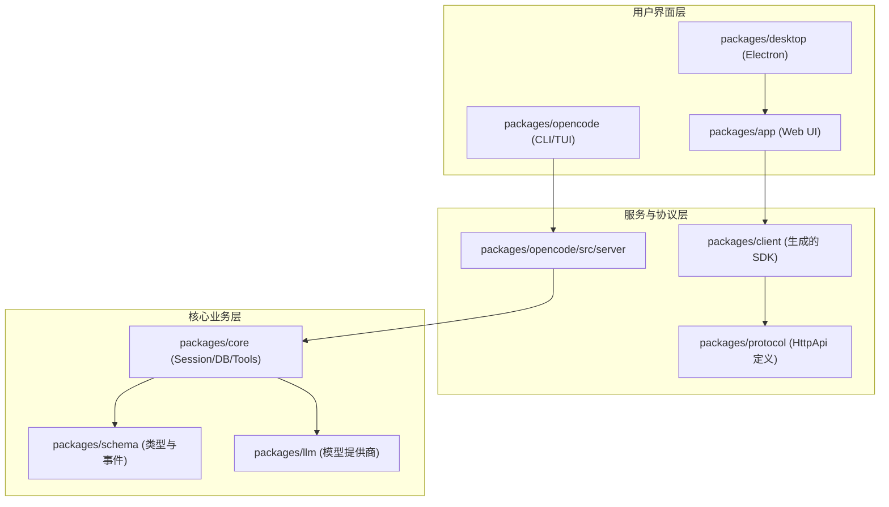

**读图要点**：TUI 直连 Server；Web/Desktop 经生成 SDK 走 `protocol` 契约；Server 下沉到 `core`（V2 引擎 + Session DB），`schema` 与 `llm` 为横切依赖。

### 1.2 包依赖（V1 / V2 双轨）

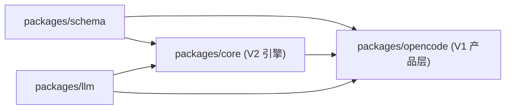

| 包 | 职责 |
|----|------|
| `schema` | 事件、配置、V1/V2 类型契约（无业务逻辑） |
| `core` | V2 Session、Runner、Compaction、Context Epoch |
| `opencode` | CLI/TUI/Server/**V1 主 Session 路径** |
| `llm` | V2 协议 lowering、CacheHint、Native 传输 |

| 主题 | V1 | V2 |
|------|----|----|
| Session 主循环 | `opencode/.../session/prompt.ts` | `core/.../session/runner/llm.ts` |
| 准入/调度 | loop 内隐式 | `input.ts` + `execution/` |
| Compaction | `opencode/.../session/compaction.ts` | `core/.../session/compaction.ts` |
| Skill / Tool / MCP | `opencode/.../` | `core/.../` + 产品层 MCP |
| 规格 | — | `specs/v2/session.md` |

---

## 2. 范式升级：ReAct → OpenCode

**V1/V2 共用理念**；V2 把 V1 隐式行为显式化（admit、drain、Context Epoch）。相对经典 ReAct，OpenCode 的三层跃迁如下：

1. **从「内存里的循环」到「可持久化的 Session 系统」**（最核心）  
   ReAct 循环活在进程内存里——崩溃、断网、关终端即丢状态；无法可靠重试、多端同步或审计「当时发生了什么」。OpenCode 把 user/asst/tool 写入 Session DB，V2 再把待处理输入放进 `session_input` inbox，使执行可恢复、可投影、可回放。

2. **从「拼 prompt」到「可版本化的系统上下文」**  
   每轮临时拼接 system/tools 难以稳定 cache，也难追踪「哪次变更导致行为漂移」。V1 每轮重拼 system；V2 **Context Epoch** 把 baseline 固定在 `system[]`，小变更走 `context.updated` 增量——兼顾动态上下文与 Prompt Cache 前缀稳定。

3. **从「能调工具」到「受治理的执行」**  
   裸 ReAct 工具调用缺少审批与策略边界。OpenCode 在 Permission（allow/ask/deny）、MCP 连接治理、Compaction 溢出恢复等层把「能调」变成「可调且可审计」。

| 维度 | ReAct | OpenCode V1 | OpenCode V2 |
|------|-------|-------------|-------------|
| 状态 | 内存 | 消息 DB + loop | + `session_input` inbox |
| 中断 | 难 | `abort` / processor 中断 | + `interrupt` 链 |
| 插队 | 无 | 无 | steer / queue |
| 治理 | 弱 | PermissionV1 | PermissionV2 |

---

## 3. 核心循环、Session 生命周期与 Runtime

### 3.1 V1 主循环（产品路径）

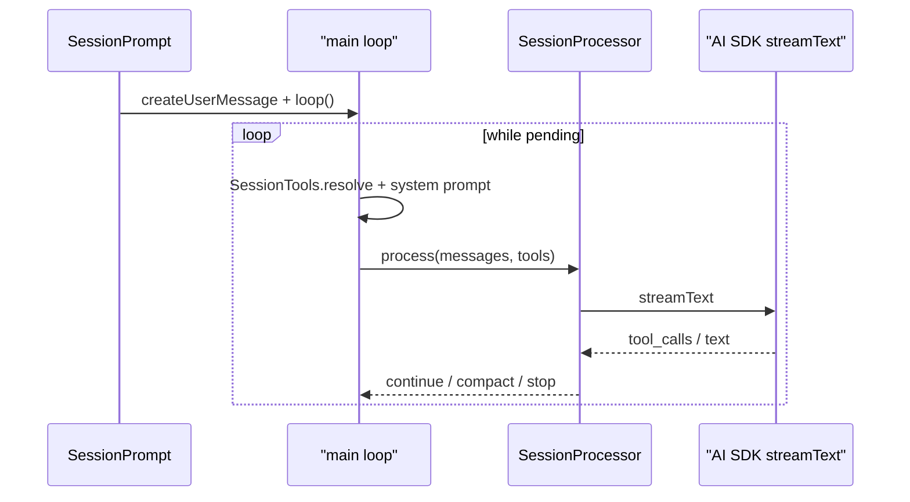

| 模块 | 职责 | 文件 |
|------|------|------|
| `SessionPrompt` | 主循环、compaction 触发 | `opencode/.../session/prompt.ts` |
| `SessionProcessor` | 单次 provider turn：流式写 part、调度工具 | `opencode/.../session/processor.ts` |
| `LLM.Service` | AI SDK（默认）或 Native LLM（实验） | `opencode/.../session/llm.ts` |

V1 Runtime 选择：`experimentalNativeLlm=true` 时走 `@opencode-ai/llm` Native，否则 AI SDK `streamText`；两条路径统一产出 `LLMEvent`。

### 3.2 V2 状态机与 drain

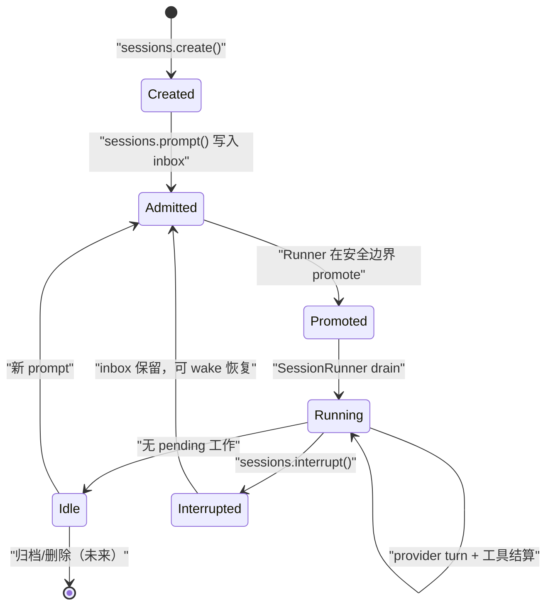

**Drain** = 排空 `session_input` inbox 中待处理工作（promote → context → `llm.stream` → 工具结算 → 下一 turn）。V1 等价物是 **loop 跑完直到 assistant 完成且无 pending tool**。

| 模块 | 职责 | 文件 |
|------|------|------|
| `SessionV2` | CRUD、prompt admission、interrupt | `core/src/session.ts` |
| `SessionExecution` | Session ID → Location Runner 路由 | `core/.../session/execution.ts` |
| `SessionRunner` | drain 主循环 | `core/.../session/runner/llm.ts` |
| `SessionProjector` | EventV2 → 可读历史 | `core/.../session/projector.ts` |

V2 **仅** `@opencode-ai/llm` `LLMClient.stream`，不走 AI SDK。

### 3.3 V1 vs V2 Runtime 对照

| 维度 | V1 | V2 |
|------|----|----|
| 编排 | `SessionPrompt.loop` 内存循环 | `SessionRunner` 持久化 drain |
| 入队 | 直接 `createUserMessage` | `admit` → promote |
| LLM | AI SDK + Native（可选） | 仅 `@opencode-ai/llm` |
| steer / queue | **无** | `SessionInput` delivery |
| Agent | 无独立 runtime；全局 `LLM.Service` 统一选路 | Runner 内 `LLMClient` |

### 3.4 与 OpenClaw / Codex 对比：核心循环

| | OpenCode | OpenClaw | Codex |
|--|----------|----------|-------|
| 循环所有者 | V1 `SessionPrompt.loop` / V2 `SessionRunner` | `agent-core` while + follow-up 队列 | L2 `run_turn` → L3 `try_run_sampling_request` |
| 插队 | V2 steer/queue（inbox + promote） | `queueSteer` 在 tool batch 间隙注入 | `pending_input` steer |
| 串行化 | Session 级 loop | Session lane + Global lane | `tokio::spawn` + async_channel |

> **要点**：三者都是 ReAct 变体。**OpenCode V2 的本质创新**是把用户输入做成 **持久化 inbox + drain**，steer 在 promote 边界生效而不打断当前 provider turn——与 Codex 的 mid-turn steer、OpenClaw 的内存队列思路相近，但 V2 多了 **admit 幂等** 和 DB 级 inbox。

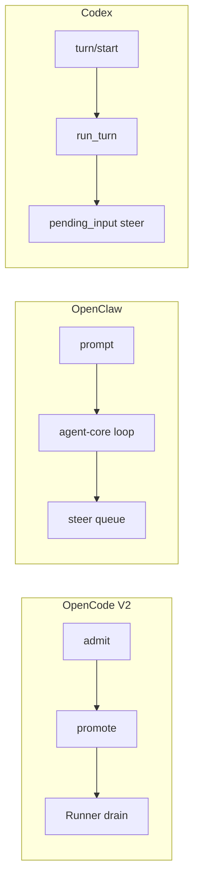

### 3.5 与 OpenClaw / Codex 对比：Harness 与 Runtime

> **OpenClaw** 显式拆分 **Harness**（谁拥有 loop：`builtin-openclaw` / Codex harness）与 **Runtime**（仅 LLM 传输 `streamSimple`）。**Codex** 无 Harness 命名，Session/Turn 层自己编排，Runtime 分散为 Task / ToolCall / ModelClient。**OpenCode 没有 Harness 抽象**——`SessionPrompt` / `SessionRunner` 即 harness+loop 合一；Runtime 指模型调用路径（V1 AI SDK seam，V2 `@opencode-ai/llm`），Effect Layer 注入另算。

| | Harness（loop 所有者） | Runtime（LLM 调用） |
|--|------------------------|---------------------|
| OpenCode | SessionPrompt / SessionRunner | AI SDK 或 LLMClient |
| OpenClaw | `src/agents/harness/*` | `src/agents/runtime` 传输层 |
| Codex | Session + Turn（内聚） | ModelClientSession + Responses API |

---

## 4. Client / Server / LLM 通信与 SDK

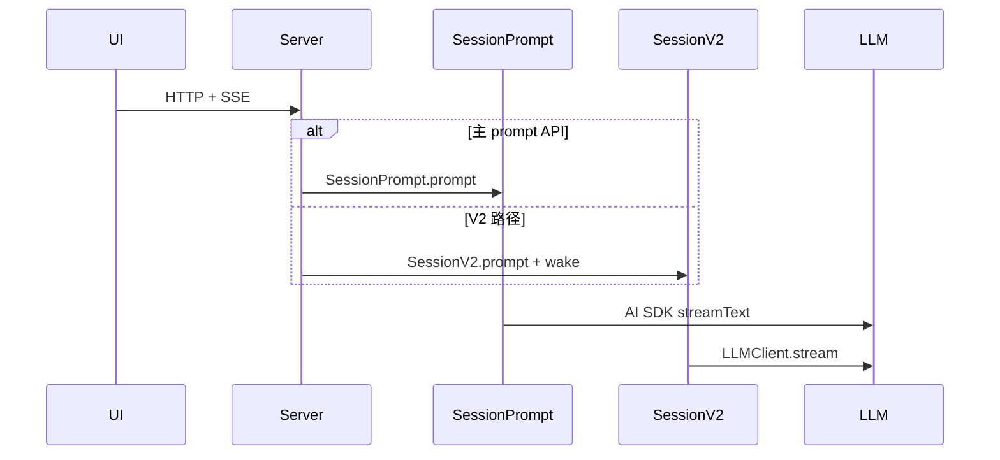

| 层级 | 说明 |
|------|------|
| Client ↔ Server | REST + SSE（`/global/event`） |
| Server 装配 | `server.ts` 同时 `SessionPrompt.node` + `SessionV2.node` |
| SDK | `@opencode-ai/sdk`（对外）、`client`（生成）、`sdk-next`（进程内） |

---

## 5. Event 事件流

### 5.1 V1 事件（UI 主消费）

| 类型 | 用途 |
|------|------|
| `message.part.delta` | 流式文本/工具 UI |
| `message.part.updated` | 部件状态 |
| `session.updated` | Session 元数据 |
| `permission.asked` | 权限弹窗 |

Reducer：`packages/app/src/context/global-sync/event-reducer.ts`

### 5.2 V2 事件

| 类型 | 用途 |
|------|------|
| `session.next.prompt.admitted` | 准入 |
| `session.next.prompted` | user 消息可见化 |
| `session.next.context.updated` | Context Source 变更 → system 增量 |
| `session.next.tool.*` / `compaction.*` | 工具/压缩生命周期 |

定义：`packages/schema/src/session-event.ts`；投影：`packages/core/src/session/projector.ts`

### 5.3 共用基础设施

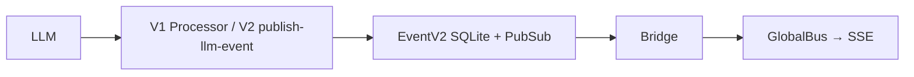

### 5.4 与 OpenClaw / Codex 对比：Event

> **OpenClaw** 四层递进：LLM delta → AgentEvent → `runId+seq` payload → Gateway WS。**Codex** 区分 **Item**（持久化历史）与 **Event**（流式通知），内部 `EventMsg` 经 app-server 翻译为 JSON-RPC 通知。**OpenCode** V1 以 `message.part.*` 面向 UI 部件流；V2 以 `session.next.*` 面向 Core 投影——**Item/Event 分离不如 Codex 显式**，但 V2 EventV2 SQLite 持久化 + Bridge 更接近 Codex 的 rollout 思路。

| | 持久化历史 | 流式 UI 事件 | 传输 |
|--|-----------|-------------|------|
| OpenCode V1 | Session DB messages | `message.part.*` | SSE |
| OpenCode V2 | EventV2 → projector | `session.next.*` | SSE |
| OpenClaw | Transcript DAG jsonl | AgentEventPayload → WS | WebSocket |
| Codex | RolloutItem | turn/item 通知 | stdio JSON-RPC |

---

## 6. Skill / MCP / Tool 与沙箱

### 6.1 加载总览

Bootstrap：`packages/opencode/src/project/bootstrap.ts` — `plugin.init()` 最先；Skill/MCP/Tool **惰性加载**（首次 provider turn）。

| 维度 | V1 | V2 |
|------|----|----|
| Skill 进模型 | `SystemPrompt.skills()` 每轮重拼 | `SkillGuidance` → Context Epoch baseline |
| Tool 注册 | `ToolRegistry` InstanceState | 每轮 `materialize()` |
| MCP | `SessionTools.resolve` 合并 | 连接层同 V1；Runner 合并演进中 |
| 热更新 | reload instance；MCP `ToolListChanged` | + `skill.reload` / `context.updated` |

关键文件：V1 `opencode/.../tool/registry.ts`；V2 `core/.../tool/registry.ts`；MCP `opencode/.../mcp/index.ts`

### 6.2 沙箱与安全

| 项 | OpenCode |
|----|----------|
| 默认 | **本机直接执行**（非 OS 沙箱） |
| Permission | allow / ask / deny（V1/V2 类似） |
| Project `sandboxes[]` | 额外 worktree，**非**安全隔离 |
| Code Mode | JS 编排层受限（`@opencode-ai/codemode`） |
| 外部隔离 | Daytona 等插件 |

### 6.3 与 OpenClaw / Codex 对比：工具与沙箱

> **OpenClaw 本质差异**在一等公民 **Docker/SSH 沙箱**（`sandbox.mode`）和 **产品级工具**（channels、cron、gateway、subagents）。**Codex** 在 `ToolCallRuntime` 内做审批+沙箱+并行锁，有 Unified Exec PTY 和 Code Mode。**OpenCode 默认无 OS 沙箱**，靠 Permission 弹窗治理；工具面偏 IDE/编码（Skill、MCP、内置 file/shell），**没有** OpenClaw 的渠道/调度类工具——安全边界更轻、更依赖用户本机信任模型。

| | 沙箱 | 特色工具 |
|--|------|---------|
| OpenCode | Permission + 可选 Daytona | Skill 全文加载、MCP、Agent 子任务 |
| OpenClaw | Docker/SSH/OpenShell | message、sessions_*、cron、gateway、Tool Search |
| Codex | ToolCallRuntime 内 | Unified Exec PTY、Code Mode、memories 工具 |

---

## 7. 三层上下文与 Prompt Cache

### 7.1 三层模型

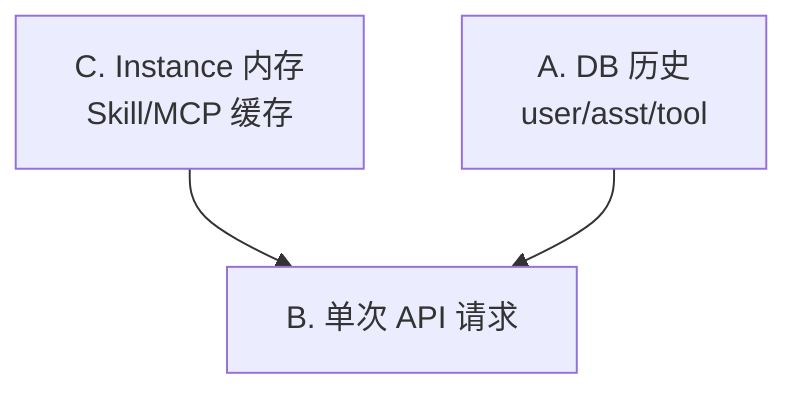

**每轮三槽**（不进 DB vs 进 DB）：

| 内容 | 每轮重算 | 写入 DB | 发给模型 |
|------|---------|---------|---------|
| tools | ✅ | ❌ | API `tools` 参数 |
| system | ✅ | ❌（V2 增量除外） | `system[]` |
| history | ❌ 只增 | ✅ | `messages[]` |

V1：`prompt.ts` → `LLMRequestPrep`；V2：`runner/llm.ts` → `LLM.request({ system, messages, tools })`

### 7.2 V1 vs V2 system 策略

| | V1 | V2 |
|--|----|----|
| system | 每轮重拼（内容通常相同） | Context Epoch **baseline** 稳定 + `context.updated` 增量 |
| 历史投影 | `filterCompacted` | `baselineSeq` + compaction seq |

### 7.3 Prompt Cache

Cache 匹配 **完整 HTTP 前缀**（tools → system → messages），**省读价不减发送 token**。

| 变更 | 影响 |
|------|------|
| tools 变 | system + messages 段失效 |
| system 变 | messages 段失效 |
| 仅追加 asst/tool | latest user 断点前仍可 hit |

V1：`ProviderTransform.applyCaching`（Anthropic 前2+后2 system）；V2：`cache: "auto"` 三断点（末 tool、末 SystemPart、**最新 user**——tool loop 关键）。

V1 每轮 `Today's date` 易 daily miss；V2 Context Epoch 把小变更转为 `context.updated` 保 baseline 稳定。

---

## 8. 上下文管理与 Compaction

### 8.1 能力矩阵

| 能力 | V1 | V2 |
|------|----|----|
| 跨 Session 记忆 | **无** | **无** |
| Compaction | 完整（prune、tail） | 精简编排 |
| Context Epoch | 无 | **有**（baseline + 增量） |
| 共享 | — | `buildPrompt` 摘要模板 |

### 8.2 V1 Compaction

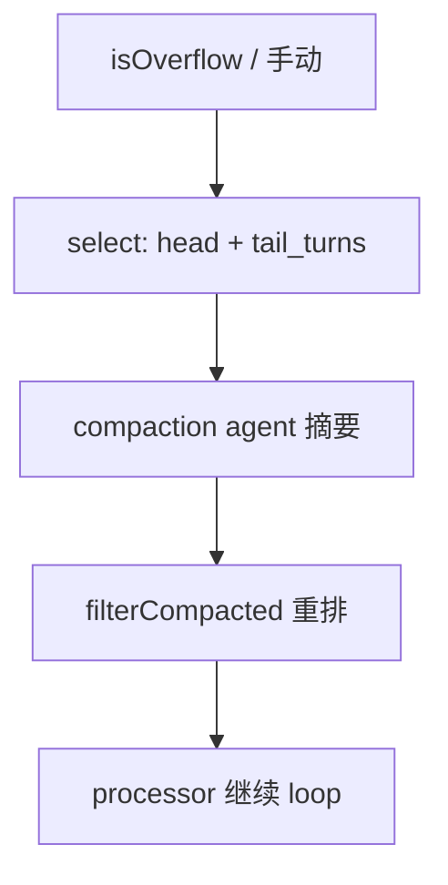

文件：`opencode/.../session/compaction.ts`；触发：`processor.ts` token ≥ `usable()`；Prune 可选软删旧 tool output。

### 8.3 V2 Compaction + Context Epoch

- 触发前 `compactIfNeeded()` 估算；溢出后 `compactAfterOverflow()`
- 摘要同 `buildPrompt`；投影为 `type: compaction` 消息

**Context Epoch（V2 独有）**：

| 层 | 位置 | 何时变 |
|----|------|--------|
| baseline | `request.system[]` | 初始化、compaction 后 replace |
| 增量 | `messages[]`（`context.updated`） | Skill/日期等 Context Source reconcile |

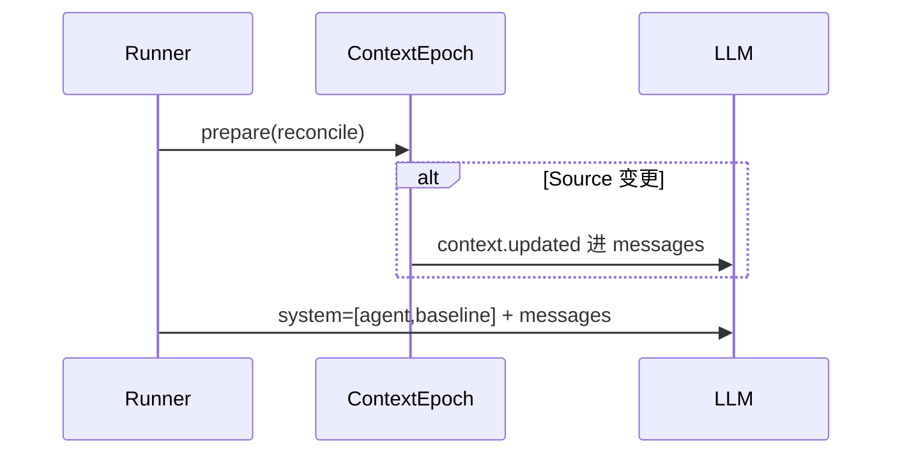

OpenAI lowering：增量包为 `<system-update>…</system-update>`；Anthropic Opus 4.8+ 可用原生 system 块。

配置示例：`compaction.auto`、`tail_turns: 2`、`preserve_recent_tokens: 8000`

### 8.4 与 OpenClaw / Codex / Hermes 对比：上下文、压缩、记忆

> **OpenClaw** 有完整 **跨 session 记忆**（`MEMORY.md` + SQLite hybrid 索引 + Active Memory 子 Agent 阻塞召回 + Memory Flush 写日记）；Transcript 是 **DAG** 而非线性列表。**Codex** 用 ContextManager **diff baseline**（首轮全量、后续只注入变更），compact 后 reinject；记忆在 `~/.codex/memories/`，**不**每轮注入正文，引导模型用工具读。**Hermes** 分 **热层**（MEMORY.md/USER.md 每轮注入 system）+ **SQLite FTS  episodic** + 可插拔 MemoryProvider（`prefetch`/`sync_turn` 钩子）；压缩前有 `on_pre_compress` 保存洞察。**OpenCode 无跨 session 记忆**；V2 Context Epoch 的创新在于 **baseline 稳定 + chronological system 增量**，兼顾 cache 与动态上下文——这是相对三者的核心差异点。

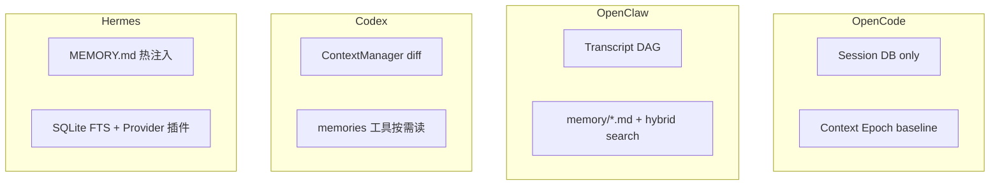

| | 跨 Session 记忆 | 压缩 | 上下文稳定性 |
|--|----------------|------|-------------|
| OpenCode | 无 | 共享 buildPrompt 摘要 | V2 Context Epoch |
| OpenClaw | memory 文件 + 索引 | safeguard + successor transcript | DAG active branch |
| Codex | memories 工具 | compact / token budget 新窗口 | reference diff baseline |
| Hermes | 热文件 + FTS + Provider | 标准 compact + pre_compress hook | 热层每轮注入 |

---

## 9. 高频问题速答

### 9.1 Directory ↔ Session

1 directory : N sessions；1 session : 1 location。**V1/V2 共用**。

### 9.2 Steer vs Interrupt

| 操作 | V1 | V2 |
|------|----|----|
| steer | **不支持** | 边界 promote，不打断当前 turn |
| interrupt | `abort` | `SessionV2.interrupt` |

### 9.3 admit 幂等（V2）

`packages/core/src/session/input.ts`：`find` 短路 → `onConflictDoNothing` → `catchDefect`。可选 `messageID` 幂等键。**admit 幂等 ≠ 执行幂等**；`resume: false` 只准入不 wake。

### 9.4 多轮加载时机

| 问题 | 答案 |
|------|------|
| Session 创建就加载 Skill/MCP？ | **否**，首次 provider turn |
| 每 turn 带 tool/system？ | **是**，每轮重算；history 从 DB 累积 |
| 改 SKILL.md 后生效？ | `InstanceStore.reload`；V2 可发 `context.updated` |
| Agent 改文件 vs 用户改？ | InstanceState 缓存不变；`skill` 工具可临时注入 |

### 9.5 schema 契约

`packages/schema` 无业务逻辑；变更后 `packages/client` 执行 `bun run generate`。

---

## 10. 速查表

### 10.1 我是 V1 还是 V2？

| 你在用… | 路径 |
|---------|------|
| Web/App 聊天主流程 | **V1** |
| `session.next.*` / inbox / steer | **V2** |
| MCP / Permission | **共用 opencode 层** |

### 10.2 口诀

> DB 只存 user/asst/tool；system/tools 每轮重算。  
> Cache 看整包前缀匹配。  
> V2：baseline 放 `system[]`，小变更走 `context.updated`。

---

## 附录 A：问题索引

| # | 主题 | 章节 |
|---|------|------|
| 0 | V1/V2 对照 | §0 |
| 1 | 核心循环 / Runtime | §3 |
| 2 | 通信/SDK | §4 |
| 3 | Event | §5 |
| 4 | Skill/MCP/Tool/沙箱 | §6 |
| 5 | 上下文/Cache | §7 |
| 6 | Compaction/记忆对比 | §8 |
| 7 | 高频问题 | §9 |

---

## 附录 B：双轨代码索引

| 主题 | V1 | V2 |
|------|----|----|
| Prompt 主循环 | `opencode/.../session/prompt.ts` | `core/.../session/runner/llm.ts` |
| 流处理 | `opencode/.../session/processor.ts` | `core/.../session/runner/publish-llm-event.ts` |
| LLM runtime | `llm.ts` + `ai-sdk.ts` / `native-runtime.ts` | `LLMClient.stream` |
| admit/promote | — | `core/.../session/input.ts` |
| Compaction | `opencode/.../session/compaction.ts` | `core/.../session/compaction.ts` |
| Context Epoch | — | `core/.../session/context-epoch.ts` |
| Cache V1 / V2 | `provider/transform.ts` | `llm/.../cache-policy.ts` |
| Event Bridge | `opencode/.../event-v2-bridge.ts` | `core/.../event.ts` |
| 规格 | — | `specs/v2/session.md` |

---

*生成时间：2026-07-17 · 精简重组版（+OpenClaw/Codex/Hermes 对比）*
