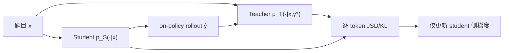

# Self-Distilled Reasoner: On-Policy Self-Distillation for Large Language Models (OPSD)

> **作者 / 机构**：Siyan Zhao, Zhihui Xie, Mengchen Liu, Jing Huang, Guan Pang, Feiyu Chen, Aditya Grover
> **链接**：[arXiv:2601.18734](https://arxiv.org/abs/2601.18734) · [代码](https://github.com/siyan-zhao/OPSD)
> **发表**：2026-01（arXiv preprint）
> **阅读日期**：2026-07-14
> **读者定位**：算法工程师，关注 LLM 推理 post-training、蒸馏与 RLVR 替代方案

---

## 目录

| 章节 | 主题 |
|------|------|
| [§1](#1-核心问题) | 核心问题 |
| [§2](#2-方法直觉) | 方法直觉 |
| [§3](#3-实验与证据) | 实验与证据 |
| [§4](#4-局限与开放问题) | 局限与开放问题 |
| [§5](#5-与-agent--工程实践的关联) | 与 Agent / 工程实践的关联 |
| [§6](#6-个人评价) | 个人评价 |

---

## 1. 核心问题

### 1.1 现有 post-training 的三难

数学推理等可验证任务上，主流 post-training 路线各有硬伤：

| 方法 | 优势 | 局限 |
|------|------|------|
| **SFT / 离线蒸馏** | 密集 token 级监督 | off-policy：训练分布 ≠ 推理分布，误差累积 |
| **GRPO / RLVR** | on-policy，分布一致 | 每题需 G 条 rollout；奖励稀疏（整段同一 advantage）；全对/全错时梯度消失 |
| **On-policy 蒸馏** | on-policy + 密集信号 | 需要**更大外部 teacher**；未利用数据集中已有的 ground-truth 解 |

### 1.2 核心直觉

> 足够强的 LLM 在拿到「特权信息」（标准答案/参考 CoT）后，能**合理化**推理路径，并据此指导「看不到答案的自己」。

OPSD 把这一直觉形式化：**同一模型、同一参数 θ**，通过不同 conditioning 扮演 teacher 与 student。

### 1.3 问题形式化

- **输入**：推理数据集 \(S = \{(x, y^\star)\}\)，\(x\) 为题目，\(y^\star\) 为含 CoT 的参考解
- **Student**：\(p_S(\cdot \mid x) \triangleq p_\theta(\cdot \mid x)\) — 与推理时一致
- **Teacher**：\(p_T(\cdot \mid x, y^\star) \triangleq p_\theta(\cdot \mid x, y^\star)\) — 可见特权信息
- **优化目标**：在 student 自己采样的轨迹 \(\hat{y} \sim p_S(\cdot \mid x)\) 上，最小化逐 token 分布散度 \(D(p_T \,\|\, p_S)\)

---

## 2. 方法直觉

### 2.1 算法步骤

1. Student 对题目 \(x\) 采样 \(\hat{y} \sim p_S(\cdot \mid x)\)
2. 在每个位置 \(n\)，Teacher 与 Student 分别给出 next-token 分布：
   - \(p_S(y_n \mid x, \hat{y}_{<n})\)
   - \(p_T(y_n \mid x, y^\star, \hat{y}_{<n})\)
3. 沿 student 轨迹平均散度，**梯度只回传 student 侧**
4. Teacher prompt 要求先「合理化」再生成新解（Figure 2），使评估 student rollout 更自然

### 2.2 关键创新点

1. **单模型自蒸馏**：无需外部大 teacher 或 PRM
2. **特权信息作 dense supervision**：直接利用 \(y^\star\)，比二元 reward 信息量大
3. **Full-vocabulary JSD**：teacher 暴露完整 next-token 分布，而非仅对采样 token 做 policy gradient shaping

### 2.3 与最接近 baseline 的差异

| 维度 | GRPO | On-policy 外部蒸馏 | **OPSD** |
|------|------|-------------------|----------|
| On-policy | ✓ | ✓ | ✓ |
| Dense 信号 | ✗（序列级） | ✓ | ✓ |
| 外部 teacher | ✓（环境） | ✗ | ✓ |
| 利用 \(y^\star\) | 仅作验证 | 通常不用 | ✓（teacher conditioning） |
| 每题 rollout 数 | 8 | 1+ | **1** |

与 **STaR** 的区别：STaR 是 hard distillation（生成→筛选→SFT）；OPSD 是 soft logit 蒸馏 + on-policy。

---

## 3. 实验与证据

### 3.1 设置

- **模型**：Qwen3-1.7B / 4B / 8B Instruct
- **训练数据**：OpenThoughts 数学子集，最多 30K 题解对
- **评测**：AIME24、AIME25、HMMT25、AMO-Bench（average@16）
- **Baseline**：SFT、GRPO（每题 8 rollout，16k 生成长度）
- **实现**：8×A100 + LoRA；Teacher 固定为**初始策略**（非 EMA），作隐式正则

### 3.2 主结果（Qwen3-8B）

| 方法 | AIME24 | AIME25 | HMMT25 | AMO | **平均** |
|------|--------|--------|--------|-----|----------|
| Base | — | — | — | — | ~49 |
| + GRPO | 76.7 | 68.7 | 45.0 | 14.8 | **51.3** |
| + OPSD | 77.5 | 69.8 | 47.1 | 14.3 | **52.2** |

- 4B/8B 上 OPSD **匹配或超过 GRPO**；1.7B 上接近
- **Token 效率**：同等有效 batch 下，OPSD 用 2k 生成长度 + 1 rollout，GRPO 用 16k + 8 rollout → 约 **4–8×** token 效率提升（Figure 3）

### 3.3 消融要点

- **模型规模**：自蒸馏需要一定 ICL/推理能力；过小模型 teacher 质量不足
- **Full-vocab vs sampled-token shaping**：full-vocab JSD 更优
- **生成长度**：OPSD 对短 generation budget 更鲁棒

### 3.4 复现难度

- 代码已开源；LoRA + 单 rollout 使算力门槛低于 GRPO
- 依赖高质量 \(y^\star\)（含 CoT）；无 ground-truth 场景不适用

---

## 4. 局限与开放问题

**作者承认 / 实验暗示**

- Teacher 固定为初始策略：稳定但可能限制上限
- 需要**可验证 ground-truth**；代码/SWE 等仅有运行时反馈的场景需改 formulation
- 模型需具备一定「看答案后能教自己」的 ICL 能力

**额外局限**

- 与 SDPO/RLTF 不同，OPSD 不处理**失败轨迹上的环境反馈**（如 runtime error）
- 数学竞赛 benchmark 与真实 Agent 长程任务仍有 gap

---

## 5. 与 Agent / 工程实践的关联

| 论文概念 | 工程对应 | 可参考 |
|----------|----------|--------|
| 特权信息 teacher | 训练时注入 oracle/trace，推理时剥离 | OpenClaw-RL OPD 的 privileged teacher 分支 |
| On-policy + dense | 比纯 GRPO 更省 rollout | Agent RL 训练预算优化 |
| 固定初始 teacher | 防 drift / catastrophic forgetting | SDFT 的 EMA teacher 是另一种稳定化 |

- **可借鉴**：有标准解/参考 trace 的任务（SWE 金 patch、单元测试通过路径）可用 OPSD 思路做 token 级自教，替代纯 outcome reward
- **需改造**：Agent 步级反馈通常不是完整 \(y^\star\)，更接近 SDPO 的 rich feedback 设定

---

## 6. 个人评价

- **价值**：4/5 — 把「看答案教自己」做成简洁 on-policy 框架，token 效率证据扎实
- **精读建议**：Method §3 + Table 2 + token efficiency 图即可；公式细节可跳读
- **后续动作**：与 SDPO/SDFT 对照读（同一 self-distillation 谱系）；在 OpenThoughts 子集上复现 Qwen3-4B 对比 GRPO

---

*阅读完成：2026-07-14*
