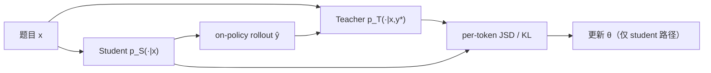

# Self-Distilled Reasoner: On-Policy Self-Distillation (OPSD)

> **作者 / 机构**：Siyan Zhao, Zhihui Xie, Mengchen Liu, Jing Huang, Guan Pang, Feiyu Chen, Aditya Grover
> **链接**：[arXiv:2601.18734](https://arxiv.org/abs/2601.18734) · [代码](https://github.com/siyan-zhao/OPSD)
> **发表**：2026-01（arXiv preprint）
> **阅读日期**：2026-07-14
> **读者定位**：算法工程师，关注 LLM 推理 post-training、蒸馏与 RLVR 替代方案

---

## 目录

| 章节 | 主题 |
|------|------|
| [§1](#1-核心问题) | 核心问题 |
| [§2](#2-方法直觉) | 方法直觉 |
| [§3](#3-实验与证据) | 实验与证据 |
| [§4](#4-局限与开放问题) | 局限与开放问题 |
| [§5](#5-与-agent--工程实践的关联) | 与 Agent / 工程实践的关联 |
| [§6](#6-个人评价) | 个人评价 |

---

## 1. 核心问题

### 1.1 痛点：RLVR 稀疏、蒸馏 off-policy、外部 teacher 昂贵

LLM 推理 post-training 主流有三条路，各有硬伤：

| 方法 | 核心问题 |
|------|----------|
| **RLVR（如 GRPO）** | 每题仅 1 bit 正确/错误；组内全对或全错时梯度消失；需 G=8 条 rollout，采样成本高 |
| **SFT / off-policy 蒸馏** | 训练分布与推理分布不匹配，错误会复合放大（exposure bias） |
| **On-policy 蒸馏** | 需独立、往往更大的 teacher 模型；未利用推理数据集中已有的 ground-truth 解 |

论文核心问题：**能否让同一个 LLM 在「看到答案」与「只看题目」两种上下文下分别扮演 teacher / student，在 student 自己的 rollout 上做 dense token 级自蒸馏？**

### 1.2 问题形式化

给定推理数据集 \(S = \{(x, y^\star)\}\)（\(x\) 为题目，\(y^\star\) 为含 CoT 的参考解）：

- **Student** \(p_S(\cdot \mid x) := p_\theta(\cdot \mid x)\)：与推理时一致，只看题目
- **Teacher** \(p_T(\cdot \mid x, y^\star) := p_\theta(\cdot \mid x, y^\star)\)：privileged information，看到标准答案
- Student 采样 \(\hat{y} \sim p_S(\cdot \mid x)\)，最小化沿 student rollout 的 per-token 散度 \(D(p_T \,\|\, p_S)\)

优化目标（Eq. 1）：

\[
\mathcal{L}_{\text{OPSD}}(\theta) = \mathbb{E}_{(x,y^\star)\sim S}\;\mathbb{E}_{\hat{y}\sim p_S(\cdot|x)}\;\sum_{n=1}^{|\hat{y}|} D\!\left(p_T(\cdot \mid x, y^\star, \hat{y}_{<n})\;\|\;p_S(\cdot \mid x, \hat{y}_{<n})\right)
\]

梯度 **只回传 student 侧**；teacher 作为固定 full-vocabulary target。

---

## 2. 方法直觉

### 2.1 训练流程

关键设计：

1. **On-policy**：只在 student 自己生成的 \(\hat{y}\) 上监督，避免 off-policy 分布偏移
2. **Dense signal**：每个 token 位置比较 teacher / student 的 next-token 分布（默认 JSD\(_{\beta=0.5}\)），而非整条轨迹共享一个标量 advantage
3. **Privileged teacher**：teacher prompt 在 \(y^\star\) 后要求「先 rationalize 再生成新解」，使 teacher 在评估 student 前缀时给出 informed 分布（Figure 2）
4. **Teacher 权重固定为初始策略**：训练过程中 teacher 不随 \(\theta\) 更新，起隐式正则、防止偏离初始模型过远

### 2.2 与相关方法对比（Table 1）

|  | SFT | GRPO | On-policy Distill | **OPSD** |
|--|:---:|:----:|:-----------------:|:--------:|
| On-policy | ✗ | ✓ | ✓ | ✓ |
| Dense 信号 | ✓ | ✗ | ✓ | ✓ |
| 低采样成本 | ✓ | ✗ | ✓ | ✓ |
| 无需外部 teacher | ✓ | ✓ | ✗ | ✓ |

### 2.3 关键创新点

- **单模型双角色**：同一 \(\theta\)，仅靠 conditioning context 区分 teacher / student
- **把 ground-truth 当 privileged info**：无需 PRM 或更大 teacher，直接利用数据集已有解
- **Full-vocabulary divergence**：比只在 sampled token 上做 policy gradient shaping 提供更 dense 的全词表监督

---

## 3. 实验与证据

### 3.1 设置

- **模型**：Qwen3-1.7B / 4B / 8B Instruct
- **训练数据**：OpenThoughts 数学推理子集，最多 30K 题解对
- **评测**：AIME24、AIME25、HMMT25、AMO-Bench（average@16）
- **Baseline**：SFT、GRPO（G=8 rollouts，binary reward）
- **OPSD**：每题 **1 条 rollout**，生成上限 2K tokens（GRPO 为 16K）

### 3.2 主结果（Qwen3-8B，Table 2）

| 方法 | AIME24 | AIME25 | HMMT25 | AMO-Bench | **平均** |
|------|--------|--------|--------|-----------|----------|
| Base | — | — | — | — | ~49 |
| + GRPO | 76.7 | 68.7 | 45.0 | 14.8 | **51.3** |
| + OPSD | 77.5 | 69.8 | 47.1 | 14.3 | **52.2** |

- OPSD 在 4B/8B 上 **匹配或超过 GRPO**，1.7B 上相当
- **Token 效率**：相同有效 batch 下，OPSD 比 GRPO **约 4–8× 更省 token**（Figure 3）；GRPO 需 8× 长生成
- **Scale 分析**：自蒸馏需要一定模型能力；过小模型 self-teach 效果有限（§4.3.1）
- **Pass@k**：提升跨 k 一致，非单纯 entropy collapse

### 3.3 作者结论 vs 数据支持

| 声称 | 支持程度 |
|------|----------|
| 优于 off-policy SFT | 强（多 benchmark 一致） |
| 比 GRPO 更 token-efficient | 强（Figure 3 有明确曲线） |
| 全面超越 GRPO 精度 | 中等（8B 小幅领先，非碾压） |
| 无需外部 teacher | 强（方法定义即如此） |

**复现难度**：代码开源；8×A100 + LoRA；teacher 固定为初始策略这一细节对稳定性重要。

---

## 4. 局限与开放问题

- **依赖 ground-truth / 参考解**：推理数据集有 \(y^\star\)；开放域、无标答任务不适用
- **模型能力下限**：1.7B 自 rationalize 能力弱，self-distillation 收益有限
- **Teacher 固定策略**：防止 collapse，但也可能限制 ceiling；EMA / 在线 teacher 未充分探索
- **评测集中在数学竞赛**：代码、工具调用、Agent 长程任务未覆盖
- **与 STaR 等 self-improvement 的关系**：概念相近，但 OPSD 是 soft logit distillation 而非 hard filter-and-SFT

---

## 5. 与 Agent / 工程实践的关联

| 论文概念 | 工程对应 | 可迁移思想 |
|----------|----------|------------|
| Privileged teacher context | 开发态可见 test oracle / golden trace，部署态不可见 | **Train with oracle, deploy without** — Agent eval harness 可把通过测试的 trace 当 \(y^\star\) |
| On-policy student rollout | Agent 在真实工具环里采样轨迹 | 比纯 SFT 日志更接近部署分布 |
| Dense token divergence | 比逐步 scalar PRM 更细 | 长程 Agent 若能把「工具报错 + 正确 patch」编进 teacher context，可类比 OPSD |
| 1 rollout / prompt | 降低 RL 采样成本 | 在线 Agent RL 成本高时，优先考虑 dense self-supervision 替代纯 GRPO |

与 [OpenClaw-RL 笔记](./2026-03-10-openclaw-rl.md) 的对照：OpenClaw 的 OPD 分支同样做 on-policy logit distillation，但 teacher context 来自 **PRM 推断的 next-state 文本**；OPSD 的 privileged info 来自 **数据集标准解**，无需在线 judge。

---

## 6. 个人评价

- **价值**：4/5 — 把「看答案的自己教没看答案的自己」形式化得很干净，token 效率证据扎实
- **精读建议**：算法工程师读 Method + Table 2/Figure 3 即可；做 math RL 管线者应精读 teacher 固定策略与 JSD 实现细节
- **后续动作**：与 SDPO / RLTF 对照读（同为 2026 self-distillation 系列）；跑 OPSD repo 对比 GRPO 在同一数据上的 wall-clock

---

*阅读完成：2026-07-14*
