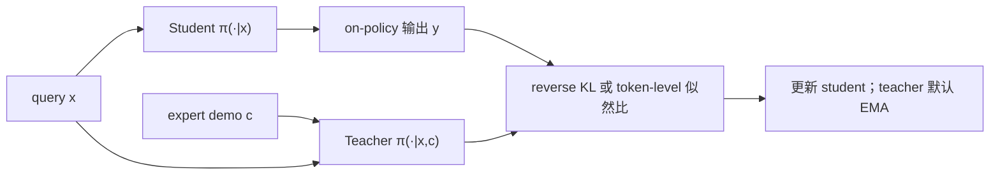

# Self-Distillation Enables Continual Learning (SDFT)

> **作者 / 机构**：Idan Shenfeld, Mehul Damani, Jonas Hübotter, Pulkit Agrawal（MIT 等）
> **链接**：[arXiv:2601.19897](https://arxiv.org/abs/2601.19897) · [代码](http://idanshenfeld.com/SDFT)
> **发表**：2026-01（arXiv preprint）
> **阅读日期**：2026-07-14
> **读者定位**：算法工程师，关注 continual learning、SFT 替代、Agent 技能累积

---

## 目录

| 章节 | 主题 |
|------|------|
| [§1](#1-核心问题) | 核心问题 |
| [§2](#2-方法直觉) | 方法直觉 |
| [§3](#3-实验与证据) | 实验与证据 |
| [§4](#4-局限与开放问题) | 局限与开放问题 |
| [§5](#5-与-agent--工程实践的关联) | 与 Agent / 工程实践的关联 |
| [§6](#6-个人评价) | 个人评价 |

---

## 1. 核心问题

### 1.1 痛点：只有 demonstration 时如何做 on-policy continual learning

Foundation model 持续学新技能时面临三角困境：

| 路径 | 优点 | 问题 |
|------|------|------|
| **SFT on demos** | 简单可扩展 |  inherently off-policy；顺序 SFT → **灾难性遗忘** |
| **IRL + on-policy RL** | 理论上 on-policy | 奖励恢复需强先验，工程落地难 |
| **On-policy RL** | 减 forgetting | 需要显式 reward，很多 demo 场景没有 |

核心问题：**只有专家 demonstration、没有 reward 函数时，能否做 on-policy 更新，既学新任务又保留旧能力？**

### 1.2 问题形式化

对每个 query \(x\)，有专家 demonstration \(c\)（如正确 tool call 示例）：

- **Student**：\(\pi(\cdot \mid x)\) — 当前策略，只看 query
- **Teacher**：\(\pi(\cdot \mid x, c)\) — 同一模型，in-context 看到 demo
- Student 采样 on-policy 轨迹，最小化 **reverse KL**：\(D_{\mathrm{KL}}(\pi(\cdot|x)\,\|\,\pi(\cdot|x,c))\)

等价于最大化 implicit reward（Eq. 5）：

\[
r(y, x, c) = \log \pi(y \mid x, c) - \log \pi_k(y \mid x)
\]

即：**demo-conditioned 的「更 wise 的自己」相对当前 student 的 log-likelihood 差**。

---

## 2. 方法直觉

### 2.1 训练流程

### 2.2 In-Context Assumption（Eq. 4）

\[
\pi^\star_{k+1}(y \mid x) \approx \pi(y \mid x, c)
\]

假设：模型看到 demo 后的行为分布 ≈ 该任务上的最优策略。这依赖两点（§3.2 实证）：

1. Demo-conditioned teacher **高 reward**（ToolAlpaca 上 42% → 100%）
2. Teacher 分布 **仍接近 base model**（非 verbatim 抄 demo），减轻 forgetting

Teacher 权重默认用 student 的 **EMA**，稳定 target 分布。

### 2.3 与 SFT / DFT 对比

| | SFT | DFT（近似 on-policy） | **SDFT** |
|--|-----|----------------------|----------|
| 训练分布 | 专家轨迹（固定） | 部分 on-policy | 完全 on-policy student 轨迹 |
| 信号来源 | 模仿 expert token | 蒸馏 | demo-aware self-teacher |
| Continual 友好 | ✗ | 部分 | ✓ |

---

## 3. 实验与证据

### 3.1 三类实验设置

**A. Skill Learning**（Tool Use、Science Q&A、Medical）

- 新任务 accuracy vs 旧 benchmark 套件（HellaSwag、MMLU、HumanEval 等）平均分的 **Pareto 权衡**（Figure 4）
- SDFT 在「新任务高 + 旧能力保留」上 **Pareto 占优**

**B. Knowledge Acquisition**

- 注入新事实（如医学 FAQ）；测 in-distribution 与 out-of-distribution 问答
- Table 1：SDFT strict accuracy **89%** vs SFT **80%**；OOD 接近 perfect，SFT 仍低

**C. Sequential Continual Learning**

- 同一模型 **顺序** 训练三个不同技能（Figure 3 / Figure 5）
- SFT：学 task B 后 task A 性能崩塌
- SDFT：**累积多技能无显著回归**

### 3.2 关键消融

| 发现 | 含义 |
|------|------|
| 收益随模型 scale 增大 | 依赖 ICL 能力；大模型更适合 SDFT |
| Pass@k 全 k 提升 | 非 entropy collapse 假改进 |
| EMA teacher vs 其他 parameterization | §4.6 有 ablation |
| vs SFT + re-invoke | 部分恢复旧能力，但不及 SDFT |

### 3.3 作者结论 vs 数据支持

| 声称 | 支持程度 |
|------|----------|
| 比 SFT 更少 catastrophic forgetting | 强（三设定 + 顺序实验） |
| 无需 reward 的 on-policy continual learning | 强（IRL 视角推导 + 实验） |
| 超越 on-policy RL | 未直接对比（缺 reward 场景） |

---

## 4. 局限与开放问题

- **In-Context Assumption 可能失效**：demo 质量差、任务与 pretrain 分布差、小模型 ICL 弱
- **需要 curated demonstrations**：不是 RL 式环境交互；demo 获取成本仍高于纯 scalar reward
- **Teacher EMA 引入额外超参**：更新节奏与 forgetting 的权衡
- **与 replay / regularization 经典 CL 方法对比有限**：主要打 SFT 系 baseline
- **Agent 长程多步**：实验以单轮 tool call / QA 为主，未测多 turn Agent 轨迹

---

## 5. 与 Agent / 工程实践的关联

| 论文概念 | 工程对应 |
|----------|----------|
| Demo-conditioned teacher | Cursor rule / skill 示例 + 当前 session 上下文 |
| On-policy student rollout | Agent 在真实 MCP 环采样，而非只 SFT 历史成功 trace |
| 顺序三技能实验 | 个人 Agent 先学「读文件」再学「写 PR」再学「跑 CI」的理想范式 |
| 接近 base 的 teacher | 新 skill 微调时应用 LoRA / 小 LR，避免破坏通用能力 |

**Agent 系统启示**：当用户给出「这样调用才对」的示范时，不应只做 off-policy SFT；应用 SDFT 式 **「带 demo 的 self-teacher 指导当前策略 rollout」** 做 on-policy 更新，更适合 continual personalization。

与 OPSD：OPSD 的 privileged info 是 **标准答案**；SDFT 是 **专家 demonstration**。二者都是单模型双 context，但 SDFT 强调 **continual / 防遗忘**。

---

## 6. 个人评价

- **价值**：5/5 — 精准命中「只有 demo、没有 reward」的 continual learning 空白；与 Agent 个性化高度相关
- **精读建议**：读 Figure 2 算法图 + Eq. 4–6 IRL 等价 + 顺序学习 Figure 3
- **后续动作**：对比 SDFT 与 EWC / replay 在相同 Agent skill 数据上的成本；与 OpenClaw-RL 的 OPD 能否统一为「demo-aware distillation」

---

*阅读完成：2026-07-14*
