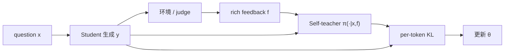

# Reinforcement Learning via Self-Distillation (SDPO)

> **作者 / 机构**：Jonas Hübotter, Frederike Lübeck, Lejs Behric, Anton Baumann, Marco Bagatella, Daniel Marta, Ido Hakimi, Idan Shenfeld, Thomas Kleine Buening, Carlos Guestrin, Andreas Krause（ETH / MIT / LAS 等）
> **链接**：[arXiv:2601.20802](https://arxiv.org/abs/2601.20802) · [代码](https://github.com/lasgroup/SDPO)
> **发表**：2026-01（arXiv preprint）
> **阅读日期**：2026-07-14
> **读者定位**：算法工程师，关注 RLVR、rich feedback、代码/工具 Agent 训练

---

## 目录

| 章节 | 主题 |
|------|------|
| [§1](#1-核心问题) | 核心问题 |
| [§2](#2-方法直觉) | 方法直觉 |
| [§3](#3-实验与证据) | 实验与证据 |
| [§4](#4-局限与开放问题) | 局限与开放问题 |
| [§5](#5-与-agent--工程实践的关联) | 与 Agent / 工程实践的关联 |
| [§6](#6-个人评价) | 个人评价 |

---

## 1. 核心问题

### 1.1 痛点：RLVR 的 credit assignment 瓶颈

在代码、数学等 **可验证域**，LLM post-training 常用 RLVR：采样答案 \(y \sim \pi_\theta(\cdot|x)\)，得标量奖励 \(r \in \{0,1\}\)（如 unit test 通过）。

问题：

1. **整条轨迹共享一个 advantage** — 不知道错在哪个 token
2. **组内全失败时 GRPO advantage = 0** — 学习停滞
3. **环境常返回 rich text**（runtime error、judge 评语）— RLVR 把它压成 1 bit，信息浪费

论文形式化 **Reinforcement Learning with Rich Feedback (RLRF)**：反馈 \(f\) 是 token 序列；目标是把 \(f\) 转成 **dense logit-level 学习信号**，且 **无需外部 teacher 或 reward model**。

### 1.2 Self-teacher 定义

同一策略 \(\pi_\theta\) 两角色：

- **Student**：\(\pi_\theta(\cdot \mid x)\) — 初始作答
- **Self-teacher**：\(\pi_\theta(\cdot \mid x, f)\) — 看到题目 + rich feedback 后，**重算**原作答各 token 的 log-prob

损失（Eq. 1）：

\[
\mathcal{L}_{\text{SDPO}}(\theta) = \sum_t \mathrm{KL}\!\left(\pi_\theta(\cdot \mid x, \hat{y}_{<t})\;\|\;\mathrm{stopgrad}\!\left(\pi_\theta(\cdot \mid x, f, \hat{y}_{<t})\right)\right)
\]

**无额外采样开销** — 只对已有 rollout 做 conditional forward。

---

## 2. 方法直觉

### 2.1 训练流程

Self-teacher prompt 模板（Table 2）可包含：

- 环境输出（如 LeetCode 失败用例摘要）
- 同组内 **已成功 rollout** 作为 implicit solution（无 rich feedback 时的 fallback）

### 2.2 SDPO advantage = logit-level credit

SDPO 梯度等价于 policy gradient，advantage 为（Eq. 2 附近）：

\[
A^{\text{SDPO}}_{i,t}(\hat{y}_{i,t}) = \log \frac{\pi_\theta(\hat{y}_{i,t} \mid x, f_i, y_{i,<t})}{\pi_\theta(\hat{y}_{i,t} \mid x, y_{i,<t})}
\]

| | GRPO | SDPO |
|--|------|------|
| Advantage 粒度 | 整条 rollout 常数 | **逐 token** |
| 全失败组 | 梯度为 0 | teacher 仍可通过 \(f\) 给出非零信号 |
| 额外采样 | G 条生成 | **0**（仅重算 log-prob） |
| 实现 | 标准 RLVR | **替换 advantage 计算即可** |

### 2.3 两种反馈 regime

1. **Rich feedback**（LiveCodeBench v6 + LeetCode 式报错）
2. **仅 scalar reward**：把同题 **成功 rollout** 当作 failed attempt 的 feedback（§3）

---

## 3. 实验与证据

### 3.1 Rich feedback：LiveCodeBench v6（Qwen3-8B，Figure 1）

| 方法 | 最终 accuracy | 样本效率 |
|------|---------------|----------|
| GRPO | 41.2% | baseline |
| **SDPO** | **48.8%** | 达 GRPO 最终精度约 **4× 更少 generations** |

随模型 scale 增大，SDPO 增益更大（强 ICL → 强 self-teaching）。

### 3.2 仅 scalar feedback：科学推理 + 工具使用

- Qwen3-8B、Olmo3-7B-Instruct
- SDPO **68.8%** vs GRPO **64.1%**（aggregate）
- 生成长度可短 **7×** 仍保持更高精度 — 有效推理不必冗长

### 3.3 Test-Time Self-Distillation

- 对极难 LCB 题（base pass@64 < 0.03），在 **单题** 上做 SDPO 式 test-time training
- 达到与 best-of-k / multi-turn 相同发现率，约 **3× 更少 attempts**

### 3.4 工程开销

- 相对 GRPO 额外成本：**self-teacher forward**（可并行，Figure 5 显示 overhead 小）
- Top-K distillation（K=100）避免存 full logits 的内存爆炸

### 3.5 作者结论 vs 数据支持

| 声称 | 支持程度 |
|------|----------|
| Rich feedback → dense RL | 强（LCB + Figure 4 token 热力图） |
| 无 rich feedback 仍优于 GRPO | 强（成功 rollout 作 implicit feedback） |
| Drop-in 替换 GRPO | 强（算法 1 + advantage swap） |
| Test-time 3× 加速 | 中等（特定难题子集） |

---

## 4. 局限与开放问题

- **依赖模型 in-context 纠错能力**：弱模型 self-teacher 不可靠
- **Feedback 质量**：垃圾 feedback → 错误 credit assignment
- **Self-teacher 与 student 同权重**：mistake 可能被「自信地合理化」
- **长 horizon Agent**：实验以单段作答为主；多轮 tool loop 的 \(f\) 结构更复杂
- **与 process RM 的关系**：dense 但不等价于人类逐步标注 PRM

---

## 5. 与 Agent / 工程实践的关联

| 论文概念 | 工程对应 |
|----------|----------|
| Rich feedback \(f\) | 终端 stderr、pytest 输出、编译器报错、LLM judge 评语 |
| 成功 rollout 作 feedback | CI 绿 build 的 patch 可监督同 PR 下失败尝试 |
| Advantage swap | 现有 GRPO 训练栈 **最小改动** 接入 |
| Test-time SDPO | 难题上 Agent 本地多轮 self-distill，不必堆 best-of-k |

与 [OpenClaw-RL](./2026-03-10-openclaw-rl.md)：OpenClaw OPD 同样用 next-state 文本作 teacher context；SDPO 更 general，形式化了 **RLRF** 且证明 **scalar-only 环境也能用 implicit feedback**。

与 RLTF：SDPO 在 **单轮** 内用 environment feedback 做 retrospective distillation；RLTF 用 **第二轮生成** 作 teacher，优化 **single-turn test** 目标 — 问题设定不同但同属「把 feedback 内化进 policy」。

---

## 6. 个人评价

- **价值**：5/5 — 清晰统一「rich feedback RL」与「RLVR 升级路径」；工程友好（换 advantage）
- **精读建议**：Algorithm 1 + Table 2 prompt + Proposition 2.1 advantage 形式 + LCB Figure 1
- **后续动作**：在 slime/veRL 管线试 SDPO advantage；对比 OPSD（privileged \(y^\star\)）在数学任务上的差异

---

*阅读完成：2026-07-14*
