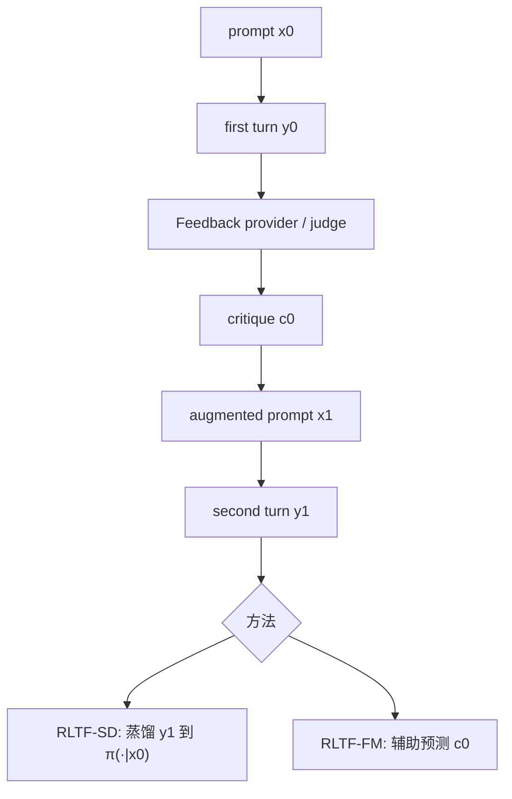

# Expanding the Capabilities of RL via Textual Feedback (RLTF)

> **作者 / 机构**：Yuda Song, Lili Chen, Fahim Tajwar, Rémi Munos, Deepak Pathak, J. Andrew Bagnell, Aarti Singh, Andrea Zanette（CMU 等）
> **链接**：[arXiv:2602.02482](https://arxiv.org/abs/2602.02482) · [代码](https://github.com/lili-chen/rltf) · [网站](https://rl-textfeedback.github.io/)
> **发表**：2026-02（arXiv preprint）
> **阅读日期**：2026-07-14
> **读者定位**：算法工程师，关注 multi-turn RL、text feedback、single-turn 能力内化

---

## 目录

| 章节 | 主题 |
|------|------|
| [§1](#1-核心问题) | 核心问题 |
| [§2](#2-方法直觉) | 方法直觉 |
| [§3](#3-实验与证据) | 实验与证据 |
| [§4](#4-局限与开放问题) | 局限与开放问题 |
| [§5](#5-与-agent--工程实践的关联) | 与 Agent / 工程实践的关联 |
| [§6](#6-个人评价) | 个人评价 |

---

## 1. 核心问题

### 1.1 痛点：标量 reward 太稀、完整 demo 太贵

LLM post-training 的监督谱：

```
完整 demonstration ──────────────────► 标量 reward
     （dense，难 scale）                    （1 bit，易 scale）
                    ▲
                    │  text feedback
                    │  （中等密度，易 scale）
```

**Text feedback**（用户批评、标注员评语、自动 judge 的 critique）在现实中 abundant，但标准 RL 要么忽略它，要么只在 **multi-turn 推理时当上下文**，不保证 **single-turn 能力提升**。

### 1.2 RLTF 问题设定

- **训练时**：2-turn 交互 — \(y_0 \sim \pi(\cdot|x_0)\) → judge 给 \(c_0\) → \(x_1 = f(x_0, y_0, c_0)\) → \(y_1 \sim \pi(\cdot|x_1)\)
- **测试时**：**single-turn** — 只评 \(J_{\text{SingleTurn}}(\pi) = \mathbb{E}[R(x_0, y)]\)，**无 feedback**

核心研究问题：**如何利用训练期的 feedback-augmented 轨迹，优化测试期 one-shot 表现？**

 naive multi-turn GRPO 能提升 multi-turn，但 **single-turn 几乎不涨**（Table 1 与 §5 验证）。

---

## 2. 方法直觉

### 2.1 总体架构



### 2.2 方法一：RLTF-SD（Self Distillation）

把 **feedback 条件下的第二轮输出** \(y_1\) 当作 implicit teacher，更新 **第一轮 policy** \(\pi(\cdot|x_0)\)：

- \(\pi_{\text{ref}}(\cdot|x_1) = \pi(\cdot|x_0)\)（AWR 式，避免 IS 方差爆炸）
- Advantage：\(A_i^{(0)} = R(x_0, y_1^i) - b^{(0)}\)，其中 \(b^{(0)}\) 为 **first-turn 组内平均 reward**（Eq. 7）

**为何不用 second-turn baseline？** 当 \(p_1 \to 1\)（第二轮几乎总对），组内 reward 常数 → **梯度 collapse**；first-turn baseline 避免此退化（§3.1 详述）。

与 Rejection Sampling（只对 \(R=1\) 的 \(y_1\) 做 SFT）相比，带 baseline 的 SD **负样本也贡献学习信号**。

### 2.3 方法二：RLTF-FM（Feedback Modeling）

辅助目标：在同一 policy 上训练 **预测 critique** \(p_\theta(c \mid x, y)\)。

- 提供 **dense token-level 梯度**（失败 rollout 也有监督）
- 理论（§4 / Appendix C）：在 batch RL + log-linear policy 下，reward-only 信号近似 **rank-1**，feedback modeling 提供 **better-conditioned representation 更新**
- **Test-time**：模型可自生成 critique 做多轮 refine，无需单独 judge（§4.2）

---

## 3. 实验与证据

### 3.1 任务与指标

| 域 | 任务 | 指标 |
|----|------|------|
| Reasoning | Knights and Knaves, Binary Matrix, Shortest Path | mean@1，single-turn |
| Math | MATH500, AIME24（DAPO / DeepMath 训练） | mean@32 |
| Creative | LitBench, WritingBench | LLM judge 分（1–10） |

对比 baseline：Single-turn GRPO、Multi-turn GRPO、Feedback Descent 等。

### 3.2 主结果（Table 1，single-turn \(J_{\text{SingleTurn}}\)）

| 任务 | Single GRPO | Multi GRPO | **RLTF-SD** | **RLTF-FM** |
|------|-------------|------------|-------------|-------------|
| Knights and Knaves | 0.058 | 0.373 | **0.802** | **0.880** |
| Binary Matrix | 0.001 | 0.125 | **0.976** | **0.978** |
| MATH500 (DAPO) | 0.376 | 0.526 | **0.548** | **0.567** |
| AIME24 (DAPO) | 0.025 | 0.058 | **0.088** | **0.083** |
| LitBench | 4.20 | 6.83 | **8.25** | **8.80** |

要点：

- **RLTF-SD / FM 全面优于 baselines**
- Multi-turn GRPO ≈ single-turn GRPO on single-turn metric — **证明需专门内化 feedback**
- Reasoning puzzle 上增益最大（train-test 分布近）；math / writing 仍有提升

### 3.3 消融（Figure 2）

- First-turn baseline > second-turn GRPO baseline
- AWR + \(\pi_{\text{ref}}=\pi(\cdot|x_0)\) > PPO/CISPO clipping 变体
- Rejection Sampling < 带 baseline 的 SD

### 3.4 作者结论 vs 数据支持

| 声称 | 支持程度 |
|------|----------|
| Text feedback 介于 reward 与 demo 之间且可 scale | 强（多域实验 + 理论） |
| 必须优化 single-turn 而非仅 multi-turn | 强（与 multi GRPO 对照） |
| FM 提供互补 representation 信号 | 中等（理论 idealized，empirical 与 SD 互有胜负） |

---

## 4. 局限与开放问题

- **训练期依赖 external judge** 产生 \(c_0\)（FM 可在 test-time 自生成，但质量待验）
- **2-turn 设定**：更多轮 critique-refine 未系统展开
- **WritingBench 泛化**：LitBench 训练 checkpoint 跨任务评测有分布 gap
- **与 SDPO 重叠**：同属 self-distillation，但 RLTF 强调 **compiler single-turn** 与 **FM 辅助头**
- **Feedback Descent 等 text-space 方法**：已证明不如 parameter-space RLTF

---

## 5. 与 Agent / 工程实践的关联

| 论文概念 | 工程对应 |
|----------|----------|
| Train multi-turn, test single-turn | Agent 开发时有 critic loop，部署时要 **one-shot 高质量** |
| First-turn baseline | 在线 RL 里应用 **pre-feedback 表现** 作 baseline，避免「第二轮总对」导致无梯度 |
| RLTF-FM | 让 Agent **学会预测用户会怎么骂**，内化改进方向 |
| Judge → critique → revise | Code review bot、CI 日志 → 第二轮 patch → 蒸馏回 first-attempt policy |

与 SDPO：SDPO 在 **同一 rollout** 上 retrospective 重算 log-prob（RLRF）；RLTF 用 **第二次采样** \(y_1\) 作 target。RLTF 更贴近「人类给评语 → 重写」交互；SDPO 更贴近「环境报错 →  hindsight 打分」。

与 OPSD / SDFT：privileged info 分别是 **标准解** / **expert demo**；RLTF 的 privileged context 是 **textual critique + 首轮输出**。

---

## 6. 个人评价

- **价值**：4/5 — 形式化 RLTF + 两种互补算法；first-turn baseline 洞察对 multi-turn RL 工程极有价值
- **精读建议**：§3 RLTF-SD 的 baseline 设计 + Table 1 + FM 表示学习命题（Appendix C 摘要）
- **后续动作**：读 [rltf 代码](https://github.com/lili-chen/rltf) 实验脚本；与 SDPO 在同一 math 任务上对比实现复杂度

---

*阅读完成：2026-07-14*
