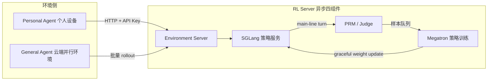
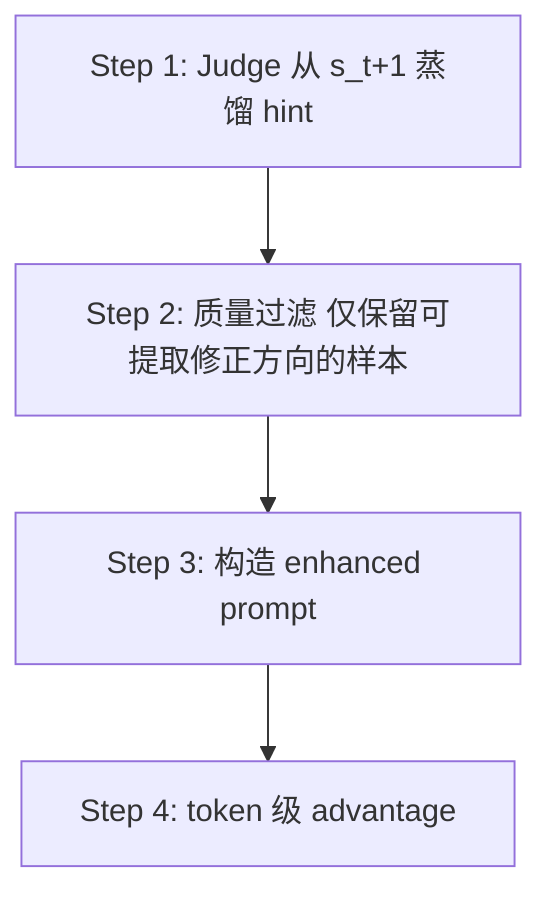
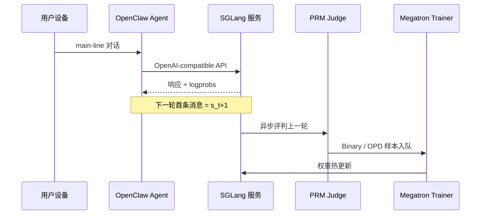

# OpenClaw-RL: Train Any Agent Simply by Talking

> **作者 / 机构**：Yinjie Wang, Xuyang Chen, Xiaolong Jin, Mengdi Wang, Ling Yang（Princeton / Gen-Verse）
> **链接**：[arXiv:2603.10165](https://arxiv.org/abs/2603.10165) · [代码](https://github.com/Gen-Verse/OpenClaw-RL)
> **发表**：2026-03（arXiv preprint）
> **阅读日期**：2026-07-14
> **读者定位**：Agent 系统工程师，关注在线 RL、个性化对齐、长程 Agent 训练基础设施

---

## 目录

| 章节 | 主题 |
|------|------|
| [§1](#1-核心问题) | 核心问题 |
| [§2](#2-方法直觉) | 方法直觉 |
| [§3](#3-实验与证据) | 实验与证据 |
| [§4](#4-局限与开放问题) | 局限与开放问题 |
| [§5](#5-与-agent--工程实践的关联) | 与 Agent / 工程实践的关联 |
| [§6](#6-个人评价) | 个人评价 |

---

## 1. 核心问题

### 1.1 痛点：next-state 信号被当上下文丢弃

Agent 每执行一步动作 \(a_t\)，环境都会返回 **next-state 信号** \(s_{t+1}\)：用户回复、工具输出、终端/GUI 状态变化、测试判决等。现有系统（ReAct、veRL、slime 等）几乎只把这些信号 **拼进下一轮 prompt**，当作推理上下文，**不把它们当作在线学习信号**。

论文认为这里存在两类「浪费」：

| 浪费类型 | next-state 里有什么 | 现有做法的问题 |
|----------|---------------------|----------------|
| **Evaluative（评价性）** | 用户重问、测试通过、报错 trace | PRM 多用于数学推理离线标注；长程 Agent 只有终局 reward，中间步无梯度 |
| **Directive（指导性）** | 「你应该先检查文件」、SWE diff 暗示的修正方向 | RLVR 只有标量 reward，无法做 token 级方向修正；蒸馏依赖预采集反馈对 |

### 1.2 问题形式化

每条交互流建模为 MDP \((S, A, T, R)\)：

- **State** \(s_t\)：到第 \(t\) 轮为止的完整对话或环境上下文
- **Action** \(a_t\)：策略 \(\pi_\theta\) 生成的 token 序列
- **Transition** \(T(s_{t+1} \mid s_t, a_t)\)：给定环境后确定性；\(s_{t+1}\) 即 next-state 信号
- **Reward** \(R(s_t, s_{t+1})\)：由 PRM Judge 从 next-state 推断

论文核心主张：**个人对话、终端、GUI、SWE、tool-call 不是五个独立训练问题，而是同一策略在同一异步训练环里可并行消费的异构交互流。**

---

## 2. 方法直觉

### 2.1 系统架构：四路完全解耦的异步环

OpenClaw-RL 建立在 [slime](https://github.com/THUDM/slime) 之上，把 **推理服务、环境托管、PRM 评判、策略训练** 拆成四个互不阻塞的循环（Figure 1）：

关键工程性质：

- 模型 **继续服务** 当前请求的同时，PRM 评判上一轮、Trainer 做梯度更新，**零协调阻塞**
- 个人 Agent：自托管模型经 **保密 API** 接入 OpenClaw，无需改 Agent 框架本体
- 通用 Agent：云端 32–128 路并行环境，缓解长程 rollout 长尾

### 2.2 个人 Agent 环境服务器：Session 感知

API 请求分两类：

| 类型 | 是否产生训练样本 | 示例 |
|------|------------------|------|
| **Main-line turn** | 是 | 主对话回复、工具执行结果 |
| **Side turn** | 否（仅转发） | 辅助查询、记忆整理、环境过渡 |

每条新 main-line 请求的首条消息即上一轮的 \(s_{t+1}\)，触发异步 PRM/OPD 管线。全量交互以 JSONL **非阻塞** 记录，权重更新边界处清空日志，保证日志对应单一策略版本。

### 2.3 学习信号一：Binary RL（标量过程奖励）

**PRM Judge** 对 \((a_t, s_{t+1})\) 输出 \(r \in \{+1, -1, 0\}\)：

- 个人 Agent：从用户下一句推断满意/不满；鼓励用户给显式反馈
- 通用 Agent：判断环境反馈是否推进任务（终端/GUI/SWE 各有专用 judge prompt，见附录）
- **多数投票**：并行 \(N\) 次 judge 查询，`MajorityVote` 得 \(r_{\text{final}}\)

优势 \(A_t = r_{\text{final}}\)，配合 PPO clipped surrogate（\(\varepsilon=0.2\)，\(\varepsilon_{\text{high}}=0.28\)，\(\beta_{\text{KL}}=0.02\)）。**实时对话无 group 结构**，不能用 GRPO 式组内标准化。

### 2.4 学习信号二：Hindsight-Guided OPD（token 级方向优势）

把 next-state 里的 **指导性信息** 转成 token 级监督，四步管线（Algorithm 2）：

| 步骤 | 做法 | 设计意图 |
|------|------|----------|
| 1. Hint 提取 | `Judge(a_t, s_{t+1}) → score, hint`；**不用原始** \(s_{t+1}\) 作 hint | 原始信号嘈杂（夹杂新问题）；蒸馏为 1–3 句可执行指令 |
| 2. 质量过滤 | 仅 `score=+1` 且 `\|hint\|>10`；取最长 hint；无有效 hint 则 **丢弃样本** | OPD 用数量换质量；与 Binary RL 广覆盖互补 |
| 3. Teacher 构造 | 把 hint 追加到最后一条 user 消息：`[user's hint / instruction]\n{hint}` | 模拟「用户一开始就给出纠正」的反事实上下文 |
| 4. Token advantage | \(A_t = \log\pi_{\text{teacher}}(a_t \mid s_{\text{enhanced}}) - \log\pi_\theta(a_t \mid s_t)\) | 正：应增权 token；负：应减权 token；**同一句内不同 token 可相反方向** |

与 RLHF/DPO/标准蒸馏的差异：无需外部强教师、无需配对偏好、无需预采集数据；**同一策略模型在 hint 增强上下文下充当自己的 teacher**。

### 2.5 组合目标：Binary + OPD

两种方法共享同一 PPO loss，仅 advantage 计算不同：

\[
A_t = w_{\text{binary}}\, r_{\text{final}} + w_{\text{opd}}\, \bigl(\log\pi_{\text{teacher}} - \log\pi_\theta\bigr)
\]

默认 \(w_{\text{binary}} = w_{\text{opd}} = 1\)。论文建议 **同时开启**：Binary 覆盖所有可评分轮次；OPD 在含丰富纠正信息的子集上提供高分辨率 token 监督。

### 2.6 通用 Agent：过程奖励 + 终局奖励

长程任务若只用 outcome reward，绝大多数中间步无梯度。遵循 RLAnything 思路：

- 每步奖励 \(r_t = r_t^{\text{outcome}} + \sum_{i=1}^{t} r_i^{\text{process}} / t\)
- 优势计算：按 **相同 step index** 分组标准化（终端环境难以按 state 聚类）

### 2.7 关键创新点（摘要）

1. **Next-state 作为通用在线学习源**：异构交互流汇入同一训练环，无需预采集数据集
2. **评价 + 指导双通道恢复**：Binary RL 吃标量过程奖励；OPD 吃 token 级方向优势
3. **全异步四组件基础设施**：服务、rollout、评判、训练零阻塞，支持「用着用着就变强」

---

## 3. 实验与证据

### 3.1 双轨评估设计

| 轨道 | 场景 | 基座模型 | 核心问题 |
|------|------|----------|----------|
| **Personal** | OpenClaw 模拟学生/教师个性化 | Qwen3-4B | 对话 next-state 能否持续个性化？ |
| **General** | Terminal / GUI / SWE / Tool-call | Qwen3-8B / Qwen3VL-8B / Qwen3-32B / Qwen3-4B-SFT | 同一基础设施能否规模化长程 RL？ |

### 3.2 个人 Agent 结果（Table 3, Figure 2）

用 LLM 模拟两类用户偏好（GSM8K 作业场景）：

- **学生**：不想被看出在用 AI（避免「bold」、过度结构化表述）
- **教师**：批改评语要具体、友好

| 方法 | 8 步更新后得分 | 16 步更新后得分 | 备注 |
|------|----------------|-----------------|------|
| Base | 0.17 | 0.17 | — |
| Binary RL | 0.25 | 0.23 | 边际改善 |
| OPD | 0.25 | 0.72 | 样本稀疏，见效慢 |
| **Combined** | **0.76** | **0.81** | 显著最优 |

Takeaway：学生设定约 **36 次** 解题交互、教师设定约 **24 次** 批改交互即可观察到明显风格迁移（Figure 2 前后对比）。

### 3.3 通用 Agent 结果

- **环境并行**：Terminal 128 路、GUI/SWE 各 64 路、Tool-call 32 路（Figure 4）
- **过程 + 终局奖励**（Table 4）：Tool-call 上 Integrated 0.30 vs Outcome-only 0.17；GUI 上 0.33 vs 0.31
- Takeaway [Q4]：长程任务集成过程奖励优于纯 outcome，但需额外 PRM 托管资源

### 3.4 复现与开源

| 维度 | 状态 |
|------|------|
| 代码 | [Gen-Verse/OpenClaw-RL](https://github.com/Gen-Verse/OpenClaw-RL)，Apache-2.0 |
| 算力 | 个人轨默认 8× GPU；支持 LoRA、Tinker/Fireworks 云部署 |
| 数据 | 个人轨为 live 对话；通用轨用 SETA、OSWorld-Verified、SWE-Bench-Verified、DAPO 等 |
| 与论文差异 | README 称 Binary RL 实现侧用 GRPO advantage；论文正文写实时对话无 group、用 PPO 标量优势——**待对照代码确认** |

### 3.5 作者结论 vs 数据实际支持

| 声称 | 支持程度 |
|------|----------|
| Combined > 单独 Binary/OPD | Table 3 强支持（个人轨） |
| 少量对话即可个性化 | Figure 2 案例支持；评估器本身也是 LLM，**存在 evaluator 偏差风险** |
| 统一基础设施覆盖四类通用 Agent | 有曲线与设置表；绝对指标因任务而异，不宜跨场景直接比大小 |
| 「零人工标注」 | PRM/Judge 本身是大模型推断，非人类标注，但 **judge 质量成为新瓶颈** |

---

## 4. 局限与开放问题

### 4.1 论文与作者承认的局限

- OPD 严格过滤导致 **训练样本稀疏**，早期效果弱于 Binary
- 托管 PRM 需要 **额外 GPU/推理资源**
- 个人轨实验为 **LLM 模拟用户**，非真实人类 longitudinal study

### 4.2 我看到的额外局限

| 局限 | 说明 |
|------|------|
| Judge 依赖 | 全程 reward 来自另一个 LLM；judge 偏见会系统性注入策略 |
| 隐私与安全 | 对话即训练数据；论文提醒勿输入敏感信息，但 RL 日志仍存全量轨迹 |
| Side turn 不训练 | 记忆整理、辅助查询不参与梯度，可能丢失部分学习信号 |
| 权重热更新 | graceful update 如何与 prompt cache、多副本 serving 一致——论文略写 |
| 多用户策略 | 2026-04 代码已支持「多人反馈优化单模型」，但论文实验以单用户模拟为主 |

### 4.3 开放问题

- 真实用户长期 A/B 下，个性化增益是否可持续？会否过拟合到少数活跃用户？
- OPD hint 蒸馏错误时，token 级负向优势会否 **强化幻觉**？
- 与 concurrent work（Buening et al. 2026 直接用 next-state prompt 对齐）的样本效率对比？

---

## 5. 与 Agent / 工程实践的关联

### 5.1 可迁移思想

| 论文概念 | 工程对应 | 可参考 |
|----------|----------|--------|
| Next-state 信号 | 用户下一句、tool result、exit code **本来就是隐式 reward** | 生产日志 → 离线 RL/DPO 管线 |
| Main-line vs Side turn | 区分可训练轮次与 housekeeping 轮次 | `openclaw-note` 中 session/transcript 边界 |
| Hint 增强 teacher | 把「事后纠正」反事实注入 prompt 做 self-distillation | Codex compact 后 reinject、Hermes `on_pre_compress` |
| 四路异步 | Serving / Rollout / RM / Train 解耦 | slime、veRL、AReal 思路；**OpenClaw-RL 新增 live HTTP 个人设备环境** |
| 过程 + 终局奖励 | 长程 Agent 每步信用分配 | RLAnything、ReasonFlux-PRM |

### 5.2 与 OpenClaw 运行时的衔接

[`openclaw-note.md`](../frontier-apps/openclaw-note.md) 描述的是 **推理与控制面**（Gateway → Harness → Runtime → Tools）。OpenClaw-RL 是 **平行叠加的训练面**：

接入方式：在 `openclaw.json` 把 model provider 的 `baseUrl` 指向 RL 服务器（`:30000/v1`），或通过 [rl-training-headers 扩展](https://github.com/Gen-Verse/OpenClaw-RL/tree/main/extensions/rl-training-headers) 给自有 OpenClaw 打标。

### 5.3 若你要做 Agent 系统，可借鉴什么？

**可直接借鉴：**

- 把 **环境反馈** 从「仅拼 context」升级为 **异步 reward 管线**，不阻塞用户请求
- Session 级区分 trainable turn，避免记忆压缩轮次污染梯度
- Binary（广覆盖）+ OPD（高精度）**双通道 reward** 组合

**需要改造：**

- 无 8× GPU 时：LoRA、云 Tinker/Fireworks，或只做 Binary + 低频训练
- 企业场景：judge 换成规则+人审混合；日志脱敏与 retention 策略
- 多租户：单策略多人反馈的 credit assignment 与公平性（代码已在探索）

### 5.4 与主流 RLHF/Agentic RL 对照

| 维度 | 批量 RLHF / GRPO | 单环境 Agentic RL | OpenClaw-RL |
|------|------------------|-------------------|-------------|
| 数据来源 | 固定数据集 | 单类模拟环境 rollout | **Live 异构多流** |
| 训练时机 | 离线阶段 | 环境步结束后 batch | **与服务并行** |
| Reward | 偏好/终局 verifiable | 多为 outcome 或专用 PRM | **Next-state PRM + OPD hint** |
| 个性化 | 难 | 非目标 | **核心场景之一** |
| 基础设施 | OpenRLHF / veRL | 每篇一套 | slime 四路异步 + HTTP 个人环境 |

---

## 6. 个人评价

### 6.1 价值：**4.5 / 5**

理由：问题定义清晰（next-state 浪费）、工程完整度高（开源 + 双轨实验）、OPD 把「用户纠正」变成 token 级梯度是 **对 Agent 工程师最值钱的部分**。扣分主要在个人轨 LLM-as-user 评估、以及对 judge 质量的敏感性分析不足。

### 6.2 阅读建议

| 人群 | 建议 |
|------|------|
| Agent 基础设施 | **精读** §2 异步架构 + Session 分类 + 算法伪代码（附录 A） |
| 对齐 / RL 算法 | **精读** OPD 四步 + Combined loss；对照 SDFT/SDPO 集成（`openclaw-opd/`） |
| 只用 OpenClaw 产品 | **读摘要 + §5.2 接入** 即可；训练自行评估 GPU |
| 数学推理-only RL | 可 **跳过**；过程奖励部分与 RLAnything 重叠 |

### 6.3 后续动作

- [ ] 对照 `openclaw-combine/` 代码确认 Binary RL 用 PPO 还是 GRPO advantage
- [ ] 与 [`openclaw-note.md`](../frontier-apps/openclaw-note.md) 对照：main-line 消息在 transcript 中的对应字段
- [ ] 追读 [RLAnything (2602.02488)](https://arxiv.org/abs/2602.02488) 理解过程奖励标准化细节
- [ ] 若有 GPU，跑 `openclaw-test` 复现 Combined vs Binary 曲线

---

*阅读完成：2026-07-14*
