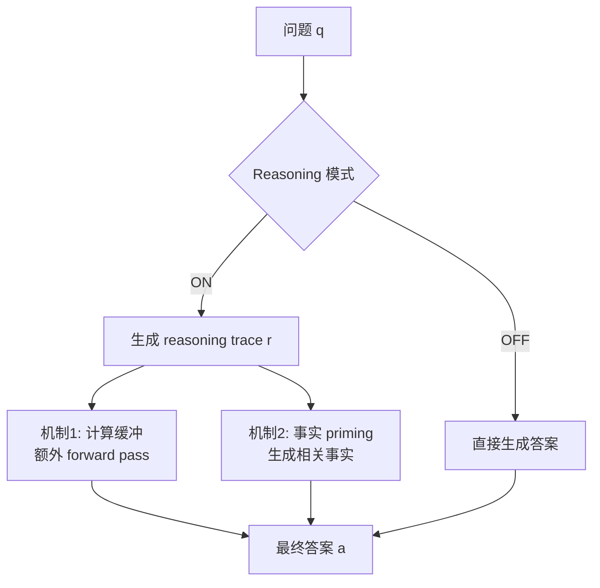

# Thinking to Recall: How Reasoning Unlocks Parametric Knowledge in LLMs

> **作者 / 机构**：Zorik Gekhman, Roee Aharoni, Eran Ofek, Mor Geva, Roi Reichart, Jonathan Herzig（Google Research / Technion / Tel Aviv University）
> **链接**：[arXiv:2603.09906](https://arxiv.org/abs/2603.09906) · [Google Research Blog](https://research.google/blog/thinking-to-recall-how-reasoning-unlocks-parametric-knowledge-in-llms/) · COLM 2026
> **发表**：2026-06
> **阅读日期**：2026-07-14
> **读者定位**：算法工程师 / Agent 系统工程师，关注 reasoning model 推理机制、闭卷 QA、test-time scaling 与 process reward 设计

---

## 目录

| 章节 | 主题 |
|------|------|
| [§1](#1-核心问题) | 核心问题 |
| [§2](#2-方法直觉) | 方法直觉 |
| [§3](#3-实验与证据) | 实验与证据 |
| [§4](#4-局限与开放问题) | 局限与开放问题 |
| [§5](#5-与-agent--工程实践的关联) | 与 Agent / 工程实践的关联 |
| [§6](#6-个人评价) | 个人评价 |

---

## 1. 核心问题

### 1.1 反直觉现象

Chain-of-Thought（CoT）在数学、代码、多跳问答上已证明有效——任务需要逻辑分解时，逐步推理很自然。但对 **简单单跳事实题**（如「Mary Engle Pennington 哪年入选 National Inventors Hall of Fame？」），模型要么参数里存了该事实，要么没有；不需要算术或多步推导。为何开启 reasoning 仍能显著提分？

论文核心主张：**reasoning 扩展了模型的参数知识召回边界（parametric knowledge boundary）**——解锁那些在 reasoning OFF 时几乎无法采到的正确答案，而主要驱动力 **不是** 任务分解，而是 **更好的参数记忆提取**。

### 1.2 问题形式化

| 维度 | 设定 |
|------|------|
| **输入** | 闭卷 QA 问题 \(q\) |
| **模型** | Hybrid R-LLM：同一权重，reasoning 可 ON/OFF 切换（控制 token / system instruction） |
| **输出** | 最终答案 \(a\)；ON 模式下额外生成 reasoning trace \(r\) |
| **评估** | pass@\(k\)：\(k\) 次采样中至少一次正确的概率；侧重 **能力边界** 而非仅 top-1 |
| **数据集** | SimpleQA-Verified（1000 条，90% 单跳）+ EntityQuestions（1000 条，模板化单跳） |

与「模型不会某事实」不同，本文关注 **Inside-out 式 hidden knowledge**：权重里编码了事实，但 direct generation 采不出来（Gekhman et al., COLM 2025）。Reasoning 是 **暴露内部记忆** 的机制之一。

---

## 2. 方法直觉

论文不做新模型训练，而是 **假设驱动的 controlled ablation**：在固定 hybrid 模型上，通过替换 / 注入 reasoning trace 内容，因果分离两种机制。

### 2.1 机制一：计算缓冲（Computational Buffer）

**假设**：reasoning token 提供额外 forward pass，模型在 latent space 做隐式计算，**与 trace 语义无关**。

**实验设计**：

| 变体 | 做法 |
|------|------|
| **ON Dummy** | 将原 trace 替换为重复的无意义句 `"Let me think."`，长度匹配原 trace |
| **ON Single Dummy** | 同上但 dummy 只出现一次（控制 ON/OFF 训练偏置） |

**结论**：ON Dummy 相对 OFF 显著提升 pass@\(k\)；ON Dummy >> ON Single Dummy，隔离出 **纯计算长度** 效应。但 dummy 再长会饱和甚至下降（SimpleQA 上 2048 token 附近最优），且 **永远达不到自然 reasoning trace 的上限** → 计算 alone 不够。

### 2.2 机制二：事实 Priming（Factual Priming）

**假设**：模型在 reasoning 中 **生成式自检索（generative self-retrieval）**——列出与问题主题相关的事实，类似人类 spreading activation，降低目标答案的检索阈值。

**实验设计**：

1. 用 LLM 从 trace 中提取 concrete facts（过滤问题复述、最终答案泄露）
2. **ON Facts**：用 fact list 替换原 trace，再生成答案
3. **OFF Facts**：reasoning OFF，fact list 作为额外 context
4. 对照 **OFF/ON Dummy Facts**：同长度无意义 filler，控制计算量

**结论**：Facts 变体显著优于 Dummy Facts；OFF Facts 仍有效 → **事实内容本身** 驱动召回；ON Facts 往往更好，EntityQuestions 上甚至接近完整 ON 且 compute 更少。

**Case study（尼泊尔第 10 任国王）**：reasoning 先列前 9 任国王，再答对第 10 任；提取 facts 后 OFF Facts 也能答对，而 OFF Dummy Facts 失败。

### 2.3 幻觉陷阱与 test-time 选择

中间事实由模型自生成，可能幻觉。**大规模审计**：Gemini-2.5-Flash + search 逐条验证 trace 中的 facts。

| 数据集 | clean trace 正确率 | hallucinated trace 正确率 |
|--------|-------------------|---------------------------|
| SimpleQA-Verified | 41.4% | 26.4% |
| EntityQuestions | 71.1% | 32.2% |

题内对比（Figure 7）回归斜率 < 1（0.84 / 0.86）→ 控制题目难度后，**含幻觉中间事实的 trace 仍显著更差**。

**Test-time selection**（Table 1，Gemini-2.5-Flash expected accuracy）：

| 策略 | SimpleQA-Verified | EntityQuestions |
|------|-------------------|-----------------|
| Regular | 27.9 | 56.9 |
| Only Facts | 30.2 (+8.2%) | 58.4 (+2.6%) |
| Only Correct Facts | 31.3 (+12.2%) | 59.8 (+5.1%) |

---

## 3. 实验与证据

### 3.1 主实验：pass@\(k\) 与 \(\Omega\)

**模型**：Gemini-2.5-Flash、Gemini-2.5-Pro、Qwen3-32B  
**采样**：每题最多 \(N=100\) 样本，Chen (2021) 无偏 pass@\(k\) 估计；Gemini-2.5-Flash autorater 判对错

**Figure 1 要点**：

- 三模型 × 两数据集，reasoning ON 的 pass@\(k\) 曲线 **一致高于** OFF
- pass@1 有提升，但 **高 \(k\) 增益更大**；Qwen3-32B 在 SimpleQA-Verified 上 pass@\(k\) 近 **翻倍** → 扩展能力边界，而非仅 sharpen 已有分布
- 汇总指标 \(\Omega\)：对 \(k=1..N\) 的相对 pass@\(k\) 提升做 **线性加权平均**（大 \(k\) 权重更高）

**Figure 2 要点**：

- 能力越弱的模型 \(\Omega\) 越高（Qwen3-32B > Gemini Flash > Pro）→ reasoning 补偿 **低效参数召回**
- SimpleQA 的 \(\Omega\)  consistently 高于 EntityQuestions → OFF baseline 更低、headroom 更大

### 3.2 消融：问题复杂度不是主因

SimpleQA-Verified 元数据标注 multi-hop / requires-reasoning；Complex vs Simple 子集的 \(\Omega\) **95% CI 重叠**，Complex 子集甚至无显著增益（Gemini-2.5-Pro CI 跨零）。

→ 增益主要来自 **参数召回**，不是多跳分解。与 concurrent work（Ma & Hewitt 2026; Calderon et al. 2026）一致，但本文额外做了 **pass@\(k\) 边界分析 + 机制因果分离**。

### 3.3 计算缓冲定量（Gemini-2.5-Flash）

| 指标 | SimpleQA-Verified | EntityQuestions |
|------|-------------------|-----------------|
| OFF pass@1 | 0.206 | 0.457 |
| ON Dummy pass@1 | 0.262 | 0.554 |

Dummy 长度 vs \(\Omega\) 非单调：SimpleQA 上增至 2048 token 仍有益，4096+ 开始下降。

### 3.4 复现难度

- **数据**：SimpleQA-Verified、EntityQuestions 公开
- **算力**：机制实验聚焦 Gemini-2.5-Flash；幻觉审计为 **数十万 trace × 逐 fact 搜索验证**，成本高
- **代码**：论文未强调开源仓库（待验证是否有官方 release）

---

## 4. 局限与开放问题

**作者承认 / 实验边界**

- Complex vs Simple 分析样本少、未构造同一事实的 complex/simple 变体，隔离不完全
- 机制实验主要在 Gemini-2.5-Flash 上完成，泛化到其他 R-LLM 架构待验
- Test-time selection 为 **模拟期望准确率**，非端到端部署系统
- Closed-book QA；未测 RAG / tool-use 场景

**额外局限**

- Factual priming 依赖 **自生成事实的正确性**；一旦幻觉，机制变脆弱——与「reasoning 提高可靠性」的常见叙事相反
- ON Dummy 效应有上限，说明 **无法仅用 filler token 替代高质量 reasoning 内容**
- 与 math/code 上 pass@\(k\) 研究对比：后者高 \(k\) 常无增益（probability sharpening），本文在 factual recall 上观察到 **边界扩展**——任务类型不同，机制可能不可直接迁移

**开放问题**

- Process reward 如何 **可扩展地** 验证中间事实（无需 per-fact search）？
- Reasoning token 的 optimal length 是否因「召回难度」而异，能否 adaptive budget？
- Agent 长链路中，中间「自检索事实」与外部 tool retrieval 如何分工？

---

## 5. 与 Agent / 工程实践的关联

| 论文概念 | 工程对应 | 可行动点 |
|----------|----------|----------|
| pass@\(k\) 边界扩展 | test-time scaling / best-of-N | 对 factual QA 子任务，**开 reasoning + 多采样** 比单次 OFF 更有价值 |
| 计算缓冲 | thinking budget / extended thinking | 即使 trace 内容一般，**额外 token 预算** 也可能解锁 hidden facts；但过长有害 |
| Factual priming | Agent 自举 context | 让模型先 **列相关事实** 再答，等价于轻量 self-RAG；可显式 prompt「先 recall 相关背景」 |
| 幻觉中间步 | process verification | 对 reasoning trace 做 **fact-level 校验**（search / verifier）再选轨迹；类似 Lightman et al. PRM |
| Only Correct Facts | trajectory selection | 生产环境：generate N 条 reasoning path → filter verifiable facts → 取最优 |
| Hybrid ON/OFF | 路由 / 成本优化 | 简单题也可 routing 到 reasoning 模式；弱模型收益更大 |

**与仓库内笔记的连接**

- **OpenClaw-RL**（`2026-03-10-openclaw-rl.md`）：PRM 从 next-state 给 process-level 信号；本文建议 process reward 应 **奖励可验证的中间事实**，与 OpenClaw 的 PRM Judge 方向一致，但验证粒度需到 **fact 而非整步**
- **Inside-out hidden knowledge**（Gekhman COLM 2025）：同一作者线；「权重有、生成无」→ reasoning 是 **召回协议** 而非新知识来源
- **Harness Engineering**（company-blogs）：Agent 系统应把 reasoning 视为 **内存暴露层**，而非仅复杂任务专用

**Agent 设计启示**

1. **不要因「简单问题」默认关 reasoning**——单跳 factual 仍可能受益
2. **Best-of-N 的筛选信号**：优先「含可验证事实、无幻觉中间步」的轨迹，比纯长度或自信度更可靠
3. **外部检索 vs 自检索**：当 factual priming 失败（幻觉链），应 fallback 到 search tool，避免错误事实污染最终答案
4. **训练侧**：RLVR / process reward 可显式奖励 **hallucination-free factual statements**，而不只奖励最终答案

---

## 6. 个人评价

- **价值**：5/5 — 用 clean ablation 把 reasoning 在简单 QA 上的收益拆成 **compute + content** 两路，并量化幻觉风险；对 R-LLM 产品化与 eval 设计有直接指导
- **精读建议**：值得精读 §3（边界）、§5.1–5.3（机制实验）和 case studies；Related Work 可速读
- **后续动作**：
  - 对照读 [Ma & Hewitt 2026](https://arxiv.org/abs/2602.22193)、[Calderon et al. 2026](https://arxiv.org/abs/2602.14080)（concurrent）
  - 在 Agent eval 中加入 **pass@\(k\)** 与 reasoning ON/OFF 对照，而不只看 pass@1
  - 探索轻量 fact verifier 接入 best-of-N 推理管线

---

*阅读完成：2026-07-14*
