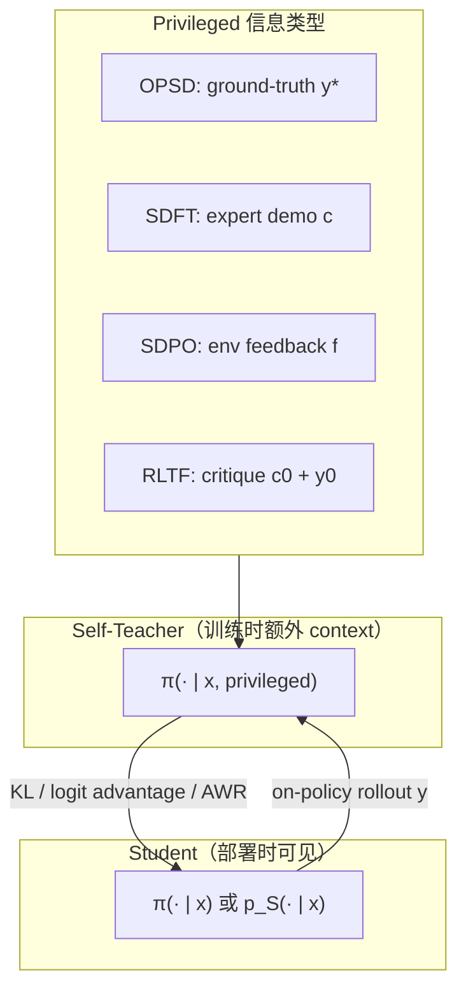
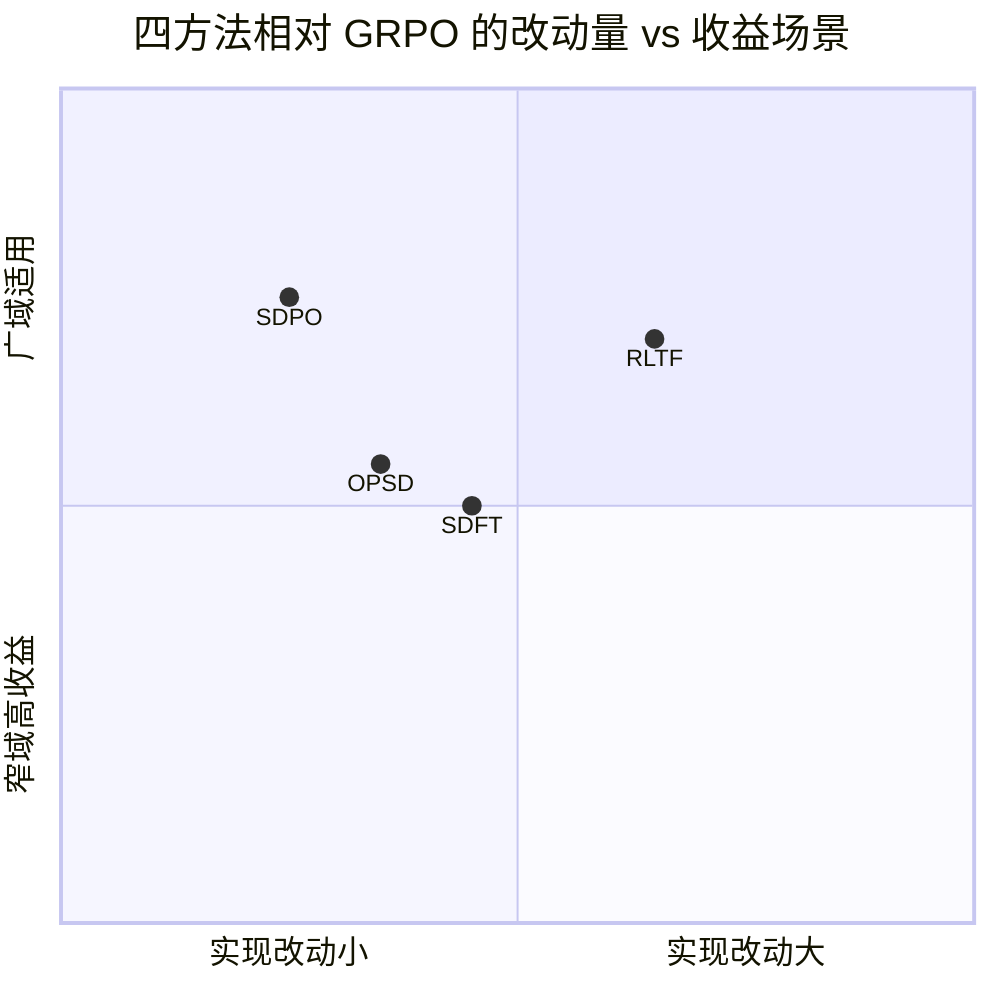
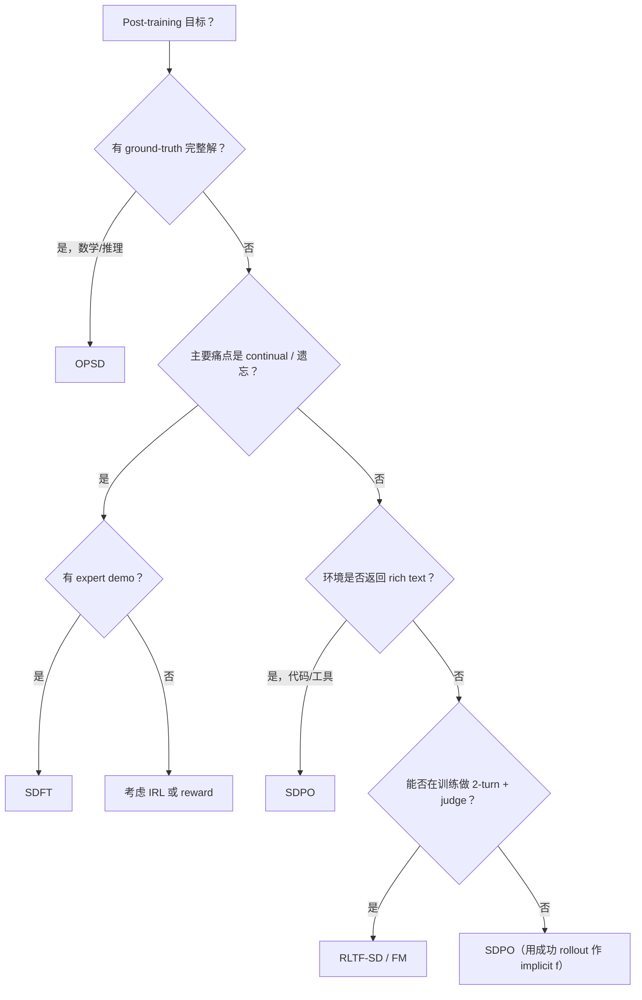

# Self-Distillation 系列论文横向对比（OPSD · SDFT · SDPO · RLTF）

> **阅读日期**：2026-07-14
> **读者定位**：算法工程师，需要在 post-training / Agent RL 管线中选型或组合方法
> **范围**：对比四篇 2026 年初 arXiv 论文的核心设定、算法异同与适用场景；不覆盖实现细节与超参复现

---

## 目录

| 章节 | 主题 |
|------|------|
| [§1](#1-一句话定位) | 一句话定位 |
| [§2](#2-统一心智模型) | 统一心智模型 |
| [§3](#3-核心维度对照表) | 核心维度对照表 |
| [§4](#4-算法机制分解) | 算法机制分解 |
| [§5](#5-监督信号谱系) | 监督信号谱系 |
| [§6](#6-实验域与证据强度) | 实验域与证据强度 |
| [§7](#7-选型决策树) | 选型决策树 |
| [§8](#8-组合与演进路线) | 组合与演进路线 |
| [§9](#9-与-agent-工程的映射) | 与 Agent 工程的映射 |
| [§10](#10-笔记索引) | 笔记索引 |

---

## 1. 一句话定位

| 论文 | 缩写 | 一句话 |
|------|------|--------|
| [Self-Distilled Reasoner](./2026-01-27-opsd-self-distilled-reasoner.md) | **OPSD** | 数学推理：用 **标准答案** 作 privileged context，单模型 on-policy logit 自蒸馏，替代 GRPO |
| [Self-Distillation Enables Continual Learning](./2026-01-28-sdft-continual-learning.md) | **SDFT** | 持续学习：用 **专家 demo** 作 in-context teacher，on-policy 蒸馏减 catastrophic forgetting |
| [Reinforcement Learning via Self-Distillation](./2026-01-29-sdpo-reinforcement-learning-self-distillation.md) | **SDPO** | RLVR 升级：用 **环境 rich feedback**（或成功 rollout）做 retrospective self-teacher，dense credit assignment |
| [Expanding RL via Textual Feedback](./2026-02-02-rltf-text-feedback.md) | **RLTF** | Multi-turn 训练：**text critique** 内化进 **single-turn** policy（SD + Feedback Modeling） |

四篇共享同一元思想：**同一个 LLM 在不同 context 下既当 student 又当 teacher，把「更多信息条件下的分布」蒸馏回「部署时分布」。**

---

## 2. 统一心智模型



---

## 3. 核心维度对照表

| 维度 | OPSD | SDFT | SDPO | RLTF |
|------|------|------|------|------|
| **Primary 目标** | 推理精度 + token 效率 | Continual learning / 防遗忘 | RL sample efficiency + rich feedback | Single-turn 内化 multi-turn feedback |
| **Privileged context** | 标准解 \(y^\star\) | 专家 demonstration \(c\) | 环境文本 \(f\) / 成功 rollout | Judge critique \(c_0\) + 首轮 \(y_0\) |
| **Student 采样** | 1 rollout / prompt | on-policy 输出 | G rollouts / prompt | \(y_0\) then \(y_1\) |
| **Teacher 动作** | 对 **同一 \(\hat{y}\)** 重算 next-token 分布 | demo-conditioned 分布 | 对 **同一 \(y\)** 加 \(f\) 重算 log-prob | 用 **\(y_1\)** 监督 \(\pi(\cdot\|x_0)\) |
| **损失形式** | Full-vocab JSD / KL | Reverse KL / 似然比 | Per-token KL（≈ logit advantage） | AWR 式 distillation + 可选 FM 头 |
| **需要外部 teacher** | ✗ | ✗ | ✗ | ✗（需 judge 产 critique） |
| **需要标量 reward** | ✗（用 \(y^\star\)） | ✗ | ✓（可仅 binary） | ✓ |
| **典型 baseline** | GRPO, SFT | SFT, DFT | GRPO | Single/Multi-turn GRPO |
| **代码** | [OPSD](https://github.com/siyan-zhao/OPSD) | [SDFT](http://idanshenfeld.com/SDFT) | [SDPO](https://github.com/lasgroup/SDPO) | [rltf](https://github.com/lili-chen/rltf) |

---

## 4. 算法机制分解

### 4.1 「蒸馏什么」

| 方法 | Target 是什么 | 关键细节 |
|------|---------------|----------|
| **OPSD** | Teacher 在 **每个 token** 上的 full next-token 分布 | Teacher 见 \(y^\star\) 后 rationalize；**teacher 权重固定为初始策略** |
| **SDFT** | Demo-aware teacher 分布 | 默认 **EMA teacher**；优化 reverse KL |
| **SDPO** | Feedback-aware 下 **原 rollout 各 token** 的 log-prob 比 | **无二次采样**；advantage = \(\log \pi(y_t|x,f) - \log \pi(y_t|x)\) |
| **RLTF-SD** | 第二轮输出 \(y_1\) 在 **\(x_0\)** 下的 likelihood | \(\pi_{\text{ref}}=\pi(\cdot|x_0)\)；**first-turn baseline** |
| **RLTF-FM** | Critique 文本本身 | 辅助表示学习，非直接 distillation |

### 4.2 「on-policy 指什么」

| 方法 | On-policy 对象 |
|------|----------------|
| OPSD | Student 生成的推理链 \(\hat{y}\) |
| SDFT | Student 当前策略下的输出（非固定 expert 轨迹） |
| SDPO | 当前策略 rollouts（含失败轨迹） |
| RLTF | \(y_0, y_1\) 均来自当前 \(\pi\)，但 \(y_1\) 条件于 feedback prompt |

### 4.3 与 GRPO 的关系



- **SDPO**：改动最小 — **只换 advantage**；直接吃环境已有 stderr / test output
- **OPSD**：新训练 loop，但每 prompt 1 sample；适合 **有标准解** 的 math pipeline
- **SDFT**：Continual 场景；与 GRPO 正交（常无 reward）
- **RLTF**：需 2-turn 数据管线 + judge；适合 **已有 critique 数据** 或能合成 feedback 的场景

---

## 5. 监督信号谱系

从「信息密度」与「获取成本」看四篇在谱系中的位置：

```
低成本 ──────────────────────────────────────────── 高成本
稀疏                                                          密集

GRPO (1 bit) ── SDPO (rich f) ── RLTF (critique) ── SDFT (demo) ── OPSD (full y*) ── 外部大 teacher
     ▲              ▲                ▲                  ▲              ▲
   仅结果      环境报错/评语      自然语言批评        专家轨迹        完整参考解
```

| 信号 | 密度 | 谁提供 | 哪篇主打 |
|------|------|--------|----------|
| Binary reward | 最低 | Verifier | SDPO / RLTF 的 baseline |
| Rich env feedback | 中–高 | 编译器/测试框架 | **SDPO** |
| Text critique | 中–高 | LLM judge / 人 | **RLTF** |
| Expert demo | 高 | 人类 / 强 Agent trace | **SDFT** |
| Ground-truth solution | 最高 | 数据集标注 | **OPSD** |

---

## 6. 实验域与证据强度

| 论文 | 主战场 | 标志性数字 | 证据短板 |
|------|--------|------------|----------|
| **OPSD** | 数学竞赛（AIME 等） | Qwen3-8B avg 52.2 vs GRPO 51.3；**4–8× token 效率** | 仅 math；依赖 \(y^\star\) |
| **SDFT** | Tool / QA / 知识注入 / **顺序三任务** | 顺序学习无遗忘；OOD knowledge **~perfect** | Demo 质量敏感；少与 RL 比 |
| **SDPO** | 科学推理、工具、**LiveCodeBench v6** | LCB 48.8 vs GRPO 41.2；**4× 样本效率** | 依赖 ICL 自纠错 |
| **RLTF** | Puzzle、Math、**创意写作** | Knights 0.80+ single-turn；LitBench **8.25** | Judge 成本；2-turn 设定 |

**共同模式**：凡声称 sample efficiency 的，都强调 **dense signal 减少无效 rollout**；凡涉及 self-teacher 的，都强调 **模型 scale / ICL 能力** 越强收益越大。

---

## 7. 选型决策树



### 快速推荐

| 你的场景 | 首选 | 备选 |
|----------|------|------|
| Math RL 想降 GRPO 成本 | **OPSD** | SDPO（若只有 pass/fail） |
| 个人 Agent 逐 skill 微调 | **SDFT** | RLTF-SD（若有 user critique 日志） |
| Code Agent + pytest/traceback | **SDPO** | RLTF（若还有 LLM review 文本） |
| 产品：训练时有 critic，部署要 one-shot | **RLTF** | SDPO + 人工 critique 模板 |
| 已有 GRPO 栈，最小改动 | **SDPO** | — |

---

## 8. 组合与演进路线

四篇 **非互斥**，可按数据可用性 **叠加 privileged context**：

| 阶段 | 可用信号 | 可组合方法 |
|------|----------|------------|
| 1 | Binary pass/fail | GRPO → **SDPO**（成功 rollout 作 f） |
| 2 | + stderr / test summary | **SDPO** full rich feedback |
| 3 | + LLM critique | **RLTF-SD** 或 SDPO with judge text |
| 4 | + golden trace / demo | **SDFT**（continual）或 **OPSD**（若有 \(y^\star\)） |

**潜在冲突**：

- OPSD 固定 initial teacher vs SDFT EMA teacher —  continual 场景需 ablate
- RLTF 2-turn 采样成本 vs SDPO 无二次采样 — 按 judge 延迟权衡
- 多源 privileged context 可能 **context 过长** — 需 compact / 分层 feedback

---

## 9. 与 Agent 工程的映射

| 工程问题 | 读哪篇 |  actionable 要点 |
|----------|--------|-----------------|
| 用户对话里 next-state 怎么进训练 | SDPO + [OpenClaw-RL](./2026-03-10-openclaw-rl.md) | 工具输出 = \(f\)；换 SDPO advantage 比纯 PRM ±1 更 dense |
| 新 skill 微调毁通用能力 | **SDFT** | Demo in context 作 teacher，student on-policy |
| 竞赛 math 训练贵 | **OPSD** | 1 rollout + \(y^\star\)；检查是否比 G=8 GRPO 省算力 |
| 部署不能 multi-turn，开发可以 | **RLTF** | 优化 \(J_{\text{SingleTurn}}\)；first-turn baseline 必抄 |
| Judge / critic 已有，想内化 | **RLTF-FM** + SDPO | FM 学「怎么骂」；SDPO 学「骂完哪 token 该改」 |

---

## 10. 笔记索引

| 论文 | arXiv | 笔记 |
|------|-------|------|
| Self-Distilled Reasoner (OPSD) | [2601.18734](https://arxiv.org/abs/2601.18734) | [2026-01-27-opsd-self-distilled-reasoner.md](./2026-01-27-opsd-self-distilled-reasoner.md) |
| Self-Distillation Enables Continual Learning (SDFT) | [2601.19897](https://arxiv.org/abs/2601.19897) | [2026-01-28-sdft-continual-learning.md](./2026-01-28-sdft-continual-learning.md) |
| Reinforcement Learning via Self-Distillation (SDPO) | [2601.20802](https://arxiv.org/abs/2601.20802) | [2026-01-29-sdpo-reinforcement-learning-self-distillation.md](./2026-01-29-sdpo-reinforcement-learning-self-distillation.md) |
| Expanding RL via Textual Feedback (RLTF) | [2602.02482](https://arxiv.org/abs/2602.02482) | [2026-02-02-rltf-text-feedback.md](./2026-02-02-rltf-text-feedback.md) |

---

## 综合个人评价

| 维度 | 评价 |
|------|------|
| **系列整体价值** | 5/5 — 2026 年 LLM post-training 从「scalar RL vs off-policy SFT」二元，扩展为 **self-distillation 统一框架** |
| **最值得先落地** | **SDPO**（改动小、环境反馈现成） |
| **Agent 最长尾价值** | **SDFT**（continual personalization）+ **RLTF**（critic 内化） |
| **Math 专用最优** | **OPSD**（有 \(y^\star\) 时 token 效率最佳） |
| **仍缺的工作** | 四篇组合 ablation；长 horizon multi-tool Agent；weak model 下 self-teacher 可靠性边界 |

---

*阅读完成：2026-07-14*
